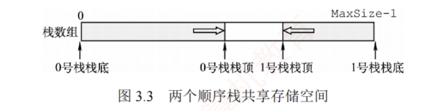

---

### 共享栈

#### 共享栈的定义

利用栈底位置相对固定的特性，可让两个顺序栈共享同一段一维数组空间，将两个栈的栈底分别置于数组两端，栈顶向中间延伸，如图3.3所示。

#### 操作说明
0号栈栈顶指针为top0，1号栈栈顶指针为top1，均指向各自的栈顶元素；初始时top0=-1（0号栈空），top1=MaxSize（1号栈空）；栈满条件为`top1-top0==1`（两栈顶相邻）。当0号栈入栈时，top0先加1，再赋值；当1号栈入栈时，top1先减1，再赋值；出栈操作的顺序相反。

#### 共享栈的优势
共享栈能更高效地利用存储空间，两个栈的空间可动态调节，仅当整个数组被占满时，才发生**栈溢出**。其存取数据的时间复杂度均为O(1)，对存取效率无影响。
