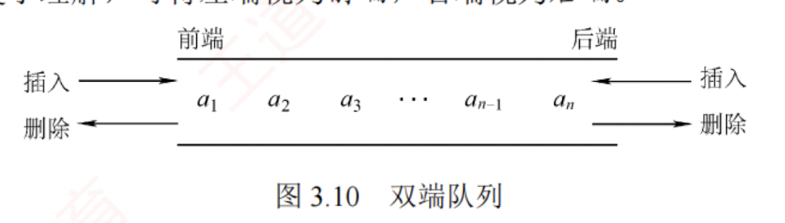

---

### **双端队列（Deque）**

**定义：**  
双端队列是一种允许在两端进行插入和删除操作的线性表。其两端地位平等，常将左端称为“前端”（front），右端称为“后端”（rear）。与普通队列不同，它支持从任意一端入队或出队。

> ✅ **核心特性：**  
> - 支持在前端插入/删除、后端插入/删除。  
> - 两端操作对称，具有双向性。   

#### 📊 图形示意（参考原图）：

---

### **输出受限的双端队列**

**定义：**  
允许在一端进行插入和删除，但在另一端仅允许插入（不允许删除），称为“输出受限双端队列”。

> 📌 举例：  
> - 前端支持入队与出队，后端只支持入队。  
> - 类似于一个“输入缓冲区”，但输出只能从一端进行。

#### 🖼️ 图形示意：

---

### **输入受限的双端队列**

**定义：**  
允许在一端进行插入和删除，但在另一端仅允许删除（不允许插入），称为“输入受限双端队列”。

> 📌 举例：  
> - 前端支持入队与出队，后端只支持出队。  
> - 若限定从某端插入的元素只能从该端删除，则退化为两个栈底相邻接的栈（即“栈+栈”结构）。

#### 🖼️ 图形示意：

---

### **实现方式**

| 实现方式       | 数据结构     | 时间复杂度（插入/删除） | 优点                     | 缺点               |
|----------------|--------------|--------------------------|--------------------------|--------------------|
| 数组循环实现   | 循环数组     | O(1)                      | 空间连续，访问快         | 容量固定，需扩容   |
| 链表实现       | 双链表       | O(1)（两端）             | 动态扩展，灵活           | 存储开销大         |
| 递归栈模拟     | 栈嵌套        | O(n)                     | 理论上可实现            | 实际效率低         |

> 💡 **推荐考研重点：**  
> - 循环数组实现双端队列的边界处理（如 front/rear 指针越界、空/满判断）。  
> - 双链表实现中，如何维护前后指针与头尾节点。  

---

### **操作复杂度分析**

| 操作         | 数组循环实现 | 链表实现 |
|--------------|---------------|----------|
| 前端插入     | O(1)          | O(1)     |
| 后端插入     | O(1)（需处理满） | O(1)     |
| 前端删除     | O(1)          | O(1)     |
| 后端删除     | O(1)          | O(1)     |
| 查找元素     | O(n)          | O(n)     |

> ⚠️ 注意：数组实现中需处理“满”与“空”的边界条件，如使用 `front == rear` 表示空队列时，插入后需判断是否溢出。

---

### **应用场景**

1. **浏览器历史记录**  
   - 支持向前/向后导航（前端删除、后端插入）。  

2. **缓存系统（LRU）**  
   - 双端队列可高效维护最近使用元素，支持快速更新与淘汰。  

3. **滑动窗口算法**  
   - 维护窗口内最大值/最小值时，双端队列可用于动态调整。  

4. **表达式求值（扩展）**  
   - 可用于实现“优先级队列”或“括号匹配”的双向操作。

---

### **考研重点与典型题目**

#### 📝 单选题

> 1. 下列关于双端队列的描述，错误的是：  
> A. 支持两端插入和删除  
> B. 输出受限时，后端仅允许插入  
> C. 输入受限时，前端仅允许删除  
> D. 双端队列退化为两个栈时，栈底相邻  

✅ **答案：C**（输入受限时，前端允许插入与删除，后端只允许删除）

---

#### 📝 填空题

> 1. 在双端队列中，若仅允许从一端插入和删除，则退化为______。  
> 2. 循环数组实现双端队列时，判断“满”的条件是：______。  

✅ **答案：**  
1. 栈  
2. `front == (rear + 1) % size`（或根据空/满定义调整）

---

#### 📝 简答题

> 1. 如何用双链表实现一个输出受限的双端队列？请描述插入与删除操作。  

✅ **答案：**  
- 插入：仅允许在前端插入，后端禁止插入（通过限制指针或设置标志）。  
- 删除：从前端和后端均可删除，但需确保后端不被用于删除操作。  
- 实现时可维护 `front` 和 `rear` 指针，并对 `rear->next = NULL` 进行约束。

---

### **常见错误与避坑点**

1. ❗ 数组实现中未正确处理“空”和“满”的边界条件，导致越界或逻辑错误。  
2. ❗ 链表实现时忘记更新前后指针，导致断链或环路。  
3. ❗ 输入受限双端队列退化为栈时，需注意“栈底相邻”的含义（即两个栈共享一个节点）。  

---

### **扩展知识：CSR/CSC 存储格式**

> 在稀疏矩阵中，双端队列可用于实现**十字链表**结构中的行/列指针管理。  
> - CSR（Compressed Sparse Row）：按行存储非零元素的索引与值。  
> - CSC（Compressed Sparse Column）：按列存储非零元素的索引与值。  

---

