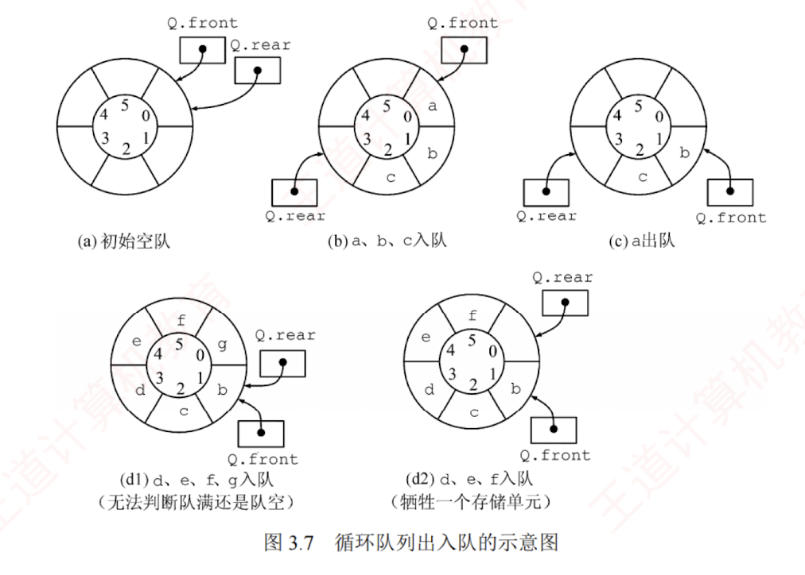

---

### 循环队列

#### 引入

为了了解决顺序队列的**假溢出**问题，引入循环队列：将顺序存储空间在逻辑上组织为**环状结构**。当指针到达数组末尾时，自动回到起始位置，这可通过**取模运算（%）** 实现。


```text
初始状态：Q.front=Q.rear=0。
队首指针进 1：Q.front=(Q.front+1)%MaxSize。
队尾指针进 1：Q.rear=(Q.rear+1)%MaxSize。
队列长度：(Q.rear+MaxSize-Q.front)%MaxSize。
出入队操作：指针均按顺时针方向移动（见图 3.7）。
```


#### 循环队列判空和判满的条件  
队空条件显然为 `Q.front==Q.rear`。但当入队速度远快于出队时，rear 会追上 front，此时同样满足 `Q.front==Q.rear`，却表示队满。因此，仅凭 `front==rear` 无法区分队空与队满。循环队列出入队的示意图如图 3.7 所示。



#### 解决无法区分队空和队满的三种方法
##### 牺牲一个存储单元

入队时少用一个存储单元，这是一种较为普通的做法，约定以“队尾指针的下一位置为队首”作为队满标志，如图 3.7(d2)所示。  
队满条件：`(Q.rear+1)%MaxSize==Q.front`。  
队空条件：`Q.front==Q.rear`。  
队列中元素个数：(Q.rear-Q.front+MaxSize)%MaxSize。 
>执行加1操作即可跳过最后一个存储单元
##### 增设 size 成员

记录当前元素个数。若入队成功，则 size++，若出队成功，则 size--。  
队空条件：`Q.size==0`。
队满条件：`Q.size==MaxSize`。  
两种情形均有 `Q.front==Q.rear`，由 size 区分队空与队满。

##### 增设 tag 标志位  

出队后置 tag=0，若此时 `Q.front==Q.rear`，则为队空。  
入队后置 tag=1，若此时 `Q.front==Q.rear`，则为队满。
>用tag来标记最近一次的入队和出队操作
#### 循环队列的操作（基于牺牲一个单元法）
    

##### 初始化

```text
void InitQueue(SqQueue &Q){
    Q.rear=Q.front=0;        //初始化队首、队尾指针
}
```

##### 判队空

```text
bool QueueEmpty(SqQueue Q){
    if(Q.rear==Q.front)      //队空条件
        return true;
    else
        return false;
}
```

##### 入队

```text
bool EnQueue(SqQueue &Q,ElemType x){
    if((Q.rear+1)%MaxSize==Q.front)    //队满则报错
        return false;
    Q.data[Q.rear]=x;
    Q.rear=(Q.rear+1)%MaxSize;         //队尾指针加 1 取模
    return true;
}
```

##### 出队

```text
bool DeQueue(SqQueue &Q,ElemType &x){
    if(Q.rear==Q.front)      //队空则报错
        return false;
    x=Q.data[Q.front];

    Q.front=(Q.front+1)%MaxSize;       //队首指针加 1 取模
    return true;
}
```