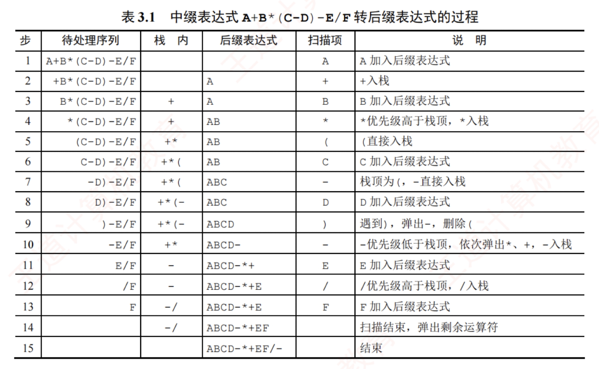

---

## 栈在括号匹配中的应用

假设表达式中允许包含两种括号：圆括号 `()` 和方括号 `[]`，其嵌套顺序任意。例如，`([]())` 或 `[([][])]` 均为合法格式，而 `[()]`、`([())` 或 `(())` 均为非法格式。

考虑如下括号序列：

```text
[  (  [  ]  [  ]  )  ]
1  2  3  4  5  6  7  8
```

### 分析过程  

1）读入第 1 个括号 “`[`” 后，系统期待与之匹配的 “`]`”（第 8 个）出现。  
2）读入第 2 个括号 “`(`” 后，第 1 个括号 “`[`” 的期待暂时搁置，转而优先期待与 “`(`” 匹配的 “`)`”（第 7 个）出现。  
3）读入第 3 个括号 “`[`”，当前最急迫的期待变为与之匹配的 “`]`”（第 4 个）。该期待满足后，先前被搁置的第 2 个括号 “`(`” 的匹配任务重新成为当前最急迫事项。  
4）以此类推，可见整个处理过程完全符合后进先出的栈行为。

### 算法思想  

1）初始化一个空栈，顺序扫描输入的括号序列。  
2）若遇到左括号，将其压入栈中，表示新增一个待匹配的期待，且其优先级最高。  
3）若遇到右括号，则检查栈是否为空：若栈非空且栈顶左括号与当前右括号匹配，则弹出栈顶，完成一次匹配；否则，括号序列非法，算法终止。  
4）扫描结束后，若栈为空，则括号序列合法；否则，存在未匹配的左括号，序列非法。
>简单来说就是依次扫描所有字符，遇到左括号入栈，遇到右括号则弹出栈顶元素检查是否匹配

### 流程框图


### 代码定义


## 栈在表达式求值中的应用

### 算数表达式


#### 组成

算数表达式又操作数、运算符、界限符构成

##### 操作数（operand）

参与运算的“对象”，可以是：

- 常量：`3、10、2.5`
    
- 变量/标识符：`a、x、sum`
    
- 更复杂的：数组元素 `a[i]`、函数调用 `f(x)`（在更一般的表达式里）
    

例：`a + b * c` 里 `a、b、c` 都是操作数。


##### 运算符（operator）

表示“做什么运算”的符号/关键字。

- 算术：`+ - * / %`
    
- 关系：`< <= > >= == !=`
    
- 逻辑：`&& || !`
    
- 位运算：`& | ^ ~ << >>`
    
- 赋值：`= += -= ...`
    
- 还有**一元运算符**：如 `-a`（取负）、`!x`（逻辑非）
    

例：`a + b * c` 里 `+、*` 是运算符。

---

##### 界限符（delimiter / separator / boundary symbol）

用来**分隔、界定结构范围**的符号，常见：

- 圆括号：`( )`（最典型：改变运算顺序、界定子表达式）
    
- 方括号：`[ ]`（数组下标）
    
- 花括号：`{ }`（代码块/集合等，取决于语言/语境）
    
- 逗号：`,`（参数/元素分隔）
    
- 分号：`;`（语句结束）
    


#### 算数表达式的分类
##### 中缀表达式（Infix Expression）

**运算符写在两个操作数中间**，人类最习惯的写法。

例：

- `a + b`
    
- `a + b * c`
    
- `(a + b) * c`
    

特点：

- 必须依赖**运算符优先级**与**结合性**，以及括号来消歧义  
    比如 `a + b * c` 默认先算 `b * c`
    

---

##### 前缀表达式（Prefix Expression / Polish Notation）

**运算符写在操作数前面**（波兰表达式）。

例（把中缀 `a + b * c` 改写）：

- 中缀：`a + (b * c)`
    
- 前缀：`+ a * b c`
    

再看一个：

- 中缀：`(a + b) * c`
    
- 前缀：`* + a b c`
    

特点：

- **不需要括号**也能唯一确定运算顺序（在运算符元数固定时，如二元运算符）
    
- 常见求值方式：**从右往左扫描，用栈**（或递归）
    

---

##### 后缀表达式（Postfix Expression / Reverse Polish Notation）

**运算符写在操作数后面**（逆波兰表达式）。

例：

- 中缀：`a + b * c`（即 `a + (b*c)`）
    
- 后缀：`a b c * +`
    

再看一个：

- 中缀：`(a + b) * c`
    
- 后缀：`a b + c *`
    

特点：

- 同样**不需要括号**就能唯一确定运算顺序
    
- 最经典应用：**从左往右扫描，用栈求值**
    
    - 遇到操作数：入栈
        
    - 遇到运算符：弹出所需操作数计算，再把结果入栈
        

---

##### 三者对照速记（同一个表达式）

以中缀：`(a + b) * c` 为例：

- **中缀**：`(a + b) * c`
    
- **前缀**：`* + a b c`
    
- **后缀**：`a b + c *`
    

你可以把它理解成：

- 前缀：**根（运算符）在前**
    
- 后缀：**根（运算符）在后**
    
- 中缀：**根在中间（左右子树夹着）**
    

---

#### 一个常见易错点：一元 `-` vs 二元 `-`

- `-a`：一元运算符（取负）
    
- `a - b`：二元运算符（减法）
    

在前缀/后缀表达式和求值规则里，一元运算符会影响“弹出几个操作数”。


如果你愿意，把你截图里那道“表达式/栈求值/中缀转后缀”的具体题发我，我可以按你考试常用的**扫描+栈变化表**一步一步写出来（这块特别适合固化进 Obsidian）。
### 中缀表达式转后缀表达式

#### 手算转换

- 按运算优先级对整个表达式逐层加括号。  
- 将每个运算符移到其所在括号的右括号之后，形成“左操作数 右操作数 运算符”的结构。  
- 删除所有括号，即得后缀表达式。

>因为运算顺序不唯一，因此对应的后缀表达式也不唯一  
>转换的过程中需要遵循左优先原则：只要左边的运算符能先计算就优先算左边的，可保证运算顺序唯一，后缀表达式也就唯一


#### 机算转换

在计算机中，该转换过程需借助一个**运算符栈**，用于暂存尚未确定输出时机的运算符。从左至右依次扫描中缀表达式的每一项，具体规则如下：

- 遇到操作数：直接加入后缀表达式。  
- 遇到界限符：若为“(”，直接入栈；若为“)”，不入栈，且不断弹出栈顶运算符并加入后缀表达式，直到遇到“(”，将其弹出并丢弃。  
- 遇到运算符：① 若其优先级高于栈顶运算符，或栈顶为“(”，则直接入栈；② 若其优先级低于或等于栈顶运算符，则依次弹出栈中运算符并加入后缀表达式，直到栈空，或栈顶为“(”，或遇到优先级更低的运算符为止，再将当前运算符入栈。

按上述方法扫描完所有字符后，将栈中剩余运算符依次弹出并加入后缀表达式。

例如，中缀表达式 A+B*(C-D)-E/F 转后缀表达式的过程如表 3.1 所示。


所谓栈的深度，是指栈中元素最大个数。通常题目会给出入栈和出栈序列，要求计算栈所需的最大容量（最大深度）。有时该信息以中缀与后缀表达式的形式间接提供。掌握栈“后进先出”的特性，并通过手工模拟转换或求值过程，是解决此类问题的有效方法。

### 后缀表达式求值

#### 后缀表达式的求值过程
从左至右依次扫描表达式，若当前项为操作数，则将其压入栈中；若为操作符 `<op>`，则从栈中弹出两个操作数，先弹出的是右操作数 `y`，后弹出的是左操作数 `x`，执行运算 `x<op>y`，并将结果压回栈中。所有项处理完毕后，栈顶元素即为最终计算结果。

例如，后缀表达式 `ABCD-*+EF/-` 的求值过程共需 12 步，如表 3.2 所示。


### 前缀表达式

关于前缀表达式的运算和转换，在真题中没有考过，因此这处知识点先留空


---
## 栈在递归中的应用

### 函数调用的特点

最后被调用的函数，最先执行结束(LIFO)

### 函数调用栈
函数调用时需要一个栈来存储：  
调用返回地址  
实参  
局部变量

递归的空间复杂度往往来自**调用栈深度**，深度为 `d` 则额外空间约 `O(d)`。
### 递归

递归是一种重要的程序设计方法。简单来说，若一个函数。过程或数据结构在其定义中直接或间接地引用了自身，则称其为递归定义，简称递归。递归通过将原问题逐层分解为规模更小但结构相同的子问题来求解。借助递归策略，仅需少量代码即可简洁地表达解题过程中反复出现的相同计算模式，显著减少程序代码量。然而，在一般情况下，递归的执行效率并不高，因为递归算法在计算机执行过程中包含很多的重复计算，所以效率会低

以斐波那契数列为例，其数学定义为

$$F(n)=\begin{cases}  
F(n-1)+F(n-2),\ n>1\  
1,\qquad\qquad\qquad\ \ n=1\  
0,\qquad\qquad\qquad\ \ n=0  
\end{cases}$$

这是递归的典型范例，其程序实现如下：

```text
int F(int n){                  //斐波那契数列的实现
    if(n==0)
        return 0;              //边界条件
    else if(n==1)
        return 1;              //边界条件
    else
        return F(n-1)+F(n-2);  //递归表达式
}
```

必须注意，递归定义不能是循环或无终止的，必须满足以下两个条件：

- **递归体**（递归表达式）：描述问题如何分解为更小规模的同类子问题。
    

- **边界条件**（递归出口）：确保递归在有限步内终止。  
    递归的精髓在于能否将原问题转化为属性相同但规模更小的问题。


---

## 队列的应用
### 队列在层次遍历中的应用

#### 常用策略

在信息处理中，有一类典型问题需要逐层或逐行处理。解决这类问题的常用策略是：在处理当前层的同时，将下一层的元素按序加入待处理队列。队列正适用于此类场景，因其先进先出的特性，能够自然地保存后续待处理元素的顺序。以二叉树的层次遍历为例（见图 3.17），可清晰体现队列的应用价值。表 3.3 展示了该遍历过程的具体执行步骤。


#### 基本过程

该过程可简要描述如下：  
① 将根结点入队。  
② 若队列为空（表示所有结点均已处理），则遍历结束；否则执行③。  
③ 取出队首结点并访问；若其存在左孩子，则将左孩子入队；若其存在右孩子，则将右孩子入队；返回②继续执行。

### 队列在计算机系统中的应用

队列在计算机系统中的应用非常广泛，以下从两个主要方面进行阐述：第一个方面是解决主机与外部设备之间速度不匹配的问题，第二个方面是解决由多用户引起的资源竞争问题。

#### 打印机缓冲区

以主机和打印机之间的速度不匹配为例。主机输出数据的速度远快于打印机处理数据的速度。若直接将数据发送给打印机，会导致数据丢失或打印错误。为此，通常设置一个打印数据缓冲区来缓解这一问题。具体实现如下：主机将待打印的数据依次写入缓冲区，当缓冲区满时，主机暂停输出并转向其他任务；打印机则从缓冲区中按先进先出原则逐个取出数据进行打印；打印完成后，打印机向主机发出请求，主机再次向缓冲区写入新的打印数据。这种方法不仅保证了数据的正确性，还提高了主机的整体效率。因此，打印数据缓冲区实际上就是一个队列。

#### CPU调度（FCFS）

在多用户环境下，CPU 资源的竞争是一个典型场景。在一个多终端系统中，用户通过各自的终端向操作系统提出对 CPU 的请求。为公平分配 CPU 时间，操作系统通常按照请求的时间顺序，将这些请求排成一个队列。具体步骤如下：每次将 CPU 分配给队首用户的程序运行；当该程序运行结束或用完规定的时间片后，操作系统使其出队；然后将 CPU 分配给新的队首用户。这种方式既保证了请求的公平处理，又提升了 CPU 利用率。此外，在某些复杂系统中，可能还会引入多队列机制，以便根据不同的优先级或调度策略动态调整资源分配。