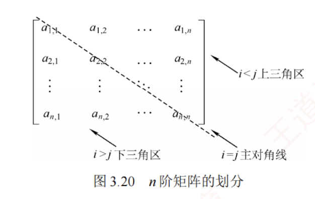
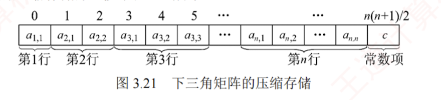
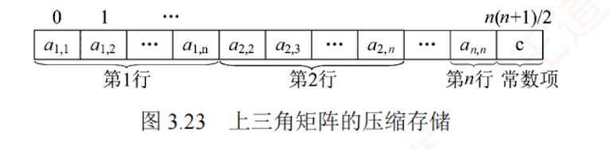

---

## 特殊矩阵的压缩存储

**压缩存储**：为多个值相同的元素只分配一个存储空间，对零元素不分配存储空间。

**特殊矩阵**：指具有大量相同元素或零元素，且这些元素分布具有规律性的矩阵。常见的特殊矩阵有对称矩阵、上（下）三角矩阵、对角矩阵等。

**特殊矩阵的压缩存储方法**：通过分析矩阵中相同元素的分布规律，仅存储一份实际数据，其余的可通过下标映射访问，从而将原本冗余的数据压缩到一个共享的空间中，显著节省内存。

### 对称矩阵

#### 定义

若 $n$ 阶矩阵 $A$ 中任意元素 $a_{i,j}$ 均满足且 $a_{i,j}=a_{j,i}\ (1\le i,j\le n)$，则称其为对称矩阵。其元素可分为三部分：上三角区、主对角线和下三角区，如图 3.20 所示。

#### 存储策略

由于上三角区与下三角区完全对称，若仍用二维数组存储，将近一半空间被浪费。为此可将 $n$ 阶对称矩阵 $A$ 压缩存储于一维数组 $B[n(n+1)/2]$ 中，通常仅存放下三角部分（含主对角线）。
>只存主对角线和下三角部分，按行优先原则依次存储。  
>也可以按照列优先存储，不过下面介绍的是行优先的方式，具体情况需要具体分析

#### 映射方式
>可以实现一个映射函数将矩阵下标与一维数组下标对应起来。

对于元素 $a_{i,j}\ (i\ge j)$，其在数组 $B$ 中的位置由其前方的元素个数决定

第 1 行：1 个元素（$a_{1,1}$）。  
第 2 行：2 个元素（$a_{2,1},a_{2,2}$）。  
……  
第 $i-1$ 行：$i-1$ 个元素（$a_{i-1,1},a_{i-1,2},\cdots,a_{i-1,i-1}$）。  
第 $i$ 行：$j-1$ 个元素（$a_{i,1},a_{i,2},\cdots,a_{i,j-1}$）。

因此，元素 $a_{i,j}$ 在数组 $B$ 中的下标  
$$  
k=1+2+\cdots+(i-1)+j-1=i(i-1)/2+j-1\ (\text{数组下标从 0 开始})  
$$  
元素下标之间的对应关系如下：  
$$  
k=\begin{cases}  
\dfrac{i(i-1)}{2}+j-1, & i\ge j\ (\text{下三角区和主对角线元素})\\[6pt]  
\dfrac{j(j-1)}{2}+i-1, & i<j\ (\text{上三角区元素 } a_{i,j}=a_{j,i})  
\end{cases}  
$$

#### 注意
描述矩阵元素时，行列号通常从1开始；  
而描述数组时通常下标从零开始。

#### 出题方法

- 存储上三角或者下三角
- 行优先或者列优先
- 矩阵元素的下标从0或者从1开始
- 数组下标从0或者从1开始

### 三角矩阵

#### 下三角矩阵

在下三角矩阵［见图 3.22(a)］中，上三角区的所有元素均为同一常量。其存储思想与对称矩阵的类似，但是需要额外存储该常量一次。因此，可以将 $n$ 阶下三角矩阵 $A$ 压缩存储在 $B[n(n+1)/2+1]$ 中。

对于元素 $a_{i,j}\ (i\ge j)$，其在数组 $B$ 中的下标为  
$$  
k=\begin{cases}  
\dfrac{i(i-1)}{2}+j-1, & i\ge j\ (\text{下三角区和主对角线元素})\\[6pt]  
\dfrac{n(n+1)}{2}, & i<j\ (\text{上三角区元素})  
\end{cases}  
$$
##### 压缩存储形式

#### 上三角矩阵

在上三角矩阵［见图 3.22(b)］中，下三角区所有元素均为同一常量。只需存储主对角线、上三角区上元素及该常量一次，同样将其压缩存储在 $B[n(n+1)/2+1]$ 中。

对于元素 $a_{i,j}\ (i\le j)$，其在数组 $B$ 中前方的元素个数为

第 1 行：$n$ 个元素  
第 2 行：$n-1$ 个元素  
……  
第 $i-1$ 行：$n-i+2$ 个元素  
第 $i$ 行：$j-i$ 个元素

故元素 $a_{i,j}$ 在数组 $B$ 中的下标  
$$  
k=n+(n-1)+\cdots+(n-i+2)+(j-i+1)-1=(i-1)(2n-i+2)/2+(j-i)  
$$

元素下标之间的对应关系如下：  
$$  
k=\begin{cases}  
\dfrac{(i-1)(2n-i+2)}{2}+(j-i), & i\le j\ (\text{上三角区和主对角线元素})\\[6pt]  
\dfrac{n(n+1)}{2}, & i>j\ (\text{下三角区元素})  
\end{cases}  
$$
##### 压缩存储形式

以上推导均假设数组下标从 0 开始。若下标指定从 1 开始，则要相应地调整映射关系。

### 三对角矩阵

