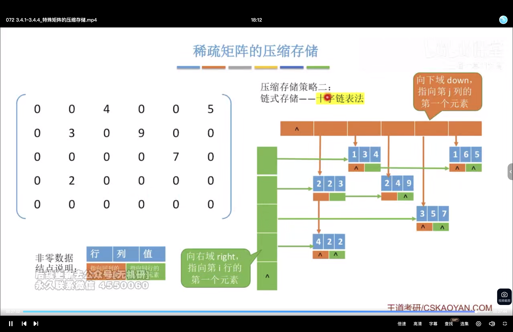

### 定义与背景

若一个 $m \times n$ 矩阵中**非零元素个数远小于总元素个数**（即 $t \ll s = m \cdot n$），则称该矩阵为**稀疏矩阵**。  
> **典型例子**：在图像处理、科学计算、图论邻接矩阵等场景中，稀疏矩阵非常常见。

#### 为什么需要压缩存储？
- 原始数组存储会浪费大量空间（如 $10^4 \times 10^4$ 的矩阵，若仅含 100 个非零元素，仍需分配 100 万字节）。
- **压缩存储**可显著节省内存、提高运算效率。

---

### 压缩存储策略一：三元组表（顺序存储）

#### 核心思想
将每个非零元素表示为一个**三元组** $(i, j, a_{ij})$，其中：
- $i$：行号（从 0 开始）
- $j$：列号（从 0 开始）
- $a_{ij}$：值

#### 存储结构
将所有非零元素的三元组按某种顺序（如**行优先、列优先或字典序**）存入一维数组中。

> **示例矩阵**
$$  
M=\begin{bmatrix}  
4 & 0 & 0 & 0\\
0 & 0 & 6 & 0\\
0 & 9 & 0 & 0\\  
0 & 23 & 0 & 0  
\end{bmatrix}  
$$

> **三元组表（行优先）**
| i   | j   | $a_{i,j}$ |
| --- | --- | --------- |
| 0   | 0   | 4         |
| 1   | 2   | 6         |
| 2   | 1   | 9         |
| 3   | 1   | 23        |

#### 存储结构代码示意（C语言风格）
```c
typedef struct {
    int row;
    int col;
    int value;
} Triple;

Triple matrix[4] = {
    {0, 0, 4},
    {1, 2, 6},
    {2, 1, 9},
    {3, 1, 23}
};
```

#### 优点
- 结构简单，易于理解与实现。
- 支持顺序遍历。

#### 缺点
- **不支持随机访问**：若要获取 $a_{i,j}$，需线性扫描三元组表（时间复杂度 $O(t)$）。
- 插入/删除效率低（需移动大量元素）。

---

### 压缩存储策略二：十字链表法（链式存储）

#### 核心思想
为解决顺序存储的随机访问问题，采用**十字链表结构**，每个非零元素是一个节点，包含：
- 行指针 `rowPtr` → 指向本行下一个非零元素。
- 列指针 `colPtr` → 指向本列下一个非零元素。
- 值域 `value`
- 行号、列号（可省略）

#### 结构示意



> **图示说明**：每个节点有行指针和列指针，形成“十字”结构。头结点分别指向每行、每列的第一个非零元素。

#### 代码示意（简化版）
```c
typedef struct Node {
    int row, col;
    int value;
    struct Node *right; // 同一行下一个节点
    struct Node *down;  // 同一列下一个节点
} Node;

// 行头结点和列头结点结构
typedef struct HeadNode {
    Node* firstRowNode; // 指向该行第一个非零元素
    Node* firstColNode; // 指向该列第一个非零元素
} HeadNode;
```

#### 优点
- 支持**高效插入和删除**（$O(1)$ 或 $O(k)$，k为相关链表长度）。
- **支持随机访问**：通过行/列头结点快速定位。

#### 缺点
- 结构复杂，实现难度高。
- 内存开销大（每个节点需额外指针域）。

---

### 总结对比表格

| 存储方式       | 是否支持随机访问 | 插入/删除效率 | 空间开销 | 适用场景                     |
|----------------|------------------|---------------|----------|------------------------------|
| **三元组表**   | ❌ 不支持         | ⚠️ 较低（需移动） | 小       | 静态稀疏矩阵、简单遍历       |
| **十字链表法** | ✅ 支持           | ✅ 高          | 大       | 动态稀疏矩阵、频繁增删操作   |

---

### 考研重点提示

1. **三元组表是基础考点**：常考“如何存储”、“时间复杂度分析”。
2. **十字链表法是进阶考点**：可能涉及“结构设计”、“插入/删除算法实现”。
3. **稀疏矩阵与栈、队列结合题型**：
   - 如用栈模拟三元组的顺序处理（如表达式求值中元素存储）。
   - 用链表结构实现稀疏矩阵运算（如加法、乘法）。

---

### 常见题目类型

#### 单选题
> 下列哪种方法最适合用于频繁插入和删除非零元素的稀疏矩阵？
A. 数组存储  
B. 三元组表  
C. 十字链表法  
D. 稀疏矩阵压缩为一维数组  

✅ 正确答案：**C**

---

#### 填空题
> 若一个 $5 \times 6$ 的稀疏矩阵中仅有 3 个非零元素，则其三元组表长度为 ______。

✅ 答案：**3**

---

#### 简答题
> 请简述十字链表法在稀疏矩阵存储中的优势与劣势。

✅ 参考答案：
- **优势**：支持高效插入/删除，可快速定位元素（通过行/列头结点），适合动态场景。
- **劣势**：结构复杂、内存开销大，实现难度高。

---

### 扩展知识（进阶）

#### 稀疏矩阵的其他存储方式
1. **压缩行存储（CSR）**
   - 存储每行第一个非零元素的位置索引数组 `rowPtr`。
   - 存储所有非零元素值的数组 `values`。
   - 存储每个非零元素列号的数组 `colIndex`。

2. **压缩列存储（CSC）**
   - 类似CSR，但按列组织数据。

3. **哈希表法**（适用于稀疏矩阵中非零元素分布极不均匀）
   - 用键值对存储 $(i, j) \rightarrow a_{ij}$。
   - 支持 $O(1)$ 随机访问，但空间开销大。

---

### 实际应用案例

- **图论**：邻接矩阵常为稀疏矩阵 → 使用十字链表法更高效。
- **科学计算**：求解线性方程组（如高斯消元）时，稀疏矩阵可大幅减少运算量。
- **机器学习**：特征向量、权重矩阵多为稀疏结构。

---

### 总结

稀疏矩阵的三元组表可通过多种方式存储，常见的有：**数组存储**将所有三元组按某种顺序存储在一维数组中，这种方式简单、直接，但插入和删除操作的效率较低；**十字链表**存储（见 6.2 节）通过链表的方式组织三元组，适用于频繁插入和删除操作的场景。无论采用哪种方式，都需要额外保存稀疏矩阵的**行数、列数和非零元素的个数**，以便支持后续的各种操作。
