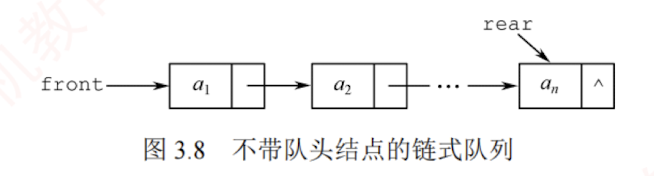
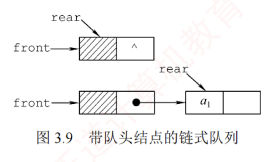

---

## 队列的链式存储结构

### 队列的链式存储
    
#### 链式队列的定义

队列的链式表示称为链式队列，本质上是一个同时带有队首指针和队尾指针的单链表，如图 3.8 所示。队首指针指向队头结点，队尾指针指向队尾结点，即单链表的最后一个结点。



#### 结构体定义

```text
typedef struct LinkNode{            //链式队列结点
    ElemType data;
    struct LinkNode *next;
}LinkNode;
typedef struct{                     //链式队列
    LinkNode *front,*rear;          //队列的队头和队尾指针
}LinkQueue;
```

当不带头结点时，若 `Q.front==NULL 且 Q.rear==NULL`，则链式队列为空队列。


**入队操作**：创建一个新结点，将其插入链表尾部，并令 Q.rear 指向该结点；若原队列为空，则同时令 Q.front 也指向该结点。  
**出队操作**：先判断队列是否为空；若非空，则取出队首元素，删除对应结点，并令 Q.front 指向下一个结点；若被删结点是最后一个元素，则将 Q.front 和 Q.rear 均置为 NULL。  
不难发现，不带头结点的链式队列在边界处理上较为烦琐。因此，通常将链式队列设计为**带头结点的单链表**，从而使插入与删除操作逻辑统一，如图 3.9 所示。



#### 链式队列的优势

链式队列特别适用于元素数量频繁变化的场景，且不存在队满或溢出问题。此外，若程序中需使用多个队列（如同多个栈的情形），优先选用链式队列可避免存储分配不合理或溢出等问题。

### 链式队列的基本操作
    
以下代码设计为带头结点的链式队列

#### 初始化

```text
void InitQueue(LinkQueue &Q){   //初始化带头结点的链式队列
    Q.front=Q.rear=(LinkNode*)malloc(sizeof(LinkNode)); //建立头结点
    Q.front->next=NULL;         //初始为空
}
```

#### 判队空

```text
bool QueueEmpty(LinkQueue Q){
    if(Q.front==Q.rear)         //判空条件
        return true;
    else
        return false;
}
```

#### 入队

```text
void EnQueue(LinkQueue &Q,ElemType x){
    LinkNode *s=(LinkNode *)malloc(sizeof(LinkNode)); //创建新结点
    s->data=x;
    s->next=NULL;
    Q.rear->next=s;             //插入链尾
    Q.rear=s;                   //修改尾指针
}
```

#### 出队

```text
bool DeQueue(LinkQueue &Q,ElemType &x){
    if(Q.front==Q.rear)
        return false;           //空队
    LinkNode *p=Q.front->next;
    x=p->data;
    Q.front->next=p->next;
    if(Q.rear==p)
        Q.rear=Q.front;         //若原队列中只有一个结点，删除后变空
    free(p);
    return true;
}
```