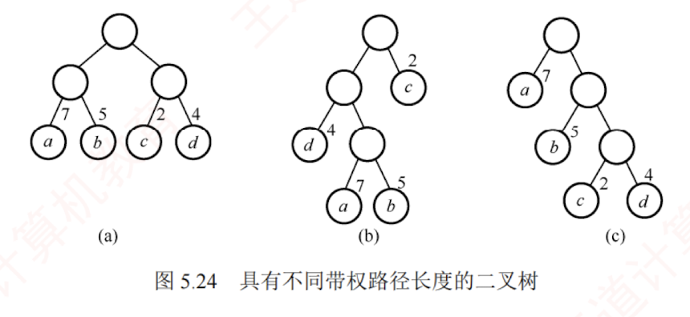

---

### 哈夫曼树

#### 定义与概念

1. **权值**：在许多实际应用中，树中的结点常被赋予一个具有特定意义的数值，称为该结点的权。
2. **带权路径长度 (WPL)**：
   - 从根结点到某一叶结点的路径长度与该结点权值的乘积。
   - 树中所有叶结点的带权路径长度之和称为该树的带权路径长度（WPL），记为
     
     $$\mathrm{WPL}=\sum_{i=1}^{n} w_i l_i$$
     
     其中，$w_i$ 为第 $i$ 个叶结点的权值，$l_i$ 为该叶结点到根结点的路径长度。
3. **加权平均长度**：每个叶结点的路径长度以其权值为权重所计算出的加权平均值称为加权平均长度。

在含有 $n$ 个带权叶结点的二叉树中，**WPL 最小的二叉树称为哈夫曼树，也称最优二叉树**。例如，对于叶结点 $a,b,c,d$ 的权值分别为 7,5,2,4，对应的 WPL 分别为：
- (a) WPL = $7 \times 2 + 5 \times 2 + 2 \times 2 + 4 \times 2 = 36$
- (b) WPL = $4 \times 2 + 7 \times 3 + 5 \times 3 + 2 \times 1 = 46$
- (c) WPL = $7 \times 1 + 5 \times 2 + 2 \times 3 + 4 \times 3 = 35$

其中，图中的哈夫曼树为(c)，其WPL最小。

#### 哈夫曼树的构造

给定 $n$ 个权值分别为 $w_1, w_2, \cdots, w_n$ 的结点，构造哈夫曼树的**步骤**如下：
1. 将这 $n$ 个结点分别视为 $n$ 棵仅含一个结点的二叉树，构成森林 $F$。
2. 构造一个新结点，从 $F$ 中选取**两棵根结点权值最小的树**作为其左右子树，并将新结点的权值设为左右子树根结点的权值之和。
3. 从 $F$ 中删除所选的两棵树，并将新生成的树加入 $F$。
4. 重复步骤2）和3），直至 $F$ 中仅剩一棵树为止，最终得到的树即为哈夫曼树。
>整体利用了贪心思想

由上述构造过程可归纳出哈夫曼树的以下**性质**：
1. 每个初始结点最终都成为叶结点，且**权值越小的结点，其到根的路径长度越大。**
2. 构造过程中共新建了 $n-1$ 个结点（双分支结点），因此哈夫曼树的**结点总数为 $2n-1$。**
3. 每次合并均选取两棵树，故哈夫曼树中**不存在度为 1** 的结点（为**严格二叉树**）。
   >树中只存在度为0或者度为2的结点

例如，权值集合 ${7,5,2,4}$ 的哈夫曼树构造过程如图所示：

#### 易错点 / 易混点辨析

##### 哈夫曼树的唯一性陷阱

   ◦ **易错点**：做选择题时，认为给定一组确定的权值，构造出来的哈夫曼树形态是唯一的。

   ◦ **辨析**：**哈夫曼树的形态并不唯一**。在构造时，如果遇到多个权值相同的树可供选择，或者在挂载左右子树时没有强制规定谁左谁右，就会产生不同形态的树。

   ◦ **结论推演**：虽然树的形态不唯一、给出的[[哈夫曼编码]]也不唯一，但**最小带权路径长度（WPL）必定是唯一且相等的**，即**最优性**不受影响。

$$

$$