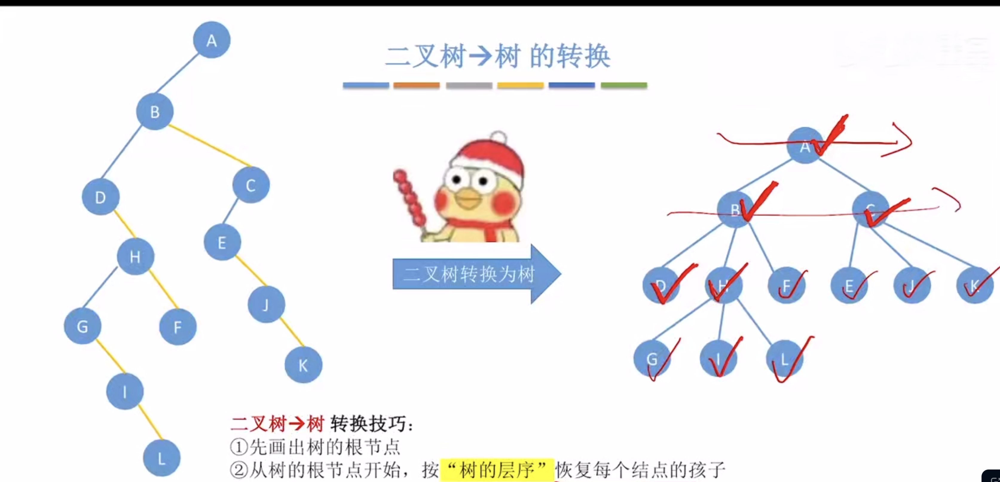
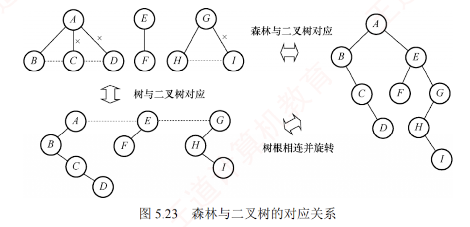

---

## 树的存储结构

### 双亲表示法

#### 定义

双亲表示法使用一组连续的存储空间（如数组）来存放树中的所有结点。每个结点除包含数据域外，还增设一个“**伪指针**”域，用于指示其双亲结点在数组中的下标。如图 5.20 所示，根结点位于下标 0 处，其双亲域设为 -1，表示无双亲。


#### 结构体定义

```text
#define MAX_TREE_SIZE 100        //树中最多结点数
typedef struct{                 //树的结点定义
    ElemType data;              //数据元素
    int parent;                 //双亲位置域
}PTNode;
typedef struct{                 //树的类型定义
    PTNode nodes[MAX_TREE_SIZE];//双亲表示
    int n;                      //结点数
}PTree;
```

#### 双亲表示法的优缺点

双亲表示法利用了每个结点（除根结点外）有且仅有一个双亲的性质。因此，查找任意结点的双亲非常高效；  
然而，查找某结点的孩子则需**遍历整个数组**，效率较低。

#### 双亲表示法的具体应用

双亲表示法适用于找父亲多和找孩子少的场景，比如[[并查集]]


#### 区分树与二叉树的顺序存储结构
在树的双亲表示法中，数组下标用于标识结点，结点间的父子关系通过 parent 域显式记录。  
在二叉树的顺序存储结构中（如完全二叉树的数组表示），下标隐含了父子关系（例如，结点 $i$ 的左孩子为 $2i+1$，右孩子为 $2i+2$）。  
二叉树是树的特例，因此可以使用树的存储结构表示。但是，一般的树不能直接使用二叉树的顺序存储方式。
[[二叉树#顺序存储结构]]


### 孩子表示法

#### 定义
孩子表示法将每个结点的所有孩子视为一个[[线性表]]，并用[[单链表]]存储。整棵树则由 $n$ 个这样的孩子链表组成（叶结点对应空链表）。为便于访问，所有孩子链表的头指针被集中存放在一个[[顺序表]]（如数组）中，每个位置对应一个结点。图 5.21(a)展示了图 5.20(a)中树的孩子表示法。
>顺序存储与链式存储相结合


#### 结构体定义

 
#### 孩子表示法的优缺点

与双亲表示法相反，孩子表示法便于查找结点的孩子，但若要查找某结点的双亲，则需遍历所有孩子链表，检查是否包含该结点，效率较低。

#### 孩子表示法的具体应用

孩子表示法适用于找父亲少和找孩子多的场景，比如服务流程树，类似于拨打中国移动10086时展开的服务。

### 孩子兄弟表示法

#### 定义
孩子兄弟表示法也称二叉树表示法，采用**二叉链表**作为树的存储结构。每个结点包含三部分：
**数据域**、**指向第一个孩子的指针**、**指向下一个兄弟的指针**（沿此指针可依次访问该结点的所有右侧兄弟），如图 5.21(b)所示。这种结构以“**左孩子-右兄弟**”的方式，将树映射为二叉树形式。

#### 结构体定义
```text
typedef struct CSNode{
    ElemType data;                              //数据域
    struct CSNode *firstchild,*nextsibling;     //第一个孩子和右兄弟指针
}CSNode,*CSTree;
```

#### 孩子兄弟表示法的优缺点

孩子兄弟表示法具有良好的灵活性，其最大优点是能自然地将树转换为二叉树，从而复用二叉树的算法。查找孩子非常高效。然而，从当前结点高效回溯到其双亲较为困难。若在结点中增设一个 parent 指针域，则可高效查询双亲，形成一种三叉链表的存储结构。

---

## 树、森林与二叉树的转换

### 引入

二叉树和树均可用二叉链表作为存储结构。从物理结构上看，树的**孩子兄弟表示法**与二叉树的二叉链表表示法完全相同，因此可以用**同一存储结构的不同解释**将一棵树转换为二叉树。

### 树转换为二叉树

#### 转换规则

树转换为二叉树的规则：每个结点的**左指针**指向其第一个孩子；**右指针**指向其在原树中的下一个右兄弟，这个规则也被称为“**左孩子-右兄弟**”原则。  
由于根结点没有兄弟，因此由树转换而来的二叉树的根结点必无右子树，如图 5.22 所示。  
**技巧**：先在二叉树中画一个根结点，再按照树的层次顺序依次处理每一个结点


#### 画图方法

树转换为二叉树的手工画法：  
1. 在所有**兄弟结点**之间添加**连线**；  
2. 对每个结点，仅**保留**其与**第一个孩子**的连线，删除与其他孩子的连线；  
3. 以树根为轴心，**顺时针旋转 45°**，使其呈现二叉树形态。

### 森林转换为二叉树

#### 转换方法

森林是若干棵树的集合，其转换基于**单棵树**的转换方法。  
首先将森林中的每棵树分别转换为对应的二叉树；  
由于每棵转换后的二叉树根结点均无右子树，可将这些根结点视为兄弟；  
将第二棵二叉树作为第一棵二叉树根的右子树……以此类推，最终形成一棵完整的二叉树。
**技巧**：先把所有树的根结点全部画出来，在二叉树中用右指针串成糖葫芦，在按照森林的层序依次处理每一个结点 


#### 画图方法

森林转换为二叉树的手工画法：  
1. 将森林中的每棵树转换为相应的二叉树；  
2. 每棵树的根也可视为兄弟关系，在各树的根之间依次添加连线；  
3. 以第一棵树的根为轴心，顺时针旋转 45°。

**等效做法**是：先在各树的根之间添加连线，然后整体应用树转二叉树的方法处理。


### 二叉树转换为树

#### 转换规则

相当于树转换为二叉树的**逆运算**，即在二叉树中**恢复**一个结点的孩子，如果当前处理的结点有左孩子，就把左孩子和“一整串石指针糖葫芦”拆下来，按顺序挂在当前结点的下方
**技巧**：先画出树的根节点，再从树的根节点开始，按“树的层序”恢复每个结点的孩子


### 二叉树转换为森林

#### 转换规则

若给定的**二叉树非空**，则其转换为森林的规则：  
- 二叉树的根及其左子树对应第一棵树的二叉树表示；  
- 将根的右指针断开，其右子树即代表剩余森林转换后的二叉树；  
- 对右子树递归应用相同规则，不断分离出下一棵树，直至右子树为空；  
- 最后将每棵分离出的二叉树还原为普通树，即可得到原始森林。  
**技巧**：先把二叉树的根节点和“一整串右指针糖葫芦”拆下来，作为多棵树的根节点，再按“森林的层序”恢复每个结点的孩子
>此过程如图 5.23 所示。二叉树转换为树或森林的结果是唯一的。


