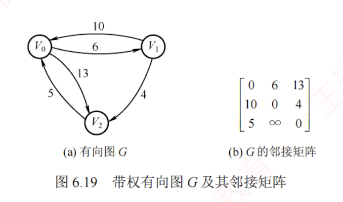
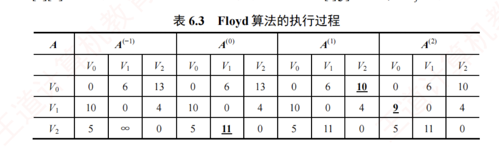
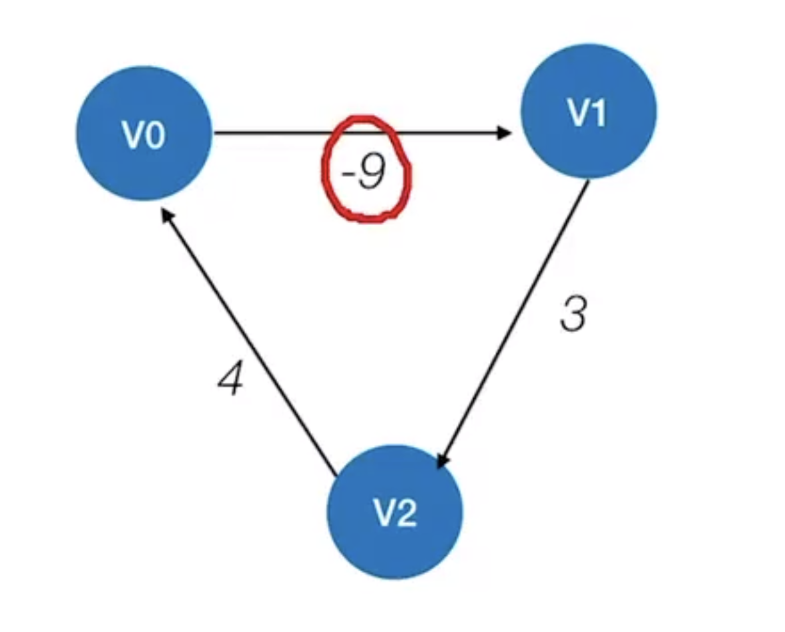

---

## Floyd 算法求各顶点之间最短路径问题

### 问题描述

给定带权有向图，对任意两个不同顶点 $v_i \ne v_j$，求解从 $v_i$ 到 $v_j$ 的最短路径及其长度。

### 算法思想

Floyd 算法的**基本思想**：  
迭代生成一系列 $n$ 阶方阵 $A^{(-1)},A^{(0)},\cdots,A^{(k)},\cdots,A^{(n-1)}$，其中 $A^{(k)}[i][j]$ 表示从顶点 $v_i$ 到 $v_j$，仅允许使用编号不超过 $k$ 的顶点作为中间顶点时的最短路径长度。  
初始时（$k=-1$），若存在从 $v_i$ 到 $v_j$ 的直接边，则 $A^{(-1)}[i][j]$ 为该边的权值；  
否则设为 $\infty$。  
特别地，对所有 $i$，令 $A^{(-1)}[i][i]=0$。  
随后，依次考虑顶点 $k$（$k=0,1,\cdots,n-1$）作为中间顶点，若经过 $v_k$ 的路径比当前记录的路径更短，则更新对应的距离。  

### 算法描述

算法的描述如下：

定义 $n$ 阶方阵序列 $A^{(-1)},A^{(0)},\cdots,A^{(n-1)}$，其中，  
$$A^{(-1)}[i][j]=arcs[i][j]$$  
$$A^{(k)}[i][j]=\mathrm{Min}{A^{(k-1)}[i][j],\ A^{(k-1)}[i][k]+A^{(k-1)}[k][j]},\ k=0,1,\cdots,n-1$$

- $A^{(0)}[i][j]$表示从 $v_i$ 到 $v_j$，仅允许使用 $v_0$ 作为中间顶点的最短路径长度；  
- $A^{(k)}[i][j]$表示从 $v_i$ 到 $v_j$，中间顶点编号不超过 $k$ 的最短路径长度。  
  >中间经过了多个之前被加入的结点
- Floyd 算法是一个**迭代**过程，每完成一次迭代，便将下一个顶点纳入可选的中间顶点集合；经过 $n$ 次迭代后，$A^{(n-1)}[i][j]$即为 $v_i$ 到 $v_j$ 的最短路径长度。  
- 最终，矩阵 $A^{(n-1)}$中的每个元素即为对应顶点对的最短路径长度。

### 图示及算法的具体执行过程

图 6.19 所示为一带权有向图 $G$ 及其邻接矩阵。应用 Floyd 算法求解所有顶点对之间的最短路径长度的过程如表 6.3 所示。**算法执行过程的说明如下**：

1. **初始化**：方阵 $A^{(-1)}[i][j]=arcs[i][j]$。

2. **第 1 轮**：以 $v_0$ 为中间顶点，检查全部顶点对 ${i,j}$。若 $A^{(-1)}[i][j] > A^{(-1)}[i][0] + A^{(-1)}[0][j]$，则将 $A^{(-1)}[i][j]$更新为 $A^{(-1)}[i][0] + A^{(-1)}[0][j]$。$A^{(-1)}[2][1]=\infty$，而 $A^{(-1)}[2][0] + A^{(-1)}[0][1]=11$，因 $\infty > 11$，故更新 $A^{(-1)}[2][1]=11$。其余元素保持不变，得到方阵 $A^{(0)}$。

3. **第 2 轮**：以 $v_1$ 为中间顶点，检查全部顶点对 ${i,j}$。$A^{(0)}[0][2]=13$，而 $A^{(0)}[0][1] + A^{(0)}[1][2]=10$，因 $13>10$，故更新 $A^{(0)}[0][2]=10$，得到方阵 $A^{(1)}$。

4. **第 3 轮**：以 $v_2$ 为中间顶点，检查全部顶点对 ${i,j}$。$A^{(1)}[1][0]=10$，而 $A^{(1)}[1][2] + A^{(1)}[2][0]=9$，更新 $A^{(1)}[1][0]=9$，最终得到方阵 $A^{(2)}$，其中每个元素 $A^{(2)}[i][j]$即为 $v_i$ 到 $v_j$ 的最短路径长度。

### 时间复杂度分析

- Floyd 算法的时间复杂度为 $O(|V|^3)$。其代码结构紧凑，仅需一个**三重循环**，无须复杂数据结构，且常数因子较小，因此在中等规模图上实际运行效率较高。

- Floyd 算法**允许图中存在负权边，但不允许存在负权环**。 
  >如图：
  >
  >该图中包含负权回路，这种图一般情况下没有最短路径，自然也就求不出来两个顶点之间的最短路径。
  
  
- Floyd 算法同样适用于**带权无向图**——只需将每条无向边视为两条方向相反、权值相同的有向边。 

- 可通过调用**单源最短路径算法**求解所有顶点对的最短路径：在边权非负的条件下，依次以每个顶点为源点运行 [[Dijkstra算法]]。Dijkstra 算法的时间复杂度为 $O(|V|^2)$，因此共需执行 $|V|$ 次，总时间复杂度为 $O(|V|^3)$，与 Floyd 算法的相同。

