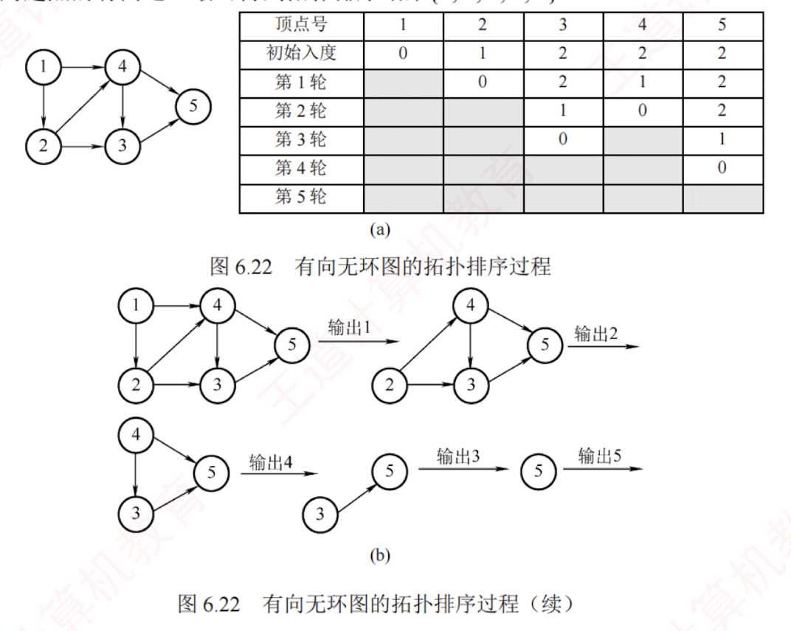

---

## 拓扑排序

### AOV网的定义

若用有向无环图表示一个工程，每个顶点代表一个活动，并用有向边 $<V_i,V_j>$表示活动 $V_i$ 必须先于活动 $V_j$ 进行的关系，则称这种**有向图为顶点表示活动的网络**，简称 AOV 网（**Activity On Vertex NetWork**）。 
在此网络中，活动 $V_i$ 是活动 $V_j$ 的直接前驱，而 $V_j$ 则是 $V_i$ 的直接后继，这种关系具有**传递性**。  
此外，任何活动都不能成为自己的前驱或后继。

### 拓扑排序的定义

在图论中，拓扑排序指的是由有向无环图的顶点构成的一个线性序列，该序列满足条件：

1. 每个顶点恰好出现一次。

2. 若存在从顶点 $A$ 到 $B$ 的路径，则在排序后的序列中，$B$ 必须排在 $A$ 之后。
   每个 AOV 网都有**一个或多个**拓扑排序序列。

### 拓扑排序方法步骤

1. 从 AOV 网中选择一个没有前驱（**入度为 0**）的顶点并输出之。
   图中可能存在多个入度为 0 的顶点，随机选择一个输出，因此拓扑序列可能不唯一。

2. 从网中删除该顶点和所有以它为起点的有向边。

3. 重复步骤①和②，直到当前 AOV 网为空或无法找到新的入度为 0 的顶点为止。  
   后一种情况表明有向图中必然存在环。


### 过程图示
图 6.22 展示了拓扑排序的过程示例，每轮选择一个入度为 0 的顶点输出，然后删除该顶点和所有以它为起点的有向边，最终得到拓扑排序结果{1, 2, 4, 3, 5}。




### 代码实现

#### 邻接表

基于**邻接表**存储结构的拓扑排序算法的实现如下：

```c
bool TopologicalSort(Graph G){
    InitStack(S);                //初始化栈，存储入度为 0 的顶点
    int i;
    for(i=0;i<G.vexnum;i++)
        if(indegree[i]==0)
            Push(S,i);           //将所有入度为 0 的顶点入栈
    int count=0;                 //计数，记录当前已经输出的顶点数
    while(!StackEmpty(S)){       //栈不空，则存在入度为 0 的顶点
        Pop(S,i);                //栈顶元素出栈
        print[count++]=i;        //输出顶点 i
        for(p=G.vertices[i].firstarc;p;p=p->nextarc){
            //将所有 i 指向的顶点的入度减 1，并且将入度减为 0 的顶点压入栈 S
            v=p->adjvex;
            if(!(--indegree[v]))
                Push(S,v);       //入度为 0，则入栈
        }
    }
    if(count<G.vexnum)
        return false;            //排序失败，有向图中有回路
    else
        return true;             //拓扑排序成功
}
```

##### 时间复杂度分析

因为输出每个顶点的同时还要删除以它为起点的边，  
所以采用**邻接表**存储时，拓扑排序的时间复杂度为 $O(|V|+|E|)$；  
采用**邻接矩阵**存储时，时间复杂度为 $O(|V|^2)$。

#### 深度优先搜索

具体实现见本节习题
之后补充###
通过深度优先搜索（DFS）也可以实现拓扑排序，其基本思路如下。对于有向无环图 $G$ 中的任意两个顶点 $u$ 和 $v$，其关系必属于以下三种情形之一：

##### 基本思路

1. 若 $u$ 是 $v$ 的祖先（存在从 $u$ 到 $v$ 的路径），则在 DFS 过程中会先访问 $u$，再递归访问 $v$；$v$ 先完成回溯，因此 $v$ 的结束时间早于 $u$，即 $u$ 的结束时间大于 $v$ 的结束时间。

2. 若 $u$ 是 $v$ 的子孙，则 $v$ 是 $u$ 的祖先，因此 $v$ 的结束时间大于 $u$ 的结束时间。

3. 若 $u$ 和 $v$ 之间不存在任何方向的路径，则它们在拓扑序列中的相对顺序可以任意。

于是，将所有顶点按 DFS 结束时间降序排列，即可得到一个合法的拓扑排序序列。

对一个 AOV 网，若采用以下步骤进行排序，则称为逆拓扑排序：

1. 从 AOV 网中选择一个没有后继（出度为 0）的顶点并输出。

2. 从网中删除该顶点和所有以它为终点的有向边。

3.  重复步骤①和②，直到当前的 AOV 网变为空为止。

用拓扑排序算法处理 AOV 网时，应注意以下几点：

1. 入度为零的顶点表示没有前驱活动，或其所有前驱活动均已执行完毕。工程可以从该顶点所代表的活动开始或继续推进。


2. 拓扑排序的结果可能不唯一。拓扑序列唯一的充要条件是：AOV 网中任意两个顶点之间都存在单向路径（任意两个活动都有明确的先后顺序）。实际判断方法是：每次输出顶点时，若当前入度为 0 的顶点都恰好只有一个，则最终拓扑序列唯一。

3. AOV 网中各顶点地位平等，其编号是人为设定的。因此，可根据拓扑排序的结果对顶点重新编号，使得新邻接矩阵成为上三角矩阵。对于一般的有向图而言，若其邻接矩阵可通过顶点重排转换为上三角矩阵，则该图一定是有向无环图，因而存在拓扑序列。