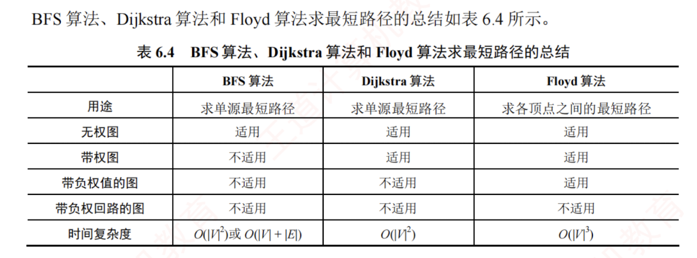

---
## 最短路径问题

求解最短路径问题的算法通常基于其**最优子结构性质**：两点间最短路径上的任意子路径，也是对应端点间的最短路径。  

图的最短路径问题一般可分为两类：  
1. **单源最短路径**——求图中某个顶点到其余各顶点的最短路径  
   - 可使用经典的 [[Dijkstra算法]]（迪杰斯特拉）求解；  
   - 如果是无权图也可以利用[[BFS求解单源最短路径问题]]。  
2. **所有顶点对之间的最短路径**  
   - 可使用 [[Floyd算法]]（弗洛伊德）求解。

## 三种算法求解最短路径问题的总结

