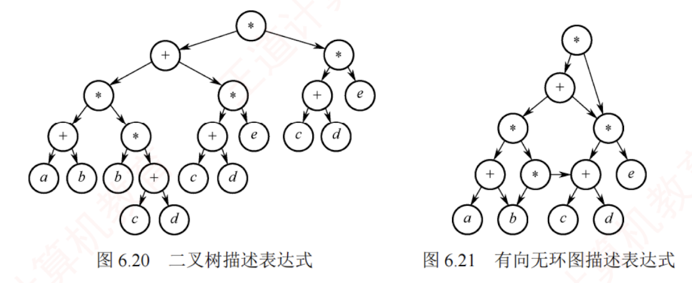
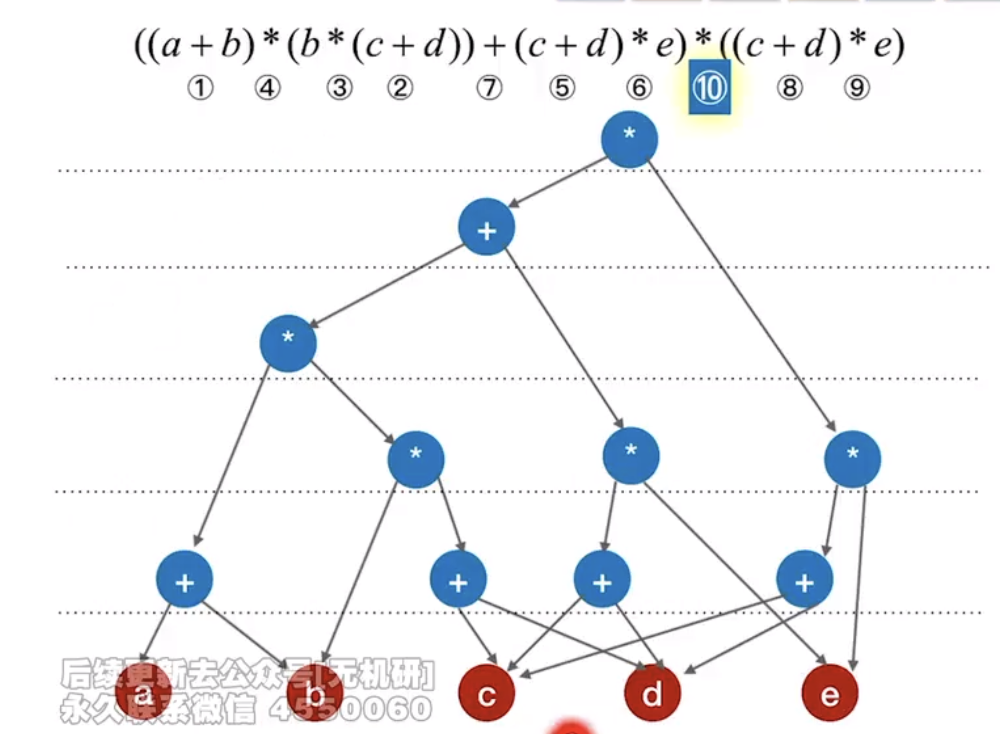

---

### 有向无环图描述表达式

**有向无环图（简称 DAG 图）是指一个不含任何有向环路的有向图。**

有向无环图是表示含有公共子表达式的代数表达式的有效工具。例如，表达式

$((a+b)_(b_(c+d))+(c+d)_e)_((c+d)*e)$

图中描述表达式利用了二叉树的[[中序遍历]]，如图 6.20 所示。  
观察该表达式，可发现存在公共子表达式，如 $(c+d)$；该子表达式在多个位置被复用，如参与构成 $(c+d)*e$ 等。  
这些重复出现的子结构会被分别存储，造成空间浪费。若采用有向无环图，公共子表达式只需存储一次，并通过多个父结点的入边共享，从而显著节省存储空间。  
图 6.21 展示了该表达式的有向无环图表示。

#### 有向无环图的构造方法

- Step 1：把各个操作数不重复地排成一排

- Step 2：标出各个运算符的生效顺序（先后顺序有点出入无所谓）

- Step 3：按顺序加入运算符，注意“分层”

##### 图示
