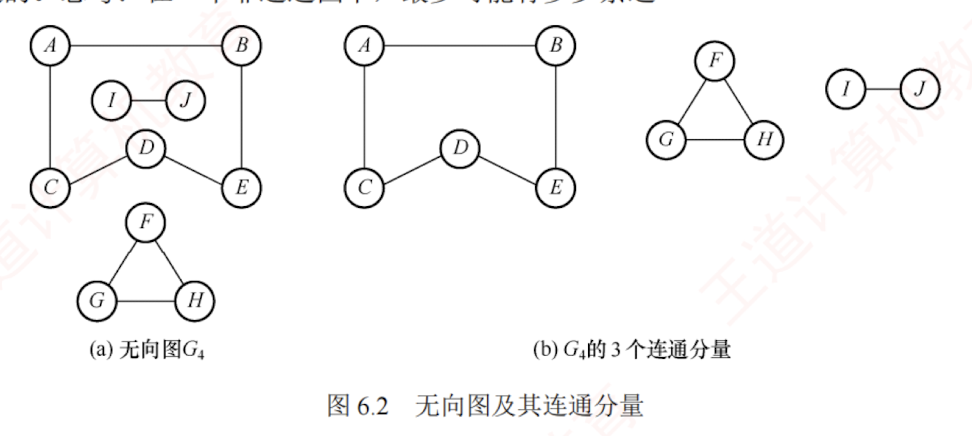

---

3．简单图、多重图

若图 $G$ 满足条件：① 不存在重复边；② 不存在顶点到自身的边，则称图 $G$ 为简单图。图 6.1 中 $G_1$ 和 $G_2$ 均为简单图。若图 $G$ 中某两个顶点之间的边数超过 1 条，并且允许顶点通过一条边与自身关联，则称图 $G$ 为多重图。多重图和简单图的定义是相对的。本书仅讨论简单图。

4．顶点的度、入度和出度

在无向图中，顶点 $v$ 的度是指依附于顶点 $v$ 的边的数量，记为 TD$(v)$。图 6.1(b)中，每个顶点的度均为 3。无向图的全部顶点的度之和等于边数的 2 倍，因为每条边与两个顶点相关联。

在有向图中，顶点 $v$ 的度分为入度和出度，入度是以顶点 $v$ 为终点的有向边的数量，记为 ID$(v)$；而出度是以顶点 $v$ 为起点的有向边的数量，记为 OD$(v)$。图 6.1(a)中，顶点 2 的出度为 2、入度为 1。顶点 $v$ 的度等于其入度与出度之和，即 TD$(v)$ = ID$(v)$ + OD$(v)$。有向图的全部顶点的入度之和与出度之和相等，并且等于边数，这是因为每条有向边都有一个起点和终点。

---

5．路径、路径长度和回路

顶点 $v_p$ 到 $v_q$ 之间的一条路径是指顶点序列 $v_p, v_{i_1}, v_{i_2}, \cdots, v_{i_m}, v_q$。路径所含边的数量称为路径长度。第一个顶点和最后一个顶点相同的路径称为回路或环。若一个图有 $n$ 个顶点，且有大于 $n-1$ 条边，则此图一定有环。

6．简单路径、简单回路

路径序列中顶点不重复出现的路径称为简单路径。除第一个顶点和最后一个顶点外，其余顶点不重复的回路称为简单回路。

7．距离

从顶点 $u$ 到 $v$ 的最短路径的长度称为从 $u$ 到 $v$ 的距离。若不存在路径，则距离为无穷大。

8．子图

设有两个图 $G=(V,E)$ 和 $G'=(V',E')$，若 $V'$ 是 $V$ 的子集，且 $E'$ 是 $E$ 的子集，则称 $G'$ 是 $G$ 的子图。若有满足 $V(G')=V(G)$ 的子图 $G'$，则称其为 $G$ 的生成子图。图 6.1 中 $G_3$ 为 $G_1$ 的子图。

注意

并非 $V$ 和 $E$ 的任何子集都能构成 $G$ 的子图，因为这样的子集可能不是图，即 $E$ 的子集中的某些边关联的顶点可能不在这个 $V$ 的子集中。

---

连通子图称为强连通分量，图 $G_1$ 的强连通分量如图 6.3 所示。思考，假设有向图拥有 $n$ 个顶点，且该图是强连通的，则最少需要多少条边？①

注意

在无向图中讨论连通性，在有向图中讨论强连通性。

11．生成树、生成森林

连通图的生成树是一个包含所有顶点的极小连通子图。若图中有 $n$ 个顶点，则其生成树恰好包含 $n-1$ 条边。这样的子图仅通过最少数量的边保持连通。对生成树而言，若移除任意一条边，都会变成非连通图；添加任何一条边则会形成一个回路。在非连通图中，每个连通分量的生成树共同构成了该图的生成森林。图 $G_2$ 的一个生成树如图 6.4 所示。

---

注意

区分极大连通子图和极小连通子图。极大连通子图要求子图必须连通，而且包含尽可能多的顶点和边；极小连通子图是既要保持子图连通又要使得边数量最少的子图。

12．边的权、网和带权路径长度

在一些图中，每条边可以被赋予一个代表某种意义的数值，称为该边的权值。这种边上带有权值的图称为带权图，也称网。路径上所有边的权值之和，称为该路径的带权路径长度。

13．完全图（也称简单完全图）

对于无向图，边的数量 $|E|$ 范围是从 0 到 $n(n-1)/2$。当边数达到最大值 $n(n-1)/2$ 时，该无向图称为完全图，意味着任意两个顶点之间都有一条边相连。对于有向图，$|E|$ 的范围是从 0 到 $n(n-1)$，有 $n(n-1)$ 条弧的有向图称为有向完全图，即任意两个顶点之间都存在方向相反的两条弧。图 6.1 中 $G_2$ 为无向完全图，而 $G_3$ 为有向完全图。

14．稠密图、稀疏图

边数相对较少的图称为稀疏图，反之称为稠密图。这两个概念本身较为模糊，稀疏和稠密常常是相对而言的。一般认为，当图 $G$ 满足 $|E|<|V|\log_2|V|$ 时，可视为稀疏图。

15．有向树

一个顶点的入度为 0，其余顶点的入度均为 1 的有向图，称为有向树。

---

9．连通、连通图和连通分量

在无向图中，若从顶点 $v$ 到 $w$ 存在路径，则称 $v$ 和 $w$ 是连通的。若图 $G$ 中任意两个顶点都是连通的，则称图 $G$ 为连通图；否则为非连通图。无向图中的极大连通子图称为连通分量，在图 6.2(a)中，图 $G_4$ 的 3 个连通分量如图 6.2(b)所示。假设一个图有 $n$ 个顶点，若边数少于 $n-1$，则此图必然是非连通的。思考：在一个非连通图中，最多可能有多少条边？①

【图6.2(a) 无向图 $G_4$】  
【图6.2(b) $G_4$ 的 3 个连通分量】

图 6.2 无向图及其连通分量

10．强连通图、强连通分量

在有向图中，如果一对顶点 $v$ 和 $w$，从 $v$ 到 $w$ 和从 $w$ 到 $v$ 之间都有路径，则称这两个顶点是强连通的。如果图中任意一对顶点都是强连通的，则称此图为强连通图。有向图中的极大强【看不清】

---

1．有向图

若 $E$ 是有向边（也称弧）的有限集合，则图 $G$ 称为有向图。弧是顶点的有序对，记为 $<v,w>$，其中，$v$ 称为弧尾，$w$ 称为弧头，表示从 $v$ 到 $w$ 的有向边，也称 $v$ 邻接到 $w$。

图 6.1(a)所示的有向图 $G_1$ 可表示为

$$  
G_1=(V_1,E_1)  
$$

$$  
V_1={1,2,3}  
$$

$$  
E_1={<1,2>,<2,1>,<2,3>}  
$$

2．无向图

若 $E$ 是无向边（简称边）的有限集合，则图 $G$ 称为无向图。边是顶点的无序对，记为 $(v,w)$ 或 $(w,v)$。可以说 $w$ 和 $v$ 互为邻接点，或称边 $(v,w)$ 和 $v,w$ 相关联。

图 6.1(b)所示的无向图 $G_2$ 可表示为

$$  
G_2=(V_2,E_2)  
$$

$$  
V_2={1,2,3,4}  
$$

$$  
E_2={(1,2),(1,3),(1,4),(2,3),(2,4),(3,4)}  
$$
