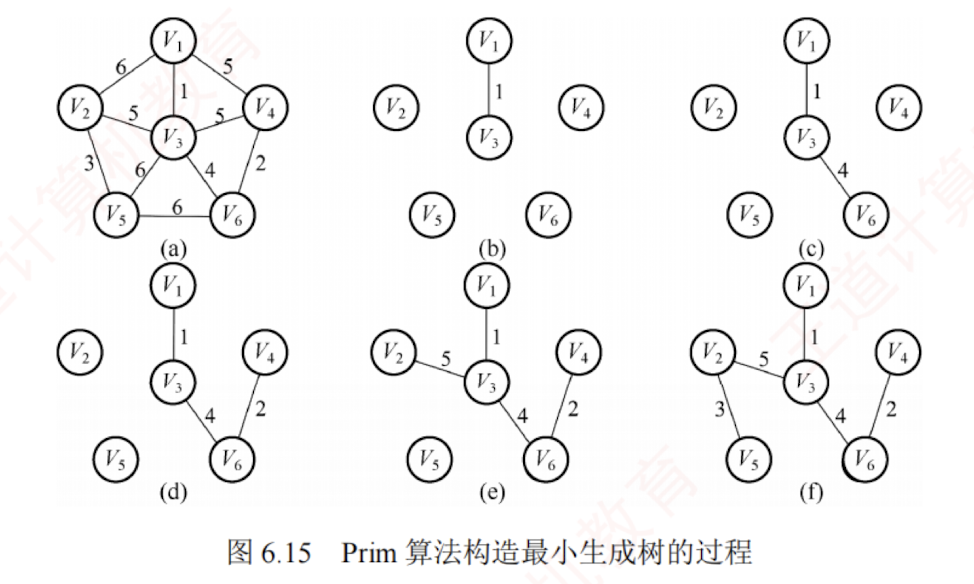

---

## 最小生成树

#### 定义

一个连通图的生成树包含了图的所有顶点，并且仅包含尽可能少的边。  
对生成树来说，若移除一条边，则会使该生成树变成非连通图；  
若增加一条边，则会在图中形成一条回路。

对于带权连通无向图 $G$ 而言，不同的生成树其总权重（树中所有边的权值之和）可能不同。**具有最小总权重的生成树称为图 $G$ 的最小生成树**（Minimum-Spanning-Tree，**MST**）。

#### 最小生成树的特性

1. **若图 $G$ 中含有权值相同的边，则最小生成树可能不唯一**，即可能存在多个不同的最小生成树。  
   **当图 $G$ 中所有边的权值互不相同时，最小生成树是唯一的**。此外，若无向连通图 $G$ 本身的边数等于顶点数减 1（$G$ 本身就是一棵树），则其最小生成树就是它本身。

2. 虽然最小生成树可能不唯一，但**所有最小生成树的总权重都是相同的**，且为最小值。

3. **最小生成树的边数等于顶点数减 1。**
#### 注意·

#### 构造最小生成树的方法

构造最小生成树的方法有多种，但大多数算法都基于这样一个**核心性质**：  
假设 $G=(V,E)$ 是一个带权连通无向图，$U$ 是顶点集 $V$ 的一个非空子集。若 $(u,v)$ 是一条权值最小的边，其中 $u\in U$，$v\in V-U$，则图 $G$ 中必存在一棵包含边 $(u,v)$ 的最小生成树。

基于此原理的主要算法包括**Prim 算法和 Kruskal 算法**，二者均采用**贪心策略**。

#### 最小生成树通用算法框架：

```text
GENERIC_MST(G) {
    T=NULL;
    while T 未形成一棵生成树;
        do 找到一条最小代价边(u,v)并且加入T后不会产生回路;
            T=T∪(u,v);
}
```

**通过逐步添加边来逐渐构造一棵生成树**，下面介绍实现上述框架的两种经典算法。


#### Prim 算法

Prim（普里姆）算法在执行过程上与求解单源最短路径的 Dijkstra 算法较为相似。

##### 算法思想

初始时，从图中任取一个顶点加入树 $T$，此时 $T$ 仅包含该顶点。接着，选择一个与当前 $T$ 中顶点集合距离最近的顶点，并将该顶点及其相连的最小权值边加入 $T$。每执行一次此操作，$T$ 中的顶点数和边数各增加 1。重复这一过程，直到图中所有顶点都被并入 $T$ 为止。最终得到的 $T$ 即为最小生成树，且其中必然含有 $n-1$ 条边。图 6.15 展示了 Prim 算法构造最小生成树的过程。


##### Prim 算法步骤

- 假设 $G={V,E}$ 是连通图，其最小生成树 $T=(U,E_T)$，$E_T$ 是 $T$ 中的边集合。

- 初始化：向空树 $T=(U,E_T)$ 中添加图 $G$ 的任意一个顶点 $u_0$，使得 $U={u_0}$，$E_T=\varnothing$。

- 循环（重复，直至 $U=V$）：从图 $G$ 中选择满足条件 ${(u,v)\mid u\in U,\ v\in V-U}$ 且具有最小权值的边 $(u,v)$，将其加入树 $T$，并更新 $U=U\cup{v}$，$E_T=E_T\cup{(u,v)}$。

##### Prim 算法的简单代码实现

```text
void Prim(G,T){
    T=∅;                 //初始化空树
    U={w};               //添加任意一个顶点w
    while((V-U)!=∅){     //若树中不含全部顶点
        设(u,v)是使u∈U 与 v∈(V-U)，且权值最小的边;
        T=T∪{(u,v)};     //边归入树
        U=U∪{v};         //顶点归入树
    }
}
```

##### 时间复杂度分析

在 Prim 算法中，每步都从当前已构建的树向外扩展一条最短边，逐步生长出整棵最小生成树。  
该算法的时间复杂度为 $O(|V|^2)$，与边数 $|E|$ 无关，因此特别适用于求解**边稠密**图的最小生成树。  
虽然采用其他方法能改进 Prim 算法的时间复杂度，但会增加实现的复杂度。


#### Kruskal 算法


与 Prim 算法从一个顶点开始扩展最小生成树的方式不同，Kruskal（克鲁斯卡尔）算法采用按边的权值递增次序选择合适的边来构造最小生成树的方法。

##### 算法思想

初始时，图 $T={V,{}}$ 包含全部 $n$ 个顶点，但不含任何边，每个顶点自成一个连通分量。  
然后按照边的权值从小到大的顺序，依次考察各条边：  
如果当前边连接的两个顶点属于 $T$ 中不同的连通分量（可通过并查集判断），则将该边加入 $T$；  
否则，舍弃此边，继续考察下一条权值最小的边。  
重复这一过程，直到所有顶点都属于同一个连通分量，此时得到的 $T$ 即为最小生成树。图 6.16 展示了 Kruskal 算法构造最小生成树的过程。


##### Kruskal 算法步骤

- 假设 $G=(V,E)$ 是连通图，其最小生成树 $T=(U,E_T)$，$E_T$ 是 $T$ 中的边集合。

- 初始化：$U=V$，$E_T=\varnothing$。即每个顶点构成一棵独立的树，$T$ 此时是一个仅含 $|V|$ 个顶点的森林。

- 循环（重复，直至 $T$ 成为一棵树）：按照边权值递增的顺序，从 $E-E_T$ 中选择一条边。若该边加入 $T$ 后不构成回路，则将其加入 $E_T$；否则舍弃，直到 $E_T$ 包含 $n-1$ 条边为止。


##### Kruskal 算法的简单代码实现

```text
void Kruskal(V,T){
    T=V;                         //初始化树T，仅含顶点
    numS=n;                      //连通分量数
    while(numS>1){               //若连通分量数大于1
        从E中取出权值最小的边(v,u);
        if(v 和 u 属于T中不同的连通分量){
            T=T∪{(v,u)};         //将此边加入生成树中
            numS--;              //连通分量数减1
        }
    }
}
```

##### 时间复杂度分析

在 Kruskal 算法中，每当选择一条连接两棵不同树的边时，这两棵树将通过这条边合并为一棵更大的树，随着算法的进行，整个森林逐渐合并成一棵树。  
考虑到算法效率，在最坏情况下需要对所有的 $|E|$ 条边各扫描一次。  
通常，边会存储在一个堆（见第 7 章）中，每次从中选出最小权值的边所需时间为 $O(\log_2|E|)$。  
同时，使用**并查集**来快速确定两个顶点是否属于同一集合的时间复杂度为 $O(\alpha(|V|))$，这里 $\alpha(|V|)$ 增长极其缓慢，可视为常数。  
因此，Kruskal 算法的总时间复杂度为 $O(|E|\log_2|E|)$，不依赖于 $|V|$，这使得它特别适合于处理**边稀疏但顶点较多**的图。
[[并查集]]


## 最短路径


求解最短路径问题的算法通常基于其**最优子结构性质**：两点间最短路径上的任意子路径，也是对应端点间的最短路径。  
图的最短路径问题一般可分为两类：  
一是**单源最短路径**——求图中某个顶点到其余各顶点的最短路径，可使用经典的 Dijkstra（迪杰斯特拉）算法求解；如果是无权图也可以使用广度优先搜索算法求解。  
二是**所有顶点对之间的最短路径**，可使用 Floyd（弗洛伊德）算法求解。

### 单源最短路径问题

#### 广度优先搜素（BFS）算法

广度优先搜索算法适用于求解**无权图**的最短路径。当图是带权图时，从一个顶点 $v_0$ 到图中任意另一个顶点 $v_i$ 的路径上所有边的权值之和，称为该路径的带权路径长度；其中，带权路径长度最小的路径（可能存在多条）称为**最短路径**。  
[[图的遍历#广度优先搜索]]


#### Dijkstra 算法求单源最短路径问题

##### 算法说明

Dijkstra 算法使用一个**集合 $S$** 记录已确定最短路径的顶点。  
初始时，将源点（顶点 0）放入 $S$；  
每当将一个新顶点 $i$ 加入 $S$ 后，需更新源点到所有尚未确定最短路径的顶点（集合 $V-S$ 中的顶点）的当前最短路径长度。  
算法执行过程中维护以下**三个辅助数组**：

- `final[]`：标记各顶点是否已找到最短路径（是否属于集合 $S$）。
    
- `dist[]`：记录从源点到各顶点的当前最短路径长度。初始化时，若存在从源点到顶点 $i$ 的直接边，则 `dist[i]` 为该边的权值，否则置为 $\infty$。
    
- `path[]`：`path[i]` 存储从源点到顶点 $i$ 的最短路径。算法结束后，可通过 `path[]` 数组回溯，重构出完整的最短路径。
    
假设源点为顶点 0，集合 $S$ 初始仅含顶点 0。图以邻接矩阵 `arcs` 表示，其中 `arcs[i][j]` 为有向边 $<i,j>$ 的权值；若该边不存在，则 `arcs[i][j]` 为 $\infty$。

##### Dijkstra 算法的步骤如下（暂不考虑对 `path[]` 的操作）：

1. **初始化**：集合 $S={0}$，`dist[]` 的初始值为 `dist[i]=arcs[0][i]`，$i=1,2,\cdots,n-1$。  
2. **选择最短路径顶点**：从不在 $S$ 中的顶点集合 $(V-S)$ 中选出顶点 $j$，使得 `dist[j]` 最小，此时，顶点 $j$ 即为当前从源点出发的最短路径的终点，将其加入集合 $S$。  
3. **松弛操作**：对每个从顶点 $j$ 出发的邻接顶点 $k$（`arcs[j][k]` $\ne \infty$），若 `dist[j] + arcs[j][k] < dist[k]`，则更新 `dist[k] = dist[j] + arcs[j][k]`。  
4. 重复步骤 2~3共 $n-1$ 次，直至所有顶点都包含在集合 $S$ 中。

##### 举例

每个新顶点加入集合 $S$ 后，都可能发现到达其他尚未确定最短路径顶点的更短路径，从而需要更新相应的 `dist[]` 值。以右图为例，设源点为 $v_0$，初始时 $S={v_0}$，`dist[1]=3`，`dist[2]=7`。将 $v_1$ 加入集合 $S$ 后，发现路径 $v_0\to v_1\to v_2$ 的长度为 4（`dist[1] + arcs[1][2] = 3 + 1 = 4`），小于原来的 7，因此将 `dist[2]` 更新为 4。

##### Dijkstra 算法与 Prim 算法有何异同之处？


##### 算法过程举例
对图 6.17 中的图应用 Dijkstra 算法求从顶点 1 出发到其余各顶点的最短路径的过程，如表 6.2 所示。算法执行过程的说明如下。


1. 初始化：集合 $S$ 初始为 ${v_1}$，从 $v_1$ 可达 $v_2$ 和 $v_5$，不可达 $v_3$ 和 $v_4$，因此 `dist[]` 数组的初始值为 `dist[2]=10`，`dist[3]=\infty`，`dist[4]=\infty`，`dist[5]=5`。

2. 第 1 轮：选出最小值 `dist[5]`，将 $v_5$ 加入集合 $S$，此时已确定 $v_1$ 到 $v_5$ 的最短路径。检查从 $v_5$ 出发的邻接边：$v_5$ 可达 $v_2$，$v_1\to v_5\to v_2$ 的长度为 8，小于当前 `dist[2]=10`，更新 `dist[2]=8`；$v_5$ 可达 $v_3$，$v_1\to v_5\to v_3$ 的长度为 14，更新 `dist[3]=14`；$v_5$ 可达 $v_4$，$v_1\to v_5\to v_4$ 的长度为 7，更新 `dist[4]=7`。

3. 第 2 轮：选出最小值 `dist[4]`，将 $v_4$ 加入集合 $S$。检查从 $v_4$ 出发的邻接边：$v_4$ 不可达 $v_2$，`dist[2]` 不变；$v_4$ 可达 $v_3$，$v_1\to v_5\to v_4\to v_3$ 的长度为 13，小于当前 `dist[3]=14`，更新 `dist[3]=13`。

4. 第 3 轮：选出最小值 `dist[2]`，将 $v_2$ 加入集合 $S$。检查从 $v_2$ 出发的邻接边：$v_2$ 可达 $v_3$，$v_1\to v_5\to v_2\to v_3$ 的长度为 9，小于当前 `dist[3]=13`，更新 `dist[3]=9`。

5. 第 4 轮：选出唯一最小值 `dist[3]`，将 $v_3$ 加入集合 $S$，此时，所有顶点均已包含在集合 $S$ 中。


##### 时间复杂度分析

1. 使用**邻接矩阵**表示图，并采用线性扫描 `dist[]` 查找最小值时，Dijkstra 算法的时间复杂度为 $O(|V|^2)$。  
2. 若改用**带权邻接表**，虽然松弛操作的总代价可降至 $O(|E|)$，但由于查找最小 `dist[]` 值仍需 $O(|V|)$ 时间，总时间复杂度仍为 $O(|V|^2)$。即使只需求解从源点到某一个特定顶点的最短路径，在最坏情况下仍需处理所有顶点，因此时间复杂度不变，仍为 $O(|V|^2)$。

##### 注意

Dijkstra 算法不适用于存在负权边的图。该算法基于**贪心策略**，**一旦顶点被加入集合 $S$，便不再更新其最短路径**。然而，若图中存在负权边，后续路径可能通过负权边“绕回”已确定的顶点，从而发现更短路径，而 Dijkstra 算法无法察觉这一变化，导致结果错误。例如，对于图 6.18 所示的带权有向图，Dijkstra 算法可能无法得到正确的最短路径。
