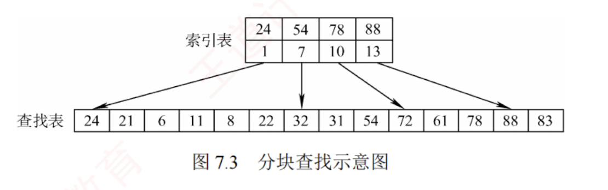

---

## 分块查找

分块查找也称索引顺序查找，它吸取了顺序查找和折半查找各自的优点，既有良好的动态性，又支持较快的查找效率。

### 基本思想

分块查找的基本思想是：将查找表划分为若干子块。块内元素可以无序，但**块间必须有序**，即任意前一块的最大关键字小于后一块中的所有关键字。  
同时，建立一个**索引表**，其中每个元素包含对应块的**最大关键字**和该块的**起始地址**，且索引表按最大关键字有序排列。

### 查找步骤

分块查找过程分为两步：  
1. 第一步在索引表中确定待查记录所在的块（可采用顺序查找或折半查找）；  
2. 第二步在目标块内进行顺序查找。

### 举例
例如，关键码集合为{88,24,72,61,21,6,32,11,8,31,22,83,78,54}，可按关键码值24,54,78,88将其划分为4个块，并建立相应的索引表，如图7.3所示。

### 平均查找长度的计算

分块查找的平均查找长度等于**索引查找的平均长度与块内查找的平均长度之和**。设索引查找和块内查找的平均查找长度分别为 $L_I$ 和 $L_S$，则分块查找的平均查找长度为

$$  
ASL=L_I+L_S  
$$

#### 等概率情况
若将长度为 $n$ 的查找表均匀地分为 $b$ 块，每块包含 $s$ 个记录（$n=bs$），并在**等概率**假设下对索引表和块内均采用顺序查找，则平均查找长度为

$$  
ASL=L_I+L_S=\frac{b+1}{2}+\frac{s+1}{2}=\frac{s^2+2s+n}{2s}  
$$

此时，当块大小 $s$ 取最优值（$s=\sqrt{n}$），则平均查找长度达到最小值 $\sqrt{n}+1$。

### 总结
尽管索引表占用了额外的存储空间，且索引查找引入了一定的系统开销，但由于分块结构限制了块内查找的范围，分块查找的总体效率仍显著优于普通的顺序查找。