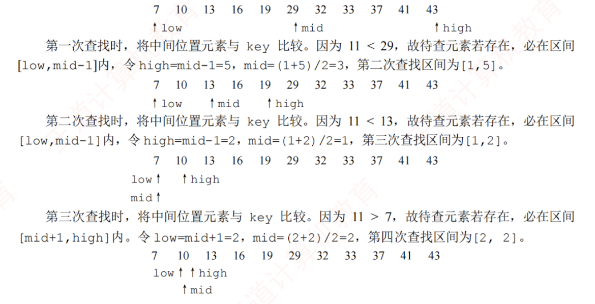

---

## 折半查找

折半查找也称**二分查找**，它仅适用于关键字**有序的顺序表**。

### 基本思想
折半查找的**基本思想**：  
1. 首先将给定值 key 与表中中间位置的元素进行比较，若相等，则查找成功，返回该元素的存储位置；
2. 若不相等，则待查元素只能位于中间元素以外的前半部分或后半部分（例如，当表按升序排列时，若 key 大于中间元素，则待查元素只可能在后半部分），随后在缩小的范围内重复上述过程，直到找到目标元素，或确定表中不存在该元素为止，此时返回查找失败信息。  
### 算法实现

```c
int Binary_Search(SSTable L,ElemType key){
    int low=0,high=L.TableLen-1,mid;
    while(low<=high){
        mid=(low+high)/2;           //取中间位置
        if(L.elem[mid]==key)
            return mid;             //查找成功则返回所在位置
        else if(L.elem[mid]>key)
            high=mid-1;             //从前半部分继续查找
        else
            low=mid+1;              //从后半部分继续查找
    }
    return -1;                      //查找失败，返回-1
}
```

在选取中间结点时，既可以采用**向下取整**，也可以采用**向上取整**。  
但每次查找必须采用相同的取整方式。

### 算法过程

例如，已知 11 个元素的有序表{7,10,13,16,19,29,32,33,37,41,43}，要查找值为 11 和 32 的元素，指针 low 和 high 分别指向当前查找区间的下界和上界，mid 指向中间位置（low+high）/2。下面说明查找 11 的过程：



折半查找的过程可用图 7.2 所示的判定树来描述，圆形结点表示表中存在的记录，结点值为其关键字；最底层的方形结点为失败结点，表示查找失败的区间。从判定树可以看出：查找成功时的查找长度等于从根结点到目的结点的路径上的结点数；查找失败时的查找长度等于从根结点到对应失败结点的父结点的路径上的结点数。该判定树满足性质：任一结点的值大于其左子树中所有结点的值，小于其右子树中所有结点的值。若有序表包含 $n$ 个元素，则对应的判定树有 $n$ 个圆形非叶结点和 $n+1$ 个方形叶结点。显然，该判定树是一棵平衡二叉树（见 7.3.2 节）。

---

由上述分析可知，折半查找的比较次数最多不超过判定树的高度。在等概率查找的情况下，查找成功的平均查找长度为

$$  
ASL=\frac{1}{n}\sum_{i=1}^{n} l_i=\frac{1}{n}(1\times1+2\times2+\cdots+h\times2^{h-1})=\frac{n+1}{n}\log_2(n+1)-1\approx \log_2(n+1)-1  
$$

其中，$h$ 为树的高度。当元素个数为 $n$ 时，树高 $h=\lceil \log_2(n+1)\rceil$。因此，折半查找的时间复杂度为 $O(\log_2 n)$，平均效率显著高于顺序查找。

以图 7.2 所示的判定树为例（对应 11 个元素），查找成功的平均查找长度为 $ASL=(1\times1+2\times2+3\times4+4\times4)/11=3$，查找失败的平均查找长度为 $ASL=(3\times4+4\times8)/12=11/3$。

考点追踪▶ 折半查找的适用场景（2024）

由于折半查找需要能够随机访问任意位置的元素，以便快速定位中间元素并缩小区间，因此它仅适用于顺序存储结构，不适用于链式存储结构，且要求表中元素按关键字有序排列。