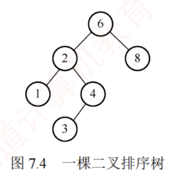
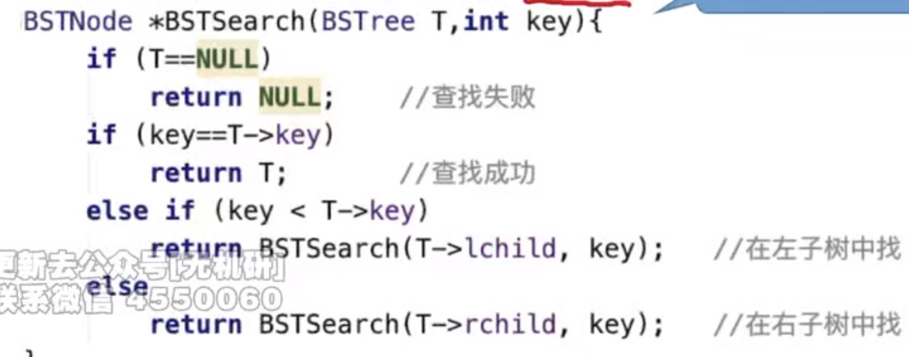
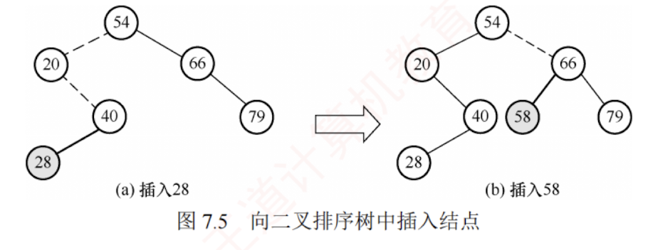
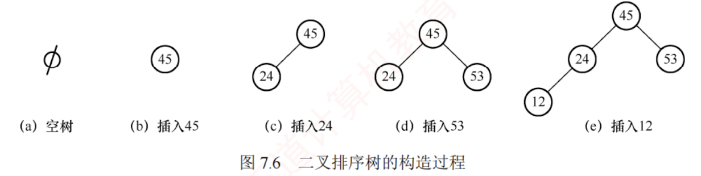
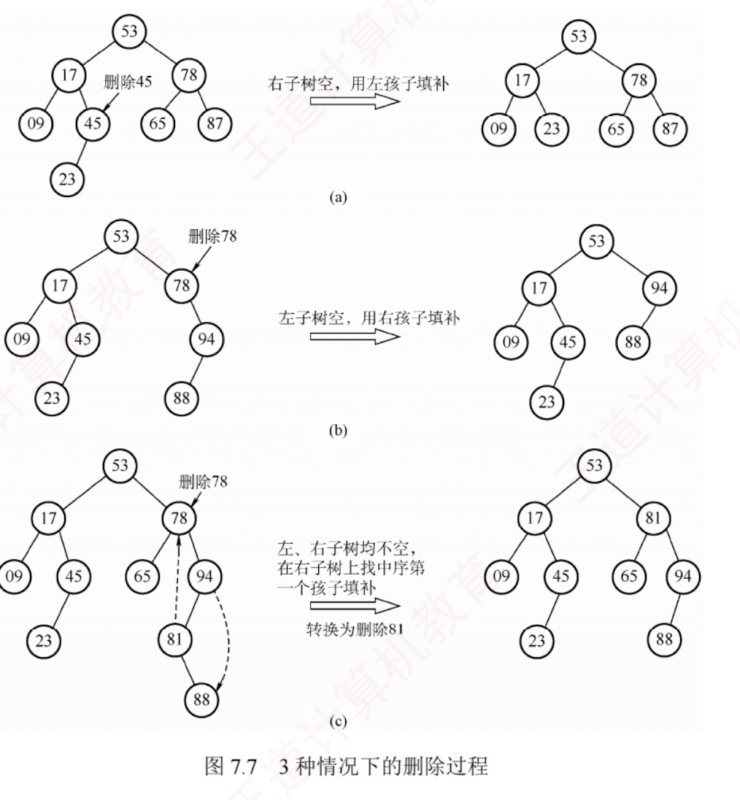
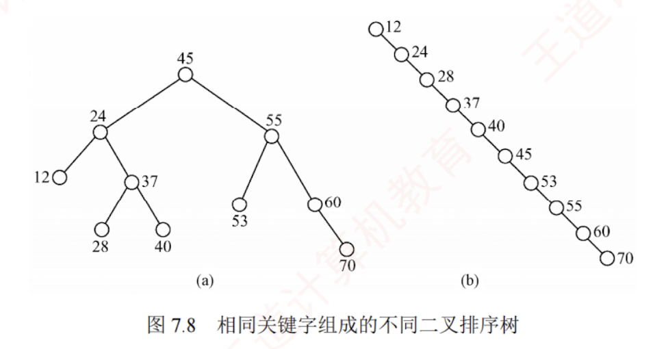

---
### 二叉排序树（BST）

构造一棵二叉排序树的主要目的并非直接输出有序序列，而是利用其有序结构支持高效的**动态查找、插入和删除**操作。这种非线性结构有利于实现快速的数据访问。


#### 二叉排序树的定义


二叉排序树（也称**二叉查找树**）或者是一棵**空树**，或者是具有下列特性的二叉树：

1. 若左子树非空，则左子树上所有结点的关键字均小于根结点的关键字。
    
2. 若右子树非空，则右子树上所有结点的关键字均大于根结点的关键字。
    
3. 左右子树也分别是一棵二叉排序树。
    

基于上述定义，对二叉排序树进行[[中序遍历]]可以得到一个**递增的有序关键字序列**。例如，图7.4所示二叉排序树的中序遍历序列为 1, 2, 3, 4, 6, 8。



#### 二叉排序树的查找

二叉排序树的查找是从根结点开始，逐层向下比较并选择左/右子树的搜索过程。  
若二叉排序树非空，先将给定关键字与根结点的关键字比较：若相等，则查找成功；若不等，小于根结点的关键字，则在根结点的左子树上查找，否则在根结点的右子树上查找。  
这一过程具有天然的**递归**结构，也可以用**循环**实现。  
##### 循环代码实现
以下是用循环实现二叉排序树查找的代码示例：

```c
BSTNode *BST_Search(BiTree T,ElemType key){
    while(T!=NULL&&key!=T->data){   //若树空或等于根结点值，则结束循环
        if(key<T->data) T=T->lchild;   //小于，则在左子树上查找
        else T=T->rchild;              //大于，则在右子树上查找
    }
    return T;
}
```

例如，在图7.4中查找关键字为 4 的结点。首先 4 与根结点 6 比较。因为 4<6，所以在根结点 6 的左子树中继续查找。因为 4>2，故在结点 2 的右子树中继续查找，该子树的根结点即为 4，查找成功。

##### 递归代码实现
同样，二叉排序树的查找也可用**递归**算法实现，其实现较为简单，但由于递归可能导致较大的栈空间开销，执行效率较低。


#### 二叉排序树的插入

二叉排序树作为一种**动态树表**，其结构通常不是一次性生成的，而是在查找过程中动态构建：**当查找失败（树中不存在关键字等于给定值的结点）时，才执行插入操作**。

##### 插入结点的过程  
若原二叉排序树为空，则将新结点作为根结点直接插入；  
否则，从根结点开始比较，若关键字 k 小于当前结点的关键字，则在左子树中继续查找并插入；  
若 k 大于当前结点的关键字，则在右子树中继续查找并插入。  
新插入的结点在插入完成后一定是一个**叶结点**，且恰好是查找失败时所访问的**最后一个结点的左孩子或右孩子**。  
如图 7.5 所示，在一棵二叉排序树中依次插入结点 28 和 58，虚线所示路径即为每次插入前的查找路径。


##### 插入操作的算法描述

二叉排序树插入操作的算法描述如下：

```c
int BST_Insert(BiTree &T,KeyType k){
    if(T==NULL){                     //原树为空，新插入的记录为根结点
        T=(BiTree)malloc(sizeof(BSTNode));
        T->data=k;
        T->lchild=T->rchild=NULL;
        return 1;                    //返回 1，插入成功
    }
    else if(k==T->data)              //树中存在相同关键字的结点，插入失败
        return 0;
    else if(k<T->data)               //插入 T 的左子树
        return BST_Insert(T->lchild,k);
    else                             //插入 T 的右子树
        return BST_Insert(T->rchild,k);
}
```

#### 二叉排序树的构造

从一棵空树开始，依次将给定元素插入二叉排序树的合适位置（重复关键字将被忽略）。设插入的关键字序列为{45, 24, 53, 45, 12, 24}，则生成的二叉排序树如图 7.6 所示。



##### 构造算法的描述

构造二叉排序树的算法描述如下：

```c
void Creat_BST(BiTree &T,KeyType str[],int n){
    T=NULL;          //初始时 T 为空树
    int i=0;
    while(i<n){      //依次将每个关键字插入二叉排序树
        BST_Insert(T,str[i]);
        i++;
    }
}
```
>需要调用二叉排序树的插入操作
#### 二叉排序树的删除

在二叉排序树中删除一个结点时，不能把以该结点为根的子树都删除，而必须将该结点从存储结构中摘下，并重新连接因删除操作而断裂的链表，同时确保整棵树仍满足二叉排序树的性质。

##### 删除操作可能遇到的三种情形
删除操作需根据被删结点的不同情况分别处理，具体分为以下三种情形：  
1. 若被删结点 z 是**叶结点**，则直接删除即可，不会破坏二叉排序树的性质。  
2. 若结点 z 仅有一棵非空子树（**左子树或右子树**），则将其唯一的子树上移，作为 z 的父结点的新子树，从而替代 z 的位置。  
3. 若结点 z **同时具有左右两棵子树**，则可用 z 的**直接后继或直接前驱**（分别为中序遍历中的下一个或上一个结点）来替代 z。替换完成后，再从树中删除该直接后继（或前驱）。由于直接后继（或前驱）至多只有一个子树，这样就转化为第①或第②种情况。

##### 图示


思考：若在二叉排序树中删除某结点，再重新插入，所得的二叉排序树是否与原树相同？

#### 二叉排序树的查找效率分析

二叉排序树的查找效率主要取决于树的高度。若左右子树高度之差的绝对值不超过 1（[[平衡二叉树]]），其平均查找长度为 $O(\log_2 n)$。  
在最坏情况下，若构造二叉排序树的输入序列是有序的，则会形成一个只有右孩子（或只有左孩子）的单支树，此时树的高度为 $n$，性能显著下降，平均查找长度退化为 $(n+1)/2$，如图 7.8(b)所示。



在等概率情况下，图 7.8(a)查找成功的平均查找长度为  
$$ASL_a=(1+2\times2+3\times4+4\times3)/10=2.9$$  
而图 7.8(b)查找成功的平均查找长度为  
$$ASL_b=(1+2+3+4+5+6+7+8+9+10)/10=5.5$$
##### 二叉排序树与二分查找的对比
1. 从查找过程来看，二叉排序树与二分查找相似。就**平均时间性能**而言，二者相近。  
   但**二分查找所对应的判定树是唯一的**，  
   而由相同关键字集合可能生成不同的二叉排序树——**其具体形态取决于关键字的插入顺序**，如图 7.8 所示。


2. 就维护表的**有序性**而言，二叉排序树无须移动结点，仅需修改指针即可完成插入和删除操作，平均时间复杂度为 $O(\log_2 n)$。  
   而二分查找的对象是**有序顺序表**，若需执行插入或删除操作，必须移动大量元素，时间复杂度为 $O(n)$。  
   因此，当表为**静态查找表**时，宜采用顺序表存储并使用二分查找；若表为**动态查找表**（需频繁插入或删除），则应选择二叉排序树作为其逻辑结构。