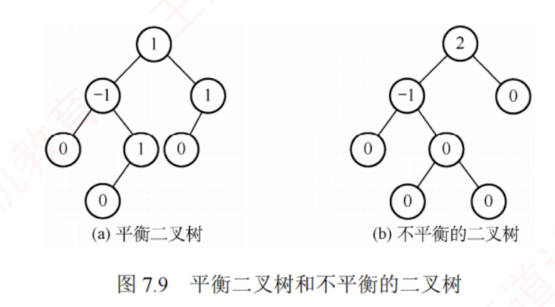
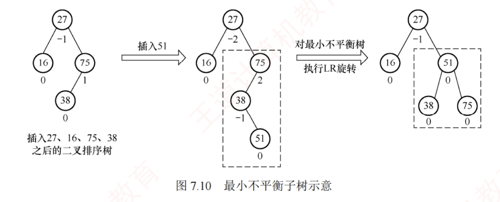
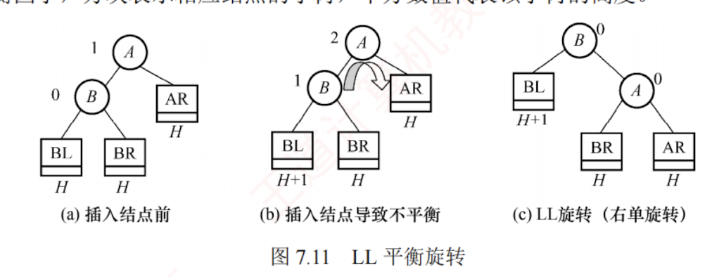
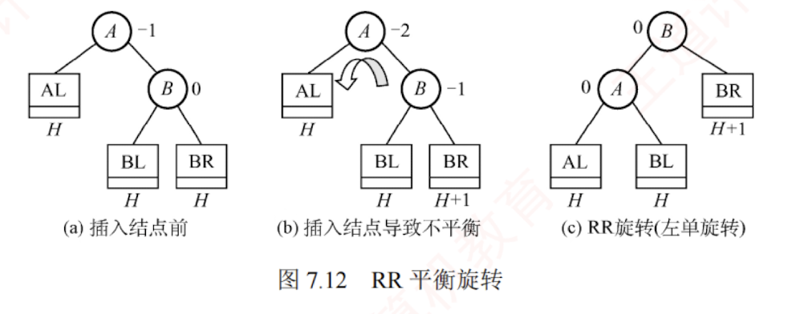
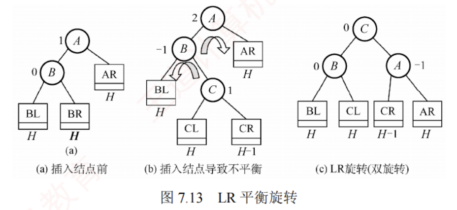
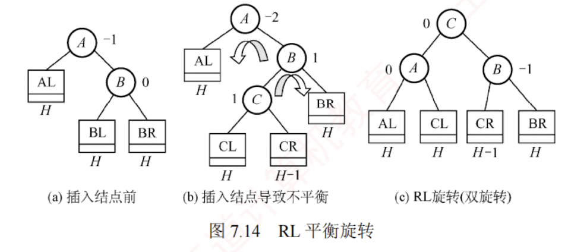
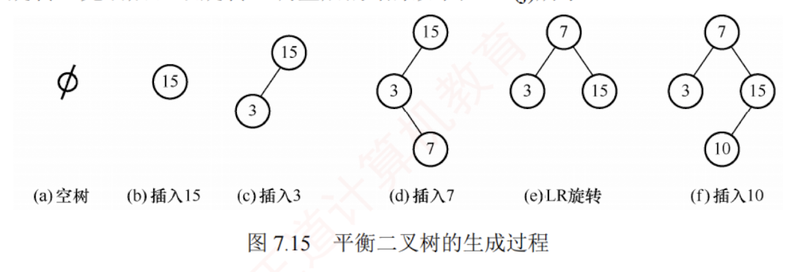
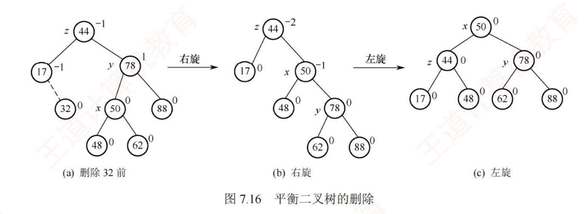
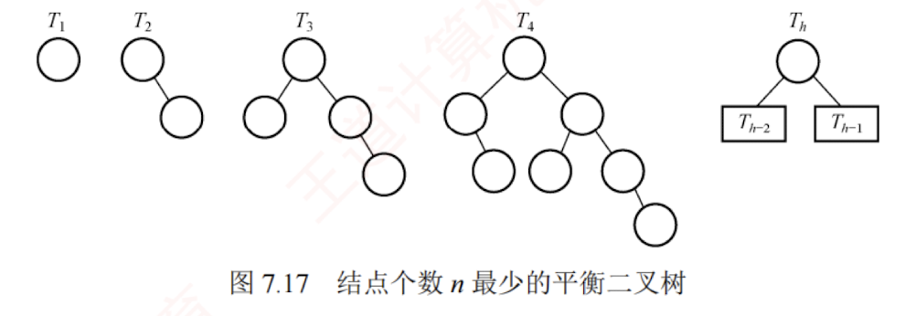

---

### 平衡二叉树的定义

为了避免树的高度增长过快而导致二叉排序树性能下降，在插入和删除结点时，需保证**任意结点的左右子树高度差的绝对值不超过 1**。满足这一条件的二叉树称为**平衡二叉树**（**Balanced Binary Tree**），也称 **AVL 树**。  
定义结点左子树与右子树的高度差为该结点的**平衡因子**，则平衡二叉树中所有结点的平衡因子只能取 -1、0 或 1。

因此，平衡二叉树可形式化定义为：  
它或者是一棵空树，或者是具有下列性质的二叉树——其左子树和右子树均为平衡二叉树，且左右子树的高度差的绝对值不超过 1。  
图 7.9(a)是一棵平衡二叉树，图 7.9(b)是一棵不平衡的二叉树。结点内的数字表示其平衡因子。

#### 自平衡的二叉查找树树

指在进行插入和删除操作时能够调整以保证定义的平衡性，比如**平衡二叉树**和[[红黑树]]以及**B树**
### 平衡二叉树的插入

#### 基本思想
平衡二叉树**维持平衡的基本思想**如下：  
每当插入一个结点后，沿查找路径向上检查各祖先结点是否因该操作而失去平衡。  
若存在失衡结点，则定位插入路径上离新结点最近，且平衡因子绝对值大于 1 的结点 A，以 A 为根的子树即为最小不平衡子树。  
随后，在保持二叉排序树特性的前提下，通过旋转调整该子树的结构，使其重新达到平衡。

每次调整的对象都是最小不平衡子树，图 7.10 中的虚线框内所示即为最小不平衡子树。

#### 插入过程
**平衡二叉树的插入过程前半部分与普通二叉排序树相同**；  
但在新结点插入后，若导致查找路径上的某个结点失去平衡，则需执行相应的调整。可将调整的规律归纳为下列 4 种情况：

1. **LL 平衡旋转**（右单旋转）  
   由于在结点 A 的左孩子（L）的左子树（L）上插入了新结点，A 的平衡因子由 1 增至 2，导致以 A 为根的子树失去平衡，需要一次向右的旋转操作。将 A 的左孩子 B 向右上旋转，使其代替 A 成为新的根结点；将 A 向右下旋转，成为 B 的右孩子；而 B 的原右子树则作为 A 的左子树。
   如图 7.11 所示，结点旁的数值代表结点的平衡因子，方块表示相应结点的子树，下方数值代表该子树的高度。
   

2. **RR 平衡旋转**（左单旋转）  
   由于在结点 A 的右孩子（R）的右子树（R）上插入了新结点，A 的平衡因子由 -1 减至 -2，导致以 A 为根的子树失去平衡，需要一次向左的旋转操作。将 A 的右孩子 B 向左上旋转，使其替代 A 成为新的根结点；将 A 向左下旋转，成为 B 的左孩子；而 B 的原左子树则作为 A 的右子树，如图 7.12 所示。
   

3. **LR 平衡旋转**（先左后右双旋转）  
   由于在结点 A 的左孩子（L）的右子树（R）上插入了新结点，A 的平衡因子由 1 增至 2，导致以 A 为根的子树失去平衡，需要进行两次旋转操作，先左旋转后右旋转。先将 A 的左孩子 B 的右子树的根结点 C 向左上旋转，使其取代 B 的位置；然后将 C 向右上旋转，使其取代 A 的位置，如图 7.13 所示。
   

4. **RL 平衡旋转**（先右后左双旋转）
   由于在结点 A 的右孩子（R）的左子树（L）上插入新结点，A 的平衡因子由 -1 减至 -2，导致以 A 为根的子树失去平衡，需要进行两次旋转操作，先右旋转后左旋转。先将 A 的右孩子 B 的左子树的根结点 C 向右上旋转，使其取代 B 的位置；然后将 C 向左上旋转，使其取代 A 的位置，如图 7.14 所示。
   

LR 和 RL 旋转时，新结点究竟是插入 C 的左子树还是右子树**不影响旋转过程**，而图 7.13 和图 7.14 中以插入 C 的左子树为例。

#### 示例

**以关键字序列{15, 3, 7, 10, 9, 8}构造一棵平衡二叉树的过程为例：**  
图 7.15(d)插入 7 后导致不平衡，最小不平衡子树的根为 15，插入位置为其左孩子的右子树，因此需执行 LR 旋转，先左后右双旋转，调整后的结果如图 7.15(e)所示。  
图 7.15(g)插入 9 后导致不平衡，最小不平衡子树的根为 15，插入位置为其左孩子的左子树，需执行 LL 旋转，右单旋转，调整后的结果如图 7.15(h)所示。  
图 7.15(i)插入 8 后导致不平衡，最小不平衡子树的根为 7，插入位置为其右孩子的左子树，需执行 RL 旋转，先右后左双旋转，调整后的结果如图 7.15(j)所示。

### 平衡二叉树的删除

与插入操作相似，以删除结点 w 为例说明平衡二叉树删除操作的步骤：

1. 使用[[二叉排序树]]的方法删除结点 w。  
2. 若导致不平衡，则从结点 w 开始向上回溯，找到**第一个不平衡的结点** z（最小不平衡子树的根）。设 y 是 z 的较高子树的根结点，x 是 y 的较高子树的根结点。  
3. 对以 z 为根的子树进行平衡调整，其中 x、y 和 z 的相对位置有以下四种情况：

- y 是 z 的左孩子，x 是 y 的左孩子（LL，右单旋转）；
    
- y 是 z 的左孩子，x 是 y 的右孩子（LR，先左后右双旋转）；
    
- y 是 z 的右孩子，x 是 y 的右孩子（RR，左单旋转）；
    
- y 是 z 的右孩子，x 是 y 的左孩子（RL，先右后左双旋转）。
    

这些调整方式与插入操作相同。不同之处在于：**插入操作只需对以 z 为根的子树进行一次平衡调整，而删除操作则可能需要多次调整。**  
若一次调整导致子树的高度减 1，则可能还需对 z 的祖先结点进行平衡调整，甚至回溯到根结点（导致整棵树的高度减 1）。

以删除图 7.16(a)中的结点 32 为例，由于 32 是叶结点，直接删除即可。然后向上回溯，找到第一个不平衡结点 44（z），z 的较高子树的根为 78（y），y 的较高子树的根为 50（x），满足 RL 情况，需执行先右后左的双旋转。调整后的结果如图 7.16(c)所示。

### 平衡二叉树的查找

在平衡二叉树上进行查找的过程与普通二叉排序树相同，因此关键字的比较次数最多等于树的深度。设 $n_h$ 表示深度为 $h$（根结点深度为 1）的平衡二叉树中所含的最少结点数。显然有 $n_0=0$，$n_1=1$，$n_2=2$，且满足 $n_h=n_{h-2}+n_{h-1}+1$，如图 7.17 所示，依次推出 $n_3=4$，$n_4=7$，$n_5=12$，⋯⋯。含有 $n$ 个结点的平衡二叉树的最大深度为 $O(\log_2 n)$，因此平均查找时间复杂度为 $O(\log_2 n)$。

该结论可用于求解给定结点数的平衡二叉树在查找时所需的**最多比较次数**（树的最大深度）。  
例如，含有 12 个结点的平衡二叉树中查找某个结点的最多比较次数？

深度为 $h$ 的平衡二叉树中所含的最多结点数显然是**满二叉树**的情况。