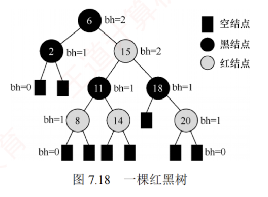
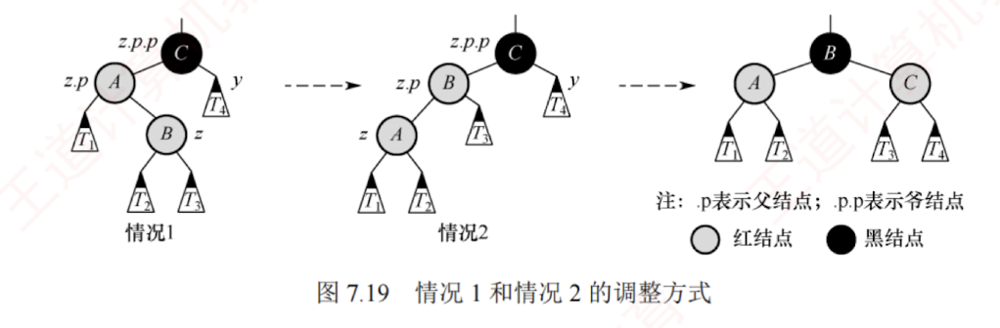

---

## 红黑树

### 红黑树的定义

为了保持 AVL 树的平衡性，在插入和删除操作后，会非常**频繁地调整全树的整体拓扑结构**，代价较大。为此，在 AVL 树的平衡标准基础上进一步放宽条件，引入了红黑树的结构。

#### 红黑树的性质
一棵红黑树是满足如下**红黑性质**的**二叉排序树**：

1. 每个结点或是红色的，或是黑色的。
    
2. 根结点是**黑色**的。
    
3. 叶结点（虚构的外部结点、NULL 结点）都是**黑色**的。
    
4. 不存在两个相邻的红结点（红结点的父结点和孩子结点均为黑色的）。
    
5. 对每个结点，从该结点到任意一个叶结点的简单路径上，所含黑结点的数量相同。
    

与折半查找树和 B 树类似，为了便于对红黑树的实现和理解，引入了 $n+1$ 个外部叶结点，这些结点被视为黑色，以保证每个内部结点的左右子树均非空。图 7.18 所示是一棵红黑树。

#### 黑高
从某个结点出发（不含该结点）到达一个叶结点的任意一个简单路径上的黑结点总数称为该结点的**黑高**（记为 $bh$），黑高的概念是由性质 ⑤ 确定的。根结点的黑高称为红黑树的黑高。

#### 红黑树的推论

##### **结论 1：从根到叶结点的最长路径不大于最短路径的 2 倍。**

根据性质 ⑤，从根到任意一个叶结点的最短路径必然全由黑结点构成。根据性质 ④，当某条路径最长时，这条路径必然是由黑结点和红结点交替构成的，此时黑结点的数量固定，红结点的数量最多等于黑结点的数量。图 7.18 中的 6-2 和 6-15-18-20 就是这样的两条路径。

##### **结论 2：有 $n$ 个内部结点的红黑树的高度 $h \le 2\log_2(n+1)$。**

**证明：** 根据结论 1，从根到叶结点（不含叶结点）的任意一条简单路径上都至少有一半是黑结点，因此根的黑高至少为 $h/2$。由此得出 $n \ge 2^{h/2}-1$，从而得到结论。

由结论 2 也可推出，黑高为 $h$ 的红黑树的内部结点数最少是 $2^h-1$，最多是 $2^{2h}-1$。

#### 总结
可见，红黑树采用“**适度平衡**”策略——相比 AVL 树的“高度平衡”（左右子树高度差 $\le 1$），允许左右子树高度相差**最多达 2 倍**，显著降低了插入/删除时结构调整的频率。  
因此，对于**动态查找表**：  
若查找操作远多于插入/删除，采用 AVL 树更优（查找更快）；  
若插入/删除频繁，则采用**红黑树**更合适（调整开销小）。  
由于红黑树在实际应用中综合性能更优，它被广泛采用，例如 C++ 中的 map 和 set（Java 中的 TreeMap 和 TreeSet）均基于**红黑树**实现。

### 红黑树的查找

查找过程与二叉排序树类似，若查找失败，需要遍历到为空的叶子结点，若查找成功则直接返回。
###  红黑树的插入

红黑树的插入过程与普通二叉查找树基本类似。  
不同之处在于，插入新结点后可能破坏红黑性质，因此需要通过重新着色或旋转操作进行调整，以恢复红黑树的基本性质。

#### 红黑树的推论
##### **结论 3：新插入的结点初始应着为红色。**

假设将其染为黑色，则该结点所在路径的黑结点数将比其他路径的多 1，几乎必然违反性质 ⑤（所有路径的黑结点数相等），且调整代价较高。而染为红色，则所有路径的黑结点数保持不变，仅当出现父子均为红色时才违反性质 ④，此时，局部调整即可高效恢复平衡。

#### 红黑树的插入与调整过程

设新插入的结点为 $z$。**插入与调整过程**如下：

1. 用二叉查找树规则插入 $z$，并将其染为红色。若 $z$ 的父结点为黑色，则红黑性质未被破坏，插入结束。
    
2. 若 $z$ 为根结点，则将其染为黑色（满足性质 ②），树的黑高加 1，插入结束。
    
3. 若 $z$ 非根，且其父结点 $z.p$ 为红色，则违反性质 ④。由于原树合法，根据性质 ② 和 ④，$z$ 的爷结点 $z.p.p$ 必然存在且为黑色。此时，需要根据叔结点 $y$（$z.p$ 的兄弟）的颜色分三种情形处理（此处假设 $z.p$ 是 $z.p.p$ 的左孩子，右孩子情形对称，后面会说明）。
    

##### **情形 1（LR 型，先左旋再右旋）**

$z$ 的叔结点 $y$ 是黑色的，且 $z$ 是其父结点的右孩子。

即 $z$ 是其爷结点的左孩子的右孩子。先对 $z.p$ 执行左旋，使 $z$ 上升取代原父位置，转化为情形 2。此操作不改变任何路径的黑结点数（因 $z$ 与 $z.p$ 均为红色），故性质 ⑤ 不受影响。

##### **情形 2（LL 型，右单旋）** 
$z$ 的叔结点 $y$ 是黑色的，且 $z$ 是其父结点的左孩子。

即 $z$ 是其爷结点的左孩子的左孩子。对 $z.p.p$ 执行右旋，并将原父结点染黑、原爷结点染红。此操作保持所有路径的黑结点数不变，同时消除连续红结点，恢复全部红黑性质，插入结束。

##### 图示
图 7.19 展示了情形 1（LR 型）和情形 2（LL 型）的调整过程。子树 $T_1, T_2, T_3$ 和 $T_4$ 均以黑结点为根，且黑高相同，确保旋转前后性质 ⑤ 成立。

##### **对称情形**
若 $z.p$ 是 $z.p.p$ 的右孩子，则对应 RL 型（先右旋后左旋）和 RR 型（左单旋），处理方式完全对称，此处不再赘述。可见，红黑树的调整方法与 AVL 树有异曲同工之妙。

##### **情形3 

$z$ 的叔结点 $y$ 是红色的。

无论 $z$ 是左孩子还是右孩子，均无影响。将 $z.p$ 和 $y$ 染为黑色，将 $z.p.p$ 染为红色，以在局部恢复性质 ④（无连续红结点）和性质 ⑤（所有路径的黑结点数相等）。但 $z.p.p$ 变红后，可能与其父结点再次形成红-红冲突。因此，将 $z.p.p$ 视为新的“待调整结点 $z$”，继续向上回溯检查。调整过程如图 7.20 所示。该过程可能多次重复，每次循环 $z$ 都会上移两层，直至满足以下任何一个终止条件：$z$ 成为根结点（此时染黑，结束）；进入情形 1 或情形 2（执行旋转后结束）。

---

**补充说明：** 尽管新结点最初总是插入在某个叶结点位置，但在情形 3 的回溯过程中，指针 $z$ 可能已上移至内部结点，从而拥有子树。因此，所有调整操作都必须考虑其子树的存在。

以图 7.21(a) 中的红黑树为例（虚线表示插入后的状态），依次插入 5、4 和 12 的过程如图 7.21 所示。插入 5，属于情形 3，将 5 的父结点 3 与叔结点 10 染黑，爷结点 7 染红；由于 7 是根结点，需将其重新染黑，树的黑高加 1，结束。插入 4，属于情形 1 的对称情形（RL 型），先对以 5 为根的子树执行右旋，转为情形 2 的对称情形（RR 型），交换 3 和 4 的颜色，再对以 4 为根的子树执行左旋，结束。插入 12，其父结点为黑色，无须调整，直接结束。

Would you like me to generate a step-by-step visual representation of one of these insertion cases?