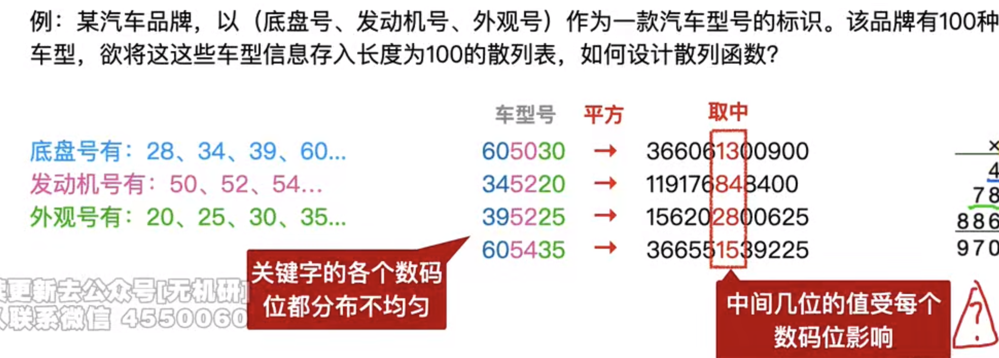

---

## 散列表的基本概念

### 引入
在前面介绍的线性表和树表查找中，查找记录需要进行一系列关键字比较。由于记录在表中的位置与其关键字之间不存在映射关系，因此这些结构的查找效率取决于关键字比较的次数。

### 散列函数
**散列函数**（也称**哈希函数**）是一种将关键字映射到其对应存储地址的函数，记为  
$$\text{Hash(key)}=\text{Addr}\quad \text{或}\quad H(\text{key})=\text{Addr}$$  
其中，地址可以是数组下标、索引或内存地址等。

散列函数可能会将两个或两个以上不同的关键字映射到同一地址，这种现象称为**冲突**，这些发生冲突的不同关键字称为**同义词**。一方面，良好的散列函数应尽可能减少冲突的发生；另一方面，由于冲突总是不可避免的，因此还需要设计有效的**冲突处理方法**。

### 散列表
**散列表**（也称**哈希表**）：一种根据关键字直接进行访问的数据结构。  
它建立了关键字到存储地址的直接映射。

#### 时间复杂度
在理想情况下，对散列表进行查找的时间复杂度为 $O(1)$，即**与表中元素的个数无关**。

## 散列函数的构造方法

### 注意
在构造散列函数时，必须注意以下几点：  
1. 散列函数的**定义域**必须包含**全部关键字**，而**值域**的范围则取决于**散列表的大小**。  
   >$H(\sqrt{key})=\sqrt{key}\%p$，这时候key取值不能为负值，定义域不能包含全部关键字
   >值域的范围内不能够包括非法地址，也就是不能超过散列表的地址范围，因此值域取决于散列表的大小
2. 散列函数计算出的地址应尽可能**均匀地分布**在整个地址空间，以有效**减少冲突**。
     
3. 散列函数应尽量**简单**，能在较短时间内计算出任意关键字对应的散列地址。

### 常用的散列函数

#### 直接定址法

直接取关键字的某个线性函数值作为散列地址，其散列函数为  
$$H(\text{key})=\text{key}\quad \text{或}\quad H(\text{key})=a\cdot \text{key}+b$$  
其中，$a$ 和 $b$ 是常数。该方法计算最简单，且不会产生冲突，适用于关键字分布基本**连续**的情形。  
若关键字**分布稀疏**、空位较多，则会造成**存储空间的浪费**。

#### 除留余数法

这是**最简单且最常用的散列函数构造方法**。  
设散列表长度为 $m$，选取一个不超过 $m$ 且尽可能接近 $m$ 的**质数** $p$  
>对质数取余可以分布更加均匀从而减小冲突

通过以下公式将关键字映射为散列地址：  
$H(key)=key\%p$

除留余数法的关键在于合理选择p，使得不同关键字经该函数映射后能近似等概率地落在散列空间的各个位置，从而尽可能减少冲突。

#### 数字分析法

设关键字是 $r$ 进制数，其各位上的数码（共 $r$ 种）出现的频率可能不同：  
某些数位上数码分布较为均匀，各种数码出现的机会接近均等；  
而另一些数位上分布不均，仅有少数几种数码频繁出现。  
此时应选取那些数码分布较为均匀的数位，以其组合构成散列地址。  
该方法适用于**已知且固定的关键字集合**，若关键字集合发生变化，则需重新构造新的散列函数。
>比如手机号码，前面几位在某些情况下都是固定的，只能出现特定的几种组合，对应数码分布不均的情况，只有后四位不一样，对应数码分布均匀的情况，这时候就可以采用数字分析法，使用后四位作为散列地址。

#### 平方取中法

顾名思义，该方法取关键字平方值的中间几位作为散列地址。  
具体取多少位根据散列表大小和关键字范围确定。  
由于平方运算与关键字的每位都有关系，因此使得散列地址的分布较为均匀。  
该方法适用于关**键字的各位取值分布不均**或关键字本身**位数较少**的情形。
>
>

### 总结
在不同应用场景下，各类散列函数的性能表现各异，因此不能笼统地说某种方法最优。实际选择时，应根据**关键字集合的特性**合理选用散列函数的构造方法。

## 处理冲突的方法

应当注意到，任何散列函数都无法绝对避免冲突。  
因此，必须设计有效的冲突处理机制，即为发生冲突的关键字寻找**下一个可用的散列地址。**  
设 $H_i$ 表示第 $i$ 次探测所得的散列地址。若初始地址 $H_0=H(\text{key})$ 发生冲突，则尝试 $H_1$
若 $H_1$ 仍冲突，则继续计算 $H_2$. 
以此类推，直到找到首个不发生冲突的地址 $H_k$，该地址即为关键字在散列表中的最终存储位置。

### 开放定址法

开放定址法是指散列表中的所有空闲地址均可用于存放任意关键字（无论是否与其同义）。其地址探测序列由如下递推公式给出：  
$$H_i=(H(key)+d_i)\%m$$
其中$H(\text{key})为散列函数；$$d_i$为第 $i$ 次探测的增量，$i=1,2,\cdots,k\ (k\le m-1)$；$m$ 为散列表表长。

一旦选定增量序列，对应的冲突处理方法即被确定。常见的增量序列取法有以下四种。

考点追踪 堆积现象导致的结果（2014）

1）线性探测法，也称线性探测再散列法。增量序列 $d_i=1,2,\cdots,m-1$。  
其特点是：冲突发生时，顺序查看表中下一个单元；若探测到表尾地址 $m-1$，则下一个探测地址回绕至表首地址 0，如此循环，直到找到一个空闲单元（只要表未满，必能找到）。然而，线性探测法容易引发“聚集（或称堆积）”现象：原本映射到地址 $i$ 的同义词被存入 $i+1$，而本应存入 $i+1$ 的元素则被迫占用 $i+2$，以此类推。这会导致大量元素在相邻地址上堆积，显著降低查找效率。

2）平方探测法，也称二次探测法。增量序列 $d_i=1^2,-1^2,2^2,-2^2,\cdots,k^2,-k^2\ (k\le m/2)$。  
其中，散列表长度 $m$ 必须是一个形如 $4k+3$ 的素数。  
平方探测法能有效避免“堆积”问题，是一种较好的冲突处理方法。其缺点是无法探测散列表中的所有位置，但至少可以覆盖一半的地址空间。

3）双散列法。增量序列 $d_i=iH_2(\text{key})$。  
该方法需使用两个散列函数。当通过第一个散列函数 $H(\text{key})$ 得到的地址发生冲突时，利用第二个散列函数 $H_2(\text{key})$ 计算地址增量。其探测序列为：  
$$H_i=\bigl(H(\text{key})+iH_2(\text{key})\bigr)\ %\ m$$  
其中，初始探测位置 $H_0=H(\text{key})%m$。$i=0,1,2,\cdots$ 表示探测序号。

4）伪随机序列法。增量序列由一个伪随机数生成器产生，即 $d_i=$ 第 $i$ 个伪随机数。

考点追踪 散列表中删除部分元素后的查找效率分析（2023）

注 意  
采用开放定址法时，不能直接物理删除表中已有元素。否则，可能截断其他同义词的查找路径，导致查找失败。正确的做法是：对被删元素所在位置设置一个删除标记，实现逻辑删除。但该方法的副作用是：经过多次删除后，散列表看似已满，但实际上有许多位置未被利用。

---

2．拉链法（链接法，chaining）

为了处理冲突，可将散列到同一地址的所有同义词组织成一个链表。每个链表由其对应的散列地址唯一确定。具体而言，若散列地址为 $i$，则该同义词链表的头指针存放在散列表的第 $i$ 个单元中。因此，查找、插入和删除操作主要在相应的同义词链表中进行。拉链法特别适用于需要频繁执行插入和删除操作的场景。例如，关键字序列 ${19,14,23,01,68,20,84,27,55,11,10,79}$，散列函数 $H(\text{key})=\text{key}%13$，采用拉链法处理冲突，建立的表如图 7.33 所示。

---

7.5.4 散列查找及性能分析的应用

考点追踪 散列表的构造及查找效率的分析（2010、2018、2019、2024）

散列表的查找过程与构造过程基本一致。对于给定的关键字 $key$，先通过散列函数计算其初始地址，然后按如下步骤执行：  
初始化：$\text{Addr}=H(key)$；  
① 检查散列表中地址 Addr 处是否有记录：若无记录，则查找失败；若有记录，则比较该记录与 key 的值，若相等，则查找成功，否则转到步骤②。  
② 按指定的冲突处理方法计算下一个探测地址，将 Addr 更新为此地址，返回步骤①。

例如，关键字序列 ${19,14,23,01,68,20,84,27,55,11,10,79}$，散列函数 $H(key)=key%13$，采用线性探测法处理冲突，所得的散列表 $L$ 如图 7.34 所示（表长为 16）。

图 7.34 用线性探测法得到的散列表 L

|地址|0|1|2|3|4|5|6|7|8|9|10|11|12|13|14|15|
|---|---|---|---|---|---|---|---|---|---|---|---|---|---|---|---|---|
|L[地址]|【看不清】|14|01|68|27|55|19|20|84|79|23|11|10|【看不清】|【看不清】|【看不清】|

查找关键字 84 的过程：初始散列地址 $H(84)=6$。因 $L[6]$ 非空且 $L[6]\ne 84$，冲突；第一次探测的地址 $H_1=(6+1)%16=7$，因 $L[7]$ 非空且 $L[7]\ne 84$，冲突；第二次探测的地址 $H_2=(6+2)%16=8$，$L[8]$ 非空且 $L[8]=84$，查找成功，返回其存储地址。

查找关键字 38 的过程：初始散列地址 $H(38)=12$。因 $L[12]$ 非空且 $L[12]\ne 38$，冲突；第一次探测的地址 $H_1=(12+1)%16=13$，因 $L[13]$ 为空，查找失败。

各关键字的查找比较次数如图 7.35 所示。

图 7.35 查找各关键字的比较次数

|关键字|14|01|68|27|55|19|20|84|79|23|11|10|
|---|---|---|---|---|---|---|---|---|---|---|---|---|
|比较次数|1|2|1|4|3|1|1|3|9|1|1|3|

平均查找长度（ASL）为  
$$\text{ASL}=(1\times 6+2+3\times 3+4+9)/12=2.5$$

对于同一关键字集合和相同的散列函数，不同的冲突处理方法会生成不同的散列表结构，从而导致不同的平均查找长度。本例的 ASL 与上节拉链法的结果不同，正好体现了这一特性。

从散列表的查找过程可见：

---

1）尽管散列表在关键字与其存储位置之间建立了直接映射，但由于冲突的存在，查找过程仍需将给定值与表中关键字进行比较。因此，ASL 仍是衡量散列表查找效率的核心指标。

考点追踪 影响散列表查找效率的因素（2011、2022）

2）散列表的查找效率主要取决于三个因素：散列函数、冲突处理方法和装填因子。  
装填因子通常记为 $\alpha$，定义为散列表的填充程度，即  
$$\alpha=\frac{\text{表中记录数 }n}{\text{散列表长度 }m}$$

散列表的平均查找长度主要依赖于装填因子 $\alpha$，而不直接依赖于 $n$ 或 $m$。直观地看，$\alpha$ 越大，表示表越“满”，发生冲突的可能性越高；反之，$\alpha$ 越小，冲突越少。

读者应能根据给定的散列表长度、元素个数、散列函数及冲突处理方法，构造出相应的散列表，并进一步计算查找成功时的平均查找长度与查找失败时的平均查找长度。