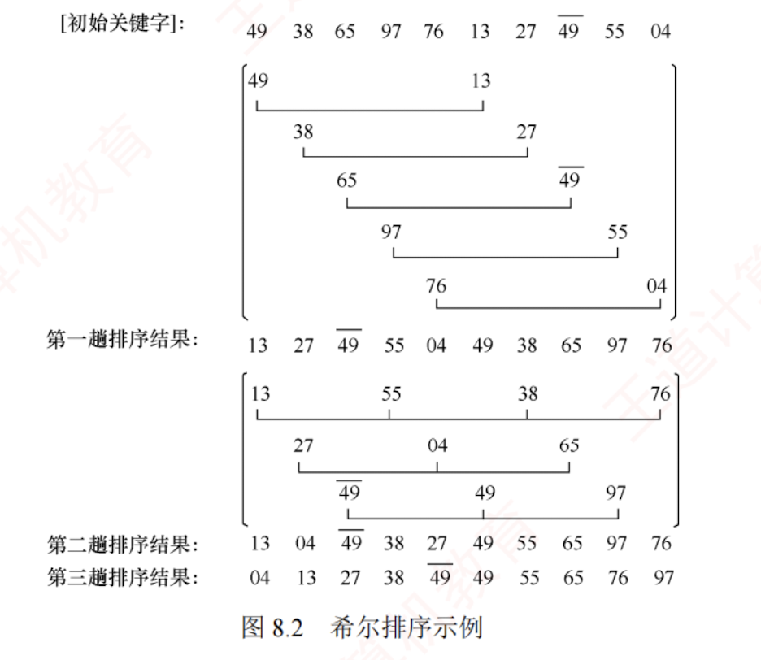

---

## 希尔排序

### 引入
由前文分析可知，直接插入排序的时间复杂度为 $O(n^2)$，但在待排序序列接近正序时，其时间效率可提升至 $O(n)$。因此，该算法更适用于基本有序或数据量较小的排序场景。希尔排序正是基于这一特性对直接插入排序进行改进，也称为缩小增量排序。

### 基本思想
希尔排序的**基本思想**是：  
通过逐步缩小**增量**的方式，对表中相隔一定距离的元素构成的子序列进行多次直接插入排序，使整个表逐渐趋于基本有序，最终通过一趟完整的直接插入排序完成全局排序。

### 算法步骤
1. 算法首先选取一个小于 $n$ 的初始增量 $d_1$，将待排序表划分为 $d_1$ 个子序列（每个子序列包含下标间隔为 $d_1$ 的记录），并对各子序列分别进行**直接插入排序**；  
2. 随后依次取更小的增量 $d_2, d_3, \dots$（满足 $d_1 > d_2 > \dots > d_t = 1$），**重复分组与排序操作**。  
3. 当**增量减至 1** 时，所有记录属于同一子序列，且序列已高度有序，**此时执行最后一趟直接插入排序**，即可快速获得最终结果。


### 图示
目前尚未找到理论上最优的增量序列。假定第一趟取 $d_1 = 5$，形成 5 个子序列（对应图中第 2 至第 6 行），排序后结果如第 7 行所示；第二趟取 $d_2 = 3$，对 3 个子序列排序，结果见第 11 行；最后对整个序列进行一趟排序，完整过程如图 8.2 所示。



### 算法实现


```c
void ShellSort(ElemType A[], int n) {
    // A[0] 只是暂存单元，不是哨兵，当 j <= 0 时，插入位置已到
    int dk, i, j;
    for (dk = n / 2; dk >= 1; dk = dk / 2)    // 增量变化（无统一规定）
        for (i = dk + 1; i <= n; ++i)
            if (A[i] < A[i - dk]) {          // 需将 A[i] 插入有序增量子表
                A[0] = A[i];                 // 暂存在 A[0]
                for (j = i - dk; j > 0 && A[0] < A[j]; j -= dk)
                    A[j + dk] = A[j];        // 记录后移，查找插入的位置
                A[j + dk] = A[0];            // 插入
            }
}
```

### 希尔排序算法的性能分析

- **空间效率**：仅使用常数个辅助单元，空间复杂度为 $O(1)$。
    
- **时间效率**：时间复杂度依赖于所选增量序列，而最优增量序列仍是数学上的未解难题，因此精确分析较为困难。当 $n$ 在常见范围内时，时间复杂度约为 $O(n^{1.3})$；最坏情况下退化为 $O(n^2)$。
    
- **稳定性**：当相同关键码的记录被划分到不同子表时，可能会改变它们的相对次序，因此希尔排序是**不稳定的排序算法**。  
  例如，图 8.2 中 $49$ 与 $\overline{49}$ 在排序过程中相对顺序发生了变化。
    
- **适用性**：希尔排序仅适用于**顺序存储的线性表**。
    >由于希尔排序的操作机制强制依赖于数组的随机存取特性，希尔排序需要根据下标在时间复杂度$O(1)$内快速定位元素，而链表只能够顺序存取，因此不适用于链表

