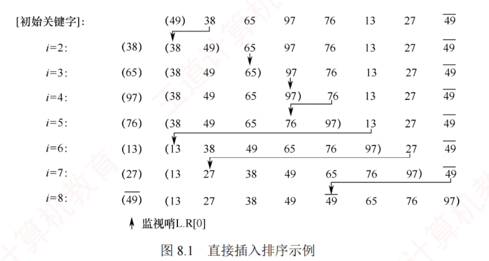

---

## 8.2.1 直接插入排序

### 排序过程

假设在排序过程中，待排序表 $L[1...n]$ 在某一时刻的状态如下：

|**有序序列 L[1...i−1]**|**L(i)**|**无序序列 L[i+1...n]**|
|---|---|---|

要将元素 $L(i)$ 插入到已有序的子序列 $L[1...i-1]$ 中，需执行以下操作（为避免混淆，下文用 $L[]$ 表示一个表，而用 $L()$ 表示一个元素）：

1. 查找 $L(i)$ 在 $L[1...i-1]$ 中的插入位置 $k$。
    
2. 将 $L[k...i-1]$ 中的所有元素依次后移一个位置。
    
3. 将 $L(i)$ 放入位置 $k$。
    

为实现对整个表 $L[1...n]$ 的排序，可从 $L(2)$ 开始，依次将 $L(2)$ 到 $L(n)$ 插入其前面已排好序的子序列中。  
初始时，$L[1]$ 可视为一个长度为 1 的有序子序列。上述过程共执行 $n-1$ 次，最终得到一个有序表。  
直接插入排序通常采用**原地排序**（**空间复杂度为 $O(1)$**）。在从后往前的比较过程中，需要将已排序的元素逐个后移，为新元素腾出插入位置。

### 直接插入排序的实现
以下是直接插入排序的实现，其中再次使用了前面提到的“**哨兵**”（作用相同）。
如果不带哨兵，那么第二层循环的条件判断需要加上一个$j\ge0$。

```c
void InsertSort(ElemType A[], int n) {
    int i, j;
    for (i = 2; i <= n; i++) {              // 依次将 A[2] ~ A[n] 插入前面已排序序列
        if (A[i] < A[i - 1]) {              // 若 A[i] 关键码小于其前驱，将 A[i] 插入有序表
            A[0] = A[i];                    // 复制为哨兵，A[0] 不存放元素
            for (j = i - 1; A[0] < A[j]; --j) // 从后往前查找待插入位置
                A[j + 1] = A[j];            // 向后挪位
            A[j + 1] = A[0];                // 复制到插入位置
        }
    }
}
```

### 排序步骤演示
假定初始序列为 49, 38, 65, 97, 76, 13, 27, 49，初始时 49 可视为一个已排好序的子序列。按照上述算法进行直接插入排序的过程如图 8.1 所示，括号内为当前已排好序的子序列。




### 直接插入排序的性能分析
直接插入排序的性能分析如下。

**空间效率**：仅使用常数个辅助单元，空间复杂度为 $O(1)$。

**时间效率**：整个排序过程共进行 $n-1$ 趟插入操作，每趟包括关键字比较和元素移动，具体次数取决于初始序列的状态。  
**最好情况**下，表中元素已有序。每插入一个元素只需一次比较，无须移动，时间复杂度为 $O(n)$。  
**最坏情况**下，表中元素完全逆序。此时每趟插入需比较 $i-1$ 次并移动 $i-1$ 个元素，总时间复杂度为 $O(n^2)$。  
**平均情况**下，假设元素随机排列，平均比较次数和移动次数均约为 $n^2/4$，故时间复杂度仍为 $O(n^2)$。因此直接插入排序算法的时间复杂度为 $O(n^2)$。

**稳定性**：由于插入时总是从后往前比较，并在找到插入位置后才移动元素，因此相同关键字的元素相对顺序不会改变。**直接插入排序是稳定的排序算法。**

**适用性**：该算法适用于**顺序存储和链式存储的线性表**，采用链式存储时无须移动元素。