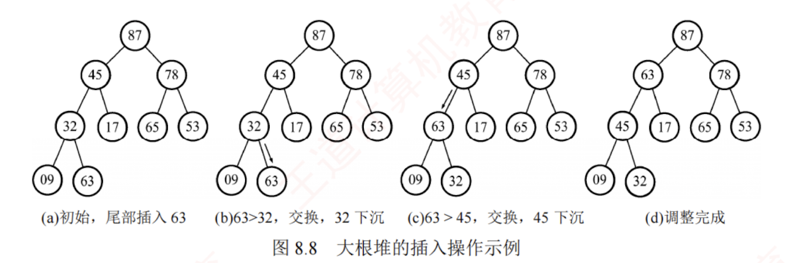

---

## 堆
### 堆的定义

堆的定义如下，$n$ 个关键字序列 $L[1 \ldots n]$ 称为堆，当且仅当该序列满足以下条件之一：

① $L(i) \ge L(2i)$ 且 $L(i) \ge L(2i+1)$ 或

② $L(i) \le L(2i)$ 且 $L(i) \le L(2i+1)$ ($1 \le i \le \lfloor n/2 \rfloor$)

### 理解
**可将堆视为一棵完全二叉树**。 [[二叉树#几种特殊的二叉树#**完全二叉树**]] 
满足条件①的堆称为**大根堆**（大顶堆），其最大元素位于根结点，且任意非根结点的值均不大于其双亲结点。  
满足条件②的堆称为**小根堆**（小顶堆），其最小元素位于根结点，性质与大根堆恰好相反。图 8.5 所示为一个大根堆。
### 图示


### 堆的主要应用
堆的主要应用包括**堆排序**、**Top-K** 问题和**优先队列**（见本节综合题 7）  
Top-K 问题和优先队列均利用了堆的结构特性。

## 堆排序
### 堆排序的基本思想
堆排序的**基本思路**是：  
1. 首先将待排序序列 $L[1 \ldots n]$ 构建成**初始堆**（以大顶堆为例），此时堆顶即为最大值。  
2. 随后，交换堆顶元素与堆底元素，使最大值归位；  
3. 接着将剩余 $n-1$ 个元素重新调整为堆，再取出新的堆顶。  
4. 重复此过程，直至堆中仅剩一个元素。  

### 进行堆排序前需要解决的问题   

1. 如何将无序序列构造初初始堆？
2. 输出堆顶后，如何高效调整剩余元素为新堆？

#### 初始堆的构建
##### 基本策略
**堆排序的关键在于初始堆的构建**。  
建堆的**基本策略**是：按**自底向上**的顺序（从最后一个分支结点到根结点），依次对每个分支结点执行**自上而下的筛选**操作：若其不满足堆的性质，则调整其对应的子树。对于含 $n$ 个结点的完全二叉树，最后一个分支结点的编号为 $\lfloor n/2 \rfloor$。因此，建堆过程从 $i = \lfloor n/2 \rfloor$ 开始，依次向前处理至 $i = 1$。  
具体而言：对每个结点 $i$，若其关键字小于**左右孩子结点中的较大者**（**大根堆**情形），则将其与该较大的子结点交换；交换后可能破坏下层子树的堆性质，因此需要继续沿该路径向下调整，直至当前子树重新满足堆的定义。  
通过依次对各分支结点执行上述的向下调整操作，最终可将整个无序序列构建成一个完整的堆。
##### 构建过程及图示

如图 8.6 所示，初始时调整 $L(4)$ 子树，$09 < 32$，交换后满足堆定义；接着调整 $L(3)$ 子树，$78 <$ 左右孩子中的较大者 $87$，交换后满足堆定义；再调整 $L(2)$ 子树，$17 <$ 左右孩子中的较大者 $45$，交换后满足堆定义；继续调整根结点 $L(1)$，$53 <$ 左右孩子中的较大者 $87$，交换后破坏了 $L(3)$ 子树的堆，于是对 $L(3)$ 重新调整，$53 <$ 左右孩子中的较大者 $78$，交换后，该完全二叉树满足堆定义。


#### 输出堆顶后再将剩余元素调整成新堆

##### 基本思想
每次输出堆顶后，将堆底元素移至堆顶，此时堆的性质可能被破坏，需要自上而下地进行筛选：将新堆顶与其左右孩子中的较大者比较，若小于该孩子结点，则交换；重复此过程，直至恢复堆性质。 

##### 执行过程及图示
例如，当 $09$ 移至堆顶后，先与左右孩子中的较大者 $78$ 交换，交换后破坏了 $L(3)$ 子树的堆；继续对 $L(3)$ 子树向下筛选，将 $09$ 与 $65$ 交换，最终得到新堆，调整过程如图 8.7 所示。


建立大根堆的算法如下：

```c
void BuildMaxHeap(ElemType A[], int len) {
    for (int i = len / 2; i > 0; i--)         // 从最后一个分支结点到根结点
        HeapAdjust(A, i, len);               // 反复调整树
}

void HeapAdjust(ElemType A[], int k, int len) {
    // 对以 k 为根的子树进行调整
    A[0] = A[k];                             // A[0] 暂存子树的根结点
    for (int i = 2 * k; i <= len; i *= 2) {  // 沿关键字较大的子结点向下筛选
        if (i < len && A[i] < A[i + 1])
            i++;                             // 取关键字较大的子结点的下标
        if (A[0] >= A[i]) break;             // 筛选结束
        else {
            A[k] = A[i];                     // 将较大结点上移
            k = i;                           // 修改 k 值，以便继续向下筛选
        }
    }
    A[k] = A[0];                             // 被筛选结点的值放入最终位置
}
```

堆调整的时间复杂度与树高成正比，为 $O(h)$。构建含 $n$ 个元素的堆时，关键字的总比较次数不超过 $4n$，故建堆时间复杂度为 $O(n)$，即可以在线性时间内将无序数组建成堆。

### 堆排序的代码实现：

```c
void HeapSort(ElemType A[], int len) {
    BuildMaxHeap(A, len);                    // 初始建堆
    for (int i = len; i > 1; i--) {          // 执行 n-1 趟排序
        Swap(A[i], A[1]);                    // 输出堆顶元素（与堆底元素交换）
        HeapAdjust(A, 1, i - 1);             // 把剩余 i-1 个元素重新整理为堆
    }
}
```

### 堆排序的插入操作
同时，堆也支持**插入操作**。  
插入时，先将新元素置于堆末端，然后自下而上地与其父结点比较：若违反堆性质，则交换，直至满足堆定义。  
图 8.8 展示了大根堆的插入操作示例。

### 堆排序的删除操作

删除操作（通常指**删除并输出堆顶极值**）的规则是：每次输出堆顶后，将**堆底元素移至堆顶**，然后**自上而下**地进行比较和交换（即向下筛选），以恢复堆的性质。

### 堆排序的应用

堆排序适用于大规模数据的排序场景，还常用于解决 Top-K 问题。例如，在 1 亿个数中选出最大的 100 个数。首先使用一个大小为 100 的数组，读入前 100 个数，构建小顶堆，而后依次读入后续数字，若小于堆顶则舍弃，否则用该数替换堆顶并向下调整，待数据读取完毕，堆中 100 个数为所求。此方法的时间复杂度为 $O(n \log_2 k)$，空间复杂度为 $O(k)$，效率远高于全排序。

### 堆排序算法的性能分析

**空间效率**：仅使用了常数个辅助单元，空间复杂度为 $O(1)$。

**时间效率**：建堆的时间复杂度为 $O(n)$，随后需进行 $n-1$ 次堆顶输出与调整操作，每次调整的时间复杂度为 $O(\log_2 n)$。  
因此，堆排序在最好、最坏和平均情况下的时间复杂度均为 $O(n \log_2 n)$。

|操作名称|时间复杂度|操作动作方向（必考考点）|
|---|---|---|
|**建初始堆**|O(n)|从 ⌊n/2⌋ 到 1，依次对每棵子树进行**自上向下**调整。|
|**整体堆排序**|O(nlog2​n)|建堆 O(n) + 连续 n−1 次堆顶调整 O(nlog2​n)。|
|**插入 (Insert)**|O(log2​n)|放堆底，然后**自下向上**调整。|
|**删除 (Delete)**|O(log2​n)|拿堆底补堆顶，然后**自上向下**调整。|

**稳定性**：在堆调整过程中，相等关键字的元素可能因交换而改变其原始相对位置，因此堆排序是**不稳定**的排序算法。例如，表 $L = \{1, 2, 2\}$，建堆时可能将 $2$ 交换到堆顶，此时 $L = \{2, 1, 2\}$，最终排序序列为 $L = \{1, 2, 2\}$，显然，$2$ 与 $2$ 的相对次序已发生变化。

**适用性**：堆排序依赖完全二叉树的随机访问特性，因此仅适用于**顺序存储的线性表**。