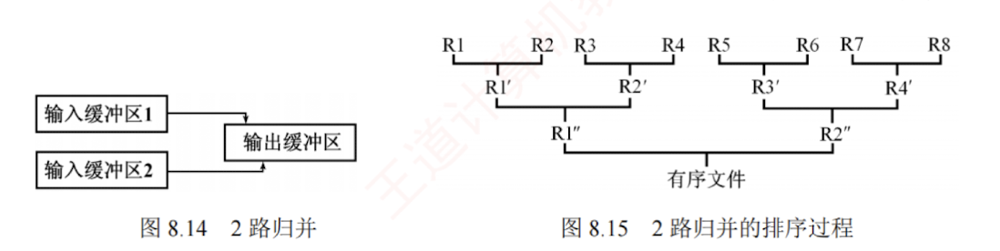
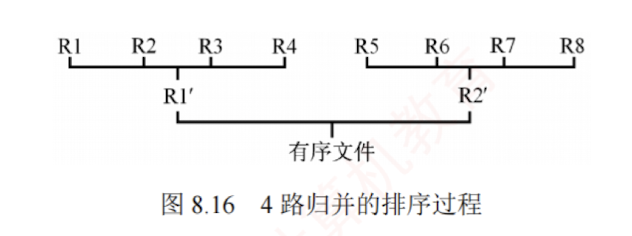

---

外部排序可能会考查相关概念、方法及排序过程。本节的主要内容包括：

1. 外部排序是指对大文件进行排序，即待排序记录存储在外存中，且无法一次性全部装入内存，需在内存与外存之间多次交换数据，以完成整个文件的排序。
    
2. 为减少多路平衡归并中外存读/写次数可采取的方法：增大归并路数和减少归并段数。
    
3. 利用败者树可高效实现多路归并，从而增大归并路数。
    
4. 利用置换-选择排序可生成更长的初始归并段，从而减少归并段个数。
    
5. 由长度不等的归并段进行多路平衡归并时，需要构造最佳归并树。
    

### 外部排序的基本概念

此前介绍的排序算法均假设所有数据可一次性载入内存（称为内部排序）。而在许多应用中，常需对大规模文件进行排序；由于记录数量庞大，无法将整个文件一次性装入内存。此时，待排序记录必须存储在外存中，排序时仅能将部分数据调入内存处理，并通过多次内外存之间的数据交换，逐步完成整体排序。这类依赖内外存协同操作的排序算法，称为外部排序。

### 外部排序的方法

文件通常以块为单位存储在磁盘上，操作系统也按块对磁盘信息进行读/写操作。由于磁盘读/写的机械动作耗时远高于内存运算时间（相比而言后者可忽略不计），因此外部排序的时间代价主要取决于**访问磁盘的次数，即 I/O 次数**。

#### 外部排序的基本思想
外部排序通常采用归并排序策略，包含两个阶段：  
1. 生成初始归并段。根据内存缓冲区大小，将外存上的文件划分为若干子文件，依次读入内存，利用内部排序算法对每个子文件排序后写回外存，形成多个有序的初始归并段（也称顺串）多路归并。
2. 对这些初始归并段进行逐趟多路归并，每趟将多个有序段合并为更长的有序段，逐步减少段数，最终得到整个有序文件。

#### 举例说明
例如，一个包含 2000 个记录的文件，每个磁盘块可容纳 125 个记录。首先通过 8 次内部排序，得到 8 个初始归并段 R1~R8，每段包含 250 条记录。随后，对该文件执行如图 8.15 所示的 **2 路归并**，直至获得一个有序文件。具体实现时，可将内存工作区划分为三个缓冲区（见图 8.14）：两个输入缓冲区和一个输出缓冲区。首先，从归并段 R1 和 R2 中各读入一个磁盘块，分别存入两个输入缓冲区；然后在内存中进行 2 路归并，将归并结果依次写入输出缓冲区；若输出缓冲区已满，则将其内容写入新的归并段 R1'，清空后继续接收后续归并结果；若某个输入缓冲区取空，则从对应的归并段中读入下一块数据，继续参与归并。如此反复，直至 R1 与 R2 的所有记录均被归并完毕。接着归并 R3 与 R4、R5 与 R6、R7 与 R8，完成第一趟归并。第二趟归并 R1' 与 R2'、R3' 与 R4'。第三趟归并 R1'' 与 R2''，最终得到完整的有序文件，整个过程共进行 **3 趟归并**。

在外部排序中实现两两归并时，通常无法将两个输入有序段及归并结果同时驻留于内存中，因此必须频繁地将数据从外存读入、再将结果写回磁盘，这会消耗大量时间。一般而言，有

$$\text{外部排序总时间} = \text{内部排序时间} + \text{外存读/写时间} + \text{内部归并时间}$$

显然，外存读/写时间远大于内部排序与内部归并所需的时间，因此应着力减少 I/O 次数。由于外存的读/写操作以磁盘块为单位进行，结合前例可知，每趟归并需进行 16 次读和 16 次写，共 32 次 I/O；3 趟归并加上初始内部排序阶段的 32 次 I/O，总计 $32 \times 3 + 32 = 128$ 次 I/O 操作。

#### 外部排序的优化
若改用 4 路归并，则仅需 2 趟归并，总 I/O 次数降至 $32 \times 2 + 32 = 96$ 次。由此可见，**增大归并路数可有效减少归并趟数**，从而显著降低总的磁盘 I/O 次数，如图 8.16 所示。

一般地，对 $r$ 个初始归并段进行 $k$ 路归并（每趟将 $k$ 个或更少的有序子文件合并为一个）。第一趟可将 $r$ 个归并段合并为 $\lceil r/k \rceil$ 个，后续每趟归并将 $m$ 个归并段合并为 $\lceil m/k \rceil$ 个，直至只剩一个归并段。树的高度 $-1 = \lceil \log_k r \rceil = \text{归并趟数 } S$。  
>可通过增加初始归并段的长度来减少初始归并段个数r

因此，**增大归并路数k，或减少初始归并段个数r**，均可减少归并趟数 $S$，进而减少磁盘 I/O 次数，有效提升外部排序效率。

