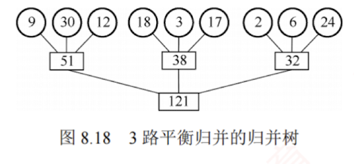
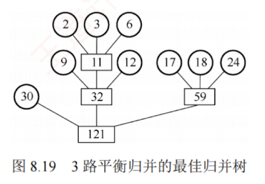
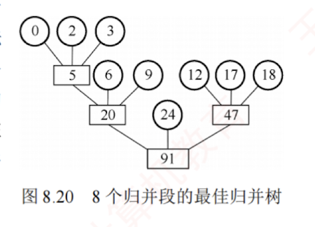

---

## 最佳归并树

### 归并方案
文件经过置换-选择排序后，得到**长度不等的初始归并段**。下面讨论如何安排这些长度不等的归并段的归并顺序，使得 I/O 次数最少。假设通过置换-选择排序得到 9 个初始归并段，其长度依次为 9, 30, 12, 18, 3, 17, 2, 6, 24。若采用 3 路平衡归并，一种可能的归并树如图 8.18 所示。

在图 8.18 中，各叶结点表示一个初始归并段，其上的权值表示该段的长度；叶结点到根的路径长度表示该段参与归并的趟数；非叶结点表示归并生成的新段；根结点对应最终有序文件。树的带权路径长度 WPL 等于归并过程中读取的总记录数，因此总的 I/O 次数 $= 2 \times \text{WPL} = 484$。

### 归并方案的优化
显然，不同的归并方案对应不同的归并树，其 WPL（I/O 次数）也不同。为最小化 I/O 开销，可将[[哈夫曼编码]]的思想推广至 $k$ 叉树情形：优先归并长度较小的段，延后归并长度较大的段，从而构造出 I/O 次数最少的最佳归并树。对上述 9 个归并段，按此原则构造的最佳 3 路归并树如图 8.19 所示，按此方案归并，总 I/O 次数仅为 446，显著优于普通方案。

### 如何处理归并轮次不足的情况
图 8.19 所示的归并树是一棵严格三叉树，即树中只有度为 3 或 0 的结点。然而，当初始归并段的数量不足以构成严格 $k$ 叉树（也称正则 $k$ 叉树）时，直接进行 $k$ 路归并会导致某些归并轮次不足 $k$ 路，从而降低效率。例如，若只有 8 个初始归并段（如删除上例中长度为 30 的段），如果强行在最后一次归并时降为 2 路，其余仍为 3 路，则 I/O 次数将高达 386，这并非最优方案。更优的做法是：**引入若干长度为 0 的“虚段”**（不包含实际数据的空归并段），使每趟归并都能满路（每次归并都处理 $k$ 个段）。这些虚段不会产生实际的 I/O 开销，但能让归并树的结构更接近哈夫曼最优形态——权值较小的段（包括虚段）被安排在更深的位置，避免过早参与归并。按照这一思路构造的最佳归并树如图 8.20 所示，其 I/O 次数显著降低至 326。

### 如何判定添加虚段的数目？

设度为 0 的结点有 $n_0$ 个，度为 $k$ 的结点有 $n_k$ 个，归并树的结点总数为 $n$，则有：

- $n = n_k + n_0$ （总结点数 = 度为 $k$ 的结点数 + 度为 0 的结点数）
    
- $n = kn_k + 1$ （总结点数 = 所有结点的度数之和 + 1）
    

因此，对严格 $k$ 叉树有 $n_0 = (k - 1)n_k + 1$，由此可得 $n_k = (n_0 - 1) / (k - 1)$。

接下来，根据 $n_0$ 和 $k$ 的关系，判断是否需要添加虚段：

- 若 $(n_0 - 1) \% (k - 1) = 0$（$\%$ 为取模运算），则说明这 $n_0$ 个叶结点（初始归并段）正好可以构成一棵严格的 $k$ 叉归并树。此时，内结点有 $n_k$ 个。
    
- 若 $(n_0 - 1) \% (k - 1) = u \neq 0$，则说明对于这 $n_0$ 个叶结点，其中有 $u$ 个多余，不能直接纳入 $k$ 叉归并树。为构造包含所有 $n_0$ 个初始归并段的 $k$ 叉归并树，应在原有 $n_k$ 个内结点的基础上再增加 1 个内结点。该内结点将代替一个叶结点的位置，被代替的叶结点连同多出的 $u$ 个叶结点，再加上 $k - u - 1$ 个空归并段，即可构建完整的归并树。
    
以图 8.20 为例，用 8 个归并段构造三叉树时，$(n_0 - 1) \% (k - 1) = (8 - 1) \% (3 - 1) = 1 \neq 0$，表明当前叶结点数无法构成严格的三叉树。因此，需要添加 $3 - 1 - 1 = 1$ 个虚段，使叶结点总数增至 9，满足 $(9 - 1) \% (3 - 1) = 0$，这样就可以构建一棵完整的严格三叉树。
