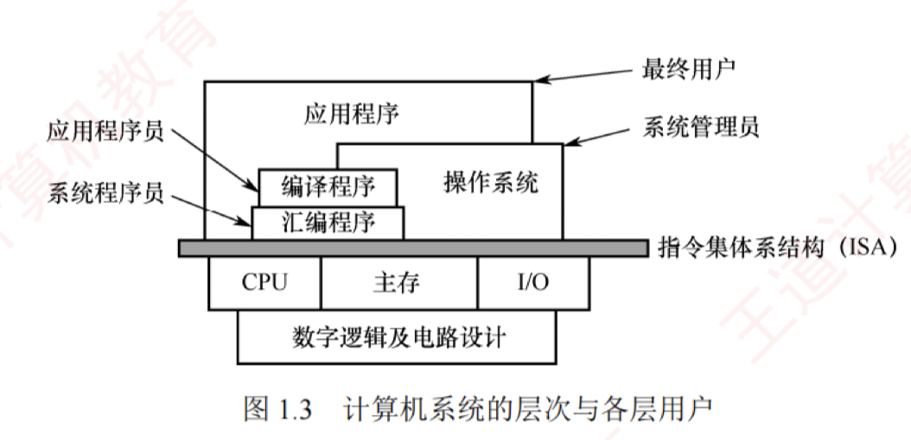

---

## 计算机系统的不同用户

根据用户使用计算机完成任务的性质，可将用户划分为以下四类角色。

**最终用户：** 直接操作应用程序完成特定任务的人员，如使用办公软件、浏览网页等的人员。他们通过操作系统提供的界面与计算机交互，无须了解底层技术细节。

**系统管理员：** 负责配置、管理和维护计算机系统，确保其稳定高效运行的人员。主要职责包括安装软/硬件、管理用户账户、数据备份与系统升级等。

**应用程序员：** 使用高级语言开发应用软件，以满足最终用户在办公、娱乐等领域的特定需求的人员。

**系统程序员：** 设计并开发操作系统、编译器、数据库管理系统等核心系统软件的人员。

在实际使用中，同一用户可能在不同场景下承担多种角色。例如，一名计算机专业的学生：网上购物时是最终用户，管理磁盘、备份数据时是系统管理员，编写应用程序作业时是应用程序员，而参与操作系统开发时则是系统程序员。计算机系统采用层次化结构构建，不同用户正是依据其角色，工作在系统相应的抽象层级上的。

如图 1.3 所示，指令集体系结构（ISA）位于计算机软/硬件的交界处，是硬件功能的集中体现，也是软件执行的基础。ISA 以下为硬件层，包括 CPU、主存和 I/O 设备等物理组件；ISA 以上为软件层，涵盖系统软件与应用软件。不同用户工作在以 ISA 为基础逐层构建的抽象层次上。

系统程序员工作在机器语言层面，直接面向 ISA；系统管理员工作在操作系统层面；应用程序员（高级语言程序员）工作在高级语言层面；最终用户则通过应用程序完成任务，处于最上层。

在计算机系统中，下层机器的结构特性对上层用户通常是 **“透明”** 的。例如，ISA 之下的硬件实现细节对高级语言程序员是透明的，他们无须了解底层机制即可进行开发。