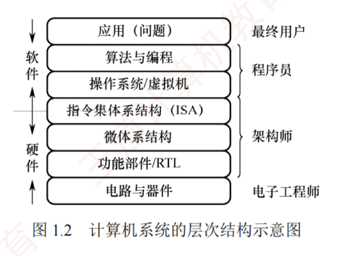

---

## 计算机系统的层次结构

如图 1.2 所示，计算机系统采用**多级层次结构**，通过逐层抽象隔离复杂的硬件实现与高层应用需求。  
从应用问题到物理器件，每层都向上提供简洁的接口，向下依赖更底层的功能实现。  
这种分层设计不仅明确了软/硬件的职责边界，还使系统开发和维护得以并行高效进行。

### 算法和编程

解决应用问题需要先将其抽象为一个正确的算法描述。随后，程序员将该算法用编程语言编写成程序。与自然语言不同，编程语言语法严谨、无二义性，能够精确描述计算机的执行顺序。

#### 编程语言

编程语言可分为高级语言与低级语言。高级语言独立于计算机底层硬件结构，是主流软件开发语言；低级语言则紧密依赖机器结构，特指机器语言及其符号化形式——汇编语言。

1. **机器语言**。又称二进制代码语言，由 0 和 1 组成的指令序列构成。程序员需要熟记每条指令的二进制编码。它是计算机唯一能直接识别和执行的语言。
    
2. **汇编语言**。采用英文助记符（如 `mov`、`add`）或其缩写代替二进制指令，显著提升了可读性与记忆性。但汇编程序不能被硬件直接执行，必须通过一个称为汇编程序的系统软件的翻译，将其转换为机器语言程序后，才能在计算机上运行。
    
3. **高级语言**。如 C、C++、Java 等，允许程序员以接近自然语言的方式描述问题求解过程，极大提高了开发效率。高级语言程序通常需经编译程序处理：或先编译为汇编语言，再经汇编生成机器语言；或直接编译为目标机器的机器语言程序。
    

#### 翻译程序

高级语言源程序必须转换为机器语言程序才能被计算机直接执行，用于完成该转换的系统软件称为翻译程序，转换后生成的程序称为目标程序。翻译程序主要分为以下三类：

1. **汇编程序（汇编器）**：将汇编语言源程序翻译为机器语言目标程序。
    
2. **解释程序（解释器）**：逐条翻译并立即执行高级语言源程序语句，不生成独立的目标程序。
    
3. **编译程序（编译器）**：将高级语言源程序一次性翻译为汇编语言或机器语言目标程序。
    

### 操作系统

所有的语言处理系统都必须在操作系统提供的运行环境中执行；操作系统通过对计算机硬件及其底层结构的抽象，构建出一台可供程序员使用的虚拟机。

### 指令集体体系结构

**指令集体体系结构**（Instruction Set Architecture, **ISA**）是计算机软/硬件之间的关键接口，它从程序员和编译器的视角，**完整地定义了软件可直接使用的硬件功能**。  
主要包括：指令格式、操作类型、寻址方式，以及可访问的寄存器等硬件资源。

因此，ISA 构成了软件所能“感知”到的计算机功能视图，也被称为软件可见部分。我们编写的机器语言程序，本质上就是一串严格遵循该 ISA 规范的指令序列；而硬件执行程序的过程，就是逐条解释并完成这些指令所规定操作的过程。

### 微体系结构

微体系结构（又称微架构）是处理器内部的硬件组织方式，用于实现 ISA 定义的功能。如果说 ISA 定义了“做什么”，那么微架构则决定了“怎么做”。  
其核心设计包括数据通路组织、控制单元实现、流水线级数、缓存层次结构以及分支预测机制等。

例如，加法操作可能通过串行进位加法器、超前进位加法器，甚至专用的 SIMD 单元来实现，这些都属于微体系结构的范畴。相同的 ISA 可对应多种不同的微架构。以 Intel x86 为例，不同代际的处理器（如 Core、Skylake、Alder Lake）均遵循同一套 ISA 规范，但内部组织方式差异显著，体现了微架构的多样性与演进性。