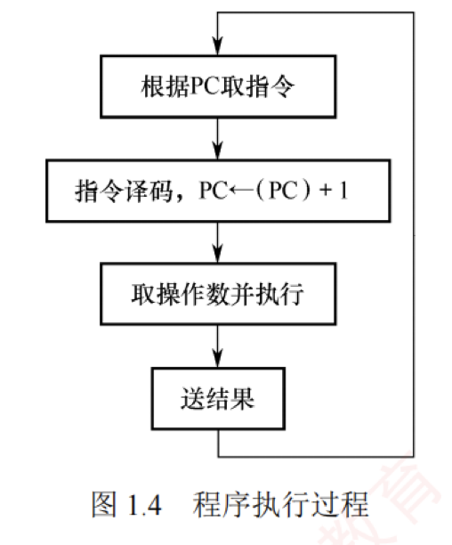
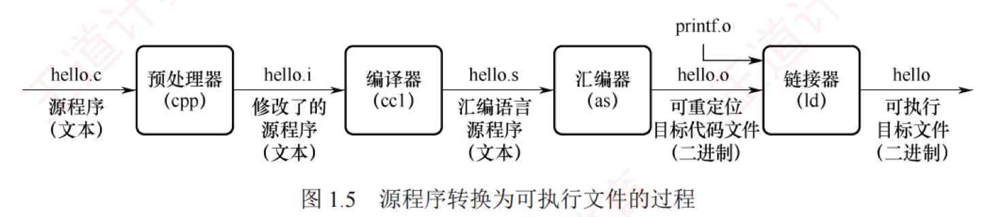

---

## 计算机系统的工作原理

### “存储程序”工作方式

“存储程序”工作方式规定：在程序执行前，需将其包含的指令和数据预先加载到主存储器中；一旦启动，计算机便无须人工干预，自动逐条取出并执行指令。如图 1.4 所示，程序的执行是一个周而复始的指令执行过程。每条指令的执行通常包括以下步骤：从主存储器中取指令（地址由程序计数器 PC 提供）、对指令译码、取操作数、执行操作，并将结果写回存储器。

程序开始执行前，先将第一条指令的地址存入程序计数器（PC）。取指令时，CPU 使用 PC 的内容作为地址访问主存储器。在每条指令执行的最后阶段，系统根据指令类型更新 PC：

- 若为**顺序指令**，则下一条指令地址为当前 PC 值加上指令长度；
    
- 若为**跳转指令**，则下一条指令地址为指令中指定的目标地址。
    
    随后，CPU 根据更新后的 PC 从主存储器中取出下一条待执行的指令，从而实现指令流的自动连续执行。
    
### 从源程序到可执行文件

在计算机中编写的 C 语言程序，必须经过**编译与链接**过程，转换为一系列低级机器指令，并按特定格式封装为**可执行目标文件**，最终以二进制形式存储于磁盘。  
以 UNIX 系统中的 **GCC 编译器**为例，给定源程序文件 `hello.c`，系统通过四个阶段生成可执行文件 `hello`，如图 1.5 所示。

1. **预处理阶段**：预处理器（`cpp`）处理源文件中以 `#` 开头的预处理指令，如将 `#include <stdio.h>` 替换为对应头文件的完整内容，生成预处理后的 C 文件 `hello.i`。
    
2. **编译阶段**：编译器（`cc1`）将 `hello.i` 翻译为汇编程序 `hello.s`，其中每条语句以文本形式描述一条低级机器指令。
    
3. **汇编阶段**：汇编器（`as`）将 `hello.s` 转换为机器语言指令，生成可重定位目标文件 `hello.o`。该文件为二进制格式，包含代码、数据及符号信息。

4.  **链接阶段**：链接器（`ld`）将 `hello.o` 与标准 C 库中所需的函数（例如 `printf`）进行链接，解析外部符号引用，最终生成完整的可执行文件 `hello`，并保存至磁盘。

### 指令执行过程的简要描述

可执行文件中的代码段由一条条**机器指令**构成。每条指令是一串二进制编码，用于指示 CPU 完成一个特定的基本操作。指令的执行可被建模为经典的“**取指—译码—执行**”三阶段循环。