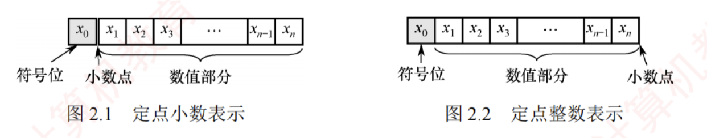

---

## 定点数的编码表示

### 真值和机器数

在日常生活中，数通常用“+”或“-”号表示正负（正号常省略），如 $+15$、$-8$。这类带有符号的数称为**真值**，即机器数所代表的实际数值。  
在计算机中，数的符号与数值部分一同编码：通常用“0”表示正，“1”表示负。这种将符号数字化的表示形式称为**机器数**。

例如，机器数 $0,101$（逗号仅用于分隔符号位与数值位）表示真值 $+5$。

### 机器数的定点表示

根据小数点位置是否固定，计算机中的数值表示分为**定点表示**和**浮点表示**。 

#### 定点表示
**定点表示用于表示定点小数和定点整数**。

1. **定点小数**。表示纯小数，约定**小数点位于符号位之后、数值部分最高位之前**。若数据 $X = x_0.x_1x_2...x_n$（其中 $x_0$ 为符号位，$x_1 \sim x_n$ 为数值位，$x_1$ 为最高有效位），其在计算机中的表示形式如图 2.1 所示。
   
    
2. **定点整数**。表示纯整数，约定**小数点位于数值部分最低位之后**。若数据 $X = x_0x_1x_2...x_n$（其中 $x_0$ 为符号位，$x_1 \sim x_n$ 为数值位，$x_n$ 为最低有效位），其表示形式如图 2.2 所示。
   >小数点默认隐含在最后

#### 图示

事实上，在**机器内部并没有小数点**，只是人为约定了小数点的位置。因此，在定点数的编码和运算中，无须区分该数表示的是小数还是整数，而只需关心符号位和数值位即可。

定点数的编码表示法主要有四种：原码、补码、反码和移码。

### 原码、补码、反码、移码

#### 原码表示法

用机器数的最高位表示数的符号，其余各位表示数的绝对值。  
原码的定义如下：

$$[x]_{原} = \begin{cases} 0,x & 0 \le x < 2^n \\ 2^n - x = 2^n + |x| & -2^n < x \le 0 \end{cases} \quad (x \text{ 是真值，字长为 } n+1)$$

例如，若字长为 8 位，$x_1 = +1110$，$x_2 = -1110$，则其原码表示分别为 $[x_1]_{原} = 0,0001110$，$x_2 = 2^7 + 1110 = 1,0001110$。

对于 $n+1$ 位原码整数，其表示范围为 $-(2^n - 1) \le x \le 2^n - 1$（**关于原点对称**）。
>如果是$n+1$位原码小数，其表示范围为$-(2^{-n} - 1) \le x \le 2^{-n} - 1$（**关于原点对称**）。

> **注意**
> 
> 零的原码表示有**正零和负零**两种形式，即 $[+0]_{原} = 0,0000000$ 和 $[-0]_{原} = 1,0000000$。

##### 原码表示的优缺点

原码表示的**优点**：  
1. 与真值的对应关系简单、直观，转换简便；  
2. 用原码实现乘除运算比较简便。  
**缺点**：  
3. 零的表示不唯一，存在 $\pm 0$ 两种编码；  
4. 用原码实现加减运算比较复杂。

#### 补码表示法

补码表示法的加法和减法运算均可通过加法器统一实现。  
正数的补码与原码相同，负数的补码等于模（$n+1$ 位补码的模为 $2^{n+1}$）与该负数绝对值之差。  
补码的定义如下：

$$[x]_{补} = \begin{cases} 0,x & 0 \le x < 2^n \\ 2^{n+1} + x = 2^{n+1} - |x| & -2^n \le x < 0 \end{cases} \pmod{2^{n+1}}$$

等价地，无论是正数还是负数，$[x]_{补} = 2^{n+1} + x \pmod{2^{n+1}}, -2^n \le x < 2^n$。

例如，若字长为 8 位，$x_1 = +1010$，$x_2 = -1101$，则其补码表示分别为 $[x_1]_{补} = 0,0001010$，$[x_2]_{补} = 2^8 - |x_2| = 1,1110011$。

对于 $n+1$ 位补码整数，其表示范围为 $-2^n \le x \le 2^n - 1$（比原码多表示一个负数，即 $-2^n$）。

- **几个特殊值的补码（$n+1$ 位）：**
    

1. $[+0]_{补} = [-0]_{补} = 0,00...0$（全 0），零的补码表示是唯一的。
    
2. $[-1]_{补} = 2^{n+1} - 1 = 1,11...1$（全 1）。
    
3. 最大正整数：$[2^n - 1]_{补} = 0,11...1$（符号位为 0，数值位全 1）。
    
4. 最小负整数：$[-2^n]_{补} = 1,00...0$（符号位为 1，数值位全 0）。
    

- **模运算（了解）**
    
    在模运算中，一个数与它除以“模”后得到的余数是等价的。如 $A$、$B$、$M$ 满足 $A = B + K \times M$（$K$ 为整数），记为 $A \equiv B \pmod M$，即 $A$、$B$ 各除以 $M$ 后的余数相同。在补码运算中，$[A]_{补} - [B]_{补} = [A]_{补} + M - [B]_{补}$，而 $M - [B]_{补} = [-B]_{补}$，因此补码能够借助加法运算实现减法运算。
    
- **补码与真值之间的转换**
    
    **考点追踪 >> 补码和真值的相互转换（2020、2023）**
    
    **真值转换为补码**：对于正数，与原码的方式一样。对于负数，符号位取 1，其余各位由其绝对值“**按位取反，末位加 1**”得到。**补码转换为真值**：若符号位为 0，则直接读作正数。若符号位为 1，则真值为负数，其绝对值由补码数值部分“**按位取反，末位加 1**”得到。
    
- **变形补码**
    
    为便于溢出检测，可采用双符号位的补码表示（又称变形补码），双符号位 00 表示正数，11 表示负数。若总位数为 $n+2$（高 2 位为符号位，其余为数值位），则变形补码定义为
    
    $$[x]_{变补} = \begin{cases} 00,x & 0 \le x < 2^n \\ 2^{n+2} + x = 2^{n+2} - |x| & -2^n \le x < 0 \end{cases} \pmod{2^{n+2}}$$
    
    在双符号位中，左符表示真正的符号位，右符用于判断“溢出”。
    

#### 反码表示法（了解即可）

反码可视为从原码转换为补码的中间表示形式。

正数的反码与其原码相同。  
负数的反码由其原码的数值部分**按位取反**（末位不加 1）得到。

反码表示存在明显不足：  
① 零的表示不唯一（存在 $\pm 0$ 两种编码）；  
② 表示范围与相同字长的原码相同，比补码少一个最小负数（$-2^n$）。因此，反码在计算机中极少使用。

移码表示法

移码主要用于表示浮点数的阶码，且用于表示整数。其核心思想是将真值 $x$ 加上一个固定偏置值，实现数轴整体右移。设字长为 $n+1$ 位，偏置值通常取 $2^n$，则移码定义为

$$[x]_{移} = 2^n + x \quad (-2^n \le x < 2^n)$$

> **注意**
> 
> 在 IEEE 754 标准的浮点数中，$k$ 位阶码的偏置值为 $2^{k-1}-1$，如 8 位阶码的偏置值为 127。

---

例如，若字长为 8 位，偏置值为 $2^7$，$x_1 = +10101$，$x_2 = -10101$，则其移码表示分别为 $[x_1]_{移} = 2^7 + 10101 = 1,0010101$；$[x_2]_{移} = 2^7 + (-10101) = 0,1101011$。

移码（设字长为 $n+1$，偏置值为 $2^n$）的主要特点如下：

① 零的表示唯一，$[+0]_{移} = 2^n + 0 = [-0]_{移} = 2^n - 0 = 1,00...0$（$n$ 个 0）。

② 在相同字长下，移码与补码仅符号位相反（将补码的最高位取反即得移码）。

③ 移码全 0 时，对应真值的最小值 $-2^n$；移码全 1 时，对应真值的最大值 $2^n - 1$。

④ **移码保持真值的大小顺序**：移码越大，对应真值越大，便于阶码比较。

#### 四种编码表示的总结如下：

1. 正数的原码、反码、补码相同；移码则不同。

2. 原码与反码在数轴上关于原点对称，二者都存在 $+0$ 与 $-0$。

3. 补码与移码的表示不对称，零的表示唯一，且比原码和反码多表示一个负数（$-2^n$）。

4. 原码可直观地比较大小（因数值部分即绝对值），而负数的补码和反码不能像原码那样直观判断。不过，在同为负数的前提下，补码或反码的数值部分越大，其真值也越大。

