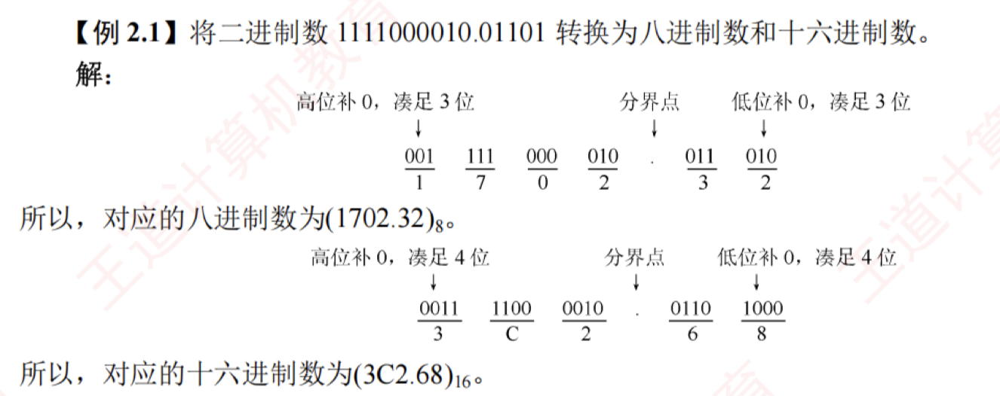
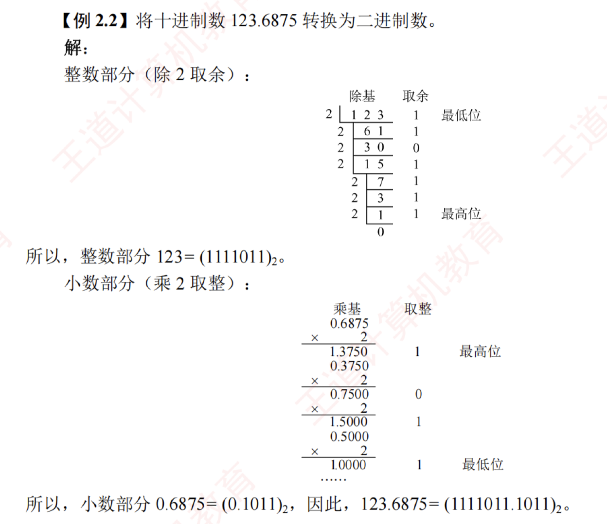

---

## 进位计数制及其相互转换

### 采用二进制编码的原因

1. 二进制只有两个状态，只需使用具有两种物理状态的器件即可表示每一位，硬件实现成本较低。例如，可用高电平和低电平分别表示 1 和 0。
    
2. 二进制的 1 和 0 恰好对应逻辑值“真”与“假”，为计算机实现逻辑运算和程序中的条件判断提供了直接支持。
    
3. 二进制的运算规则极为简单，可通过基本的逻辑门电路高效实现各类算术与逻辑操作。
    

### 进位计数制

常用的进位计数制包括十进制、二进制、八进制和十六进制。  
十进制是日常生活中最常用的计数制，而计算机内部主要使用二进制，并常借助八进制和十六进制来简化表示。

#### 基数
在进位计数制中，**基数**是指每个数位所能使用的**不同数码的个数**。  
例如，十进制的基数为 10（数码为 0~9），计数时遵循“逢十进一”的规则。以十进制数 101 为例，百位的 1 表示 100，个位的 1 表示 1，二者数值不同，是因为每一位的实际值等于该数码乘以其所在位置的位权。一个进位制数的数值，等于各位数码与其位权的乘积之和。

#### r进制基数法的描述
一个 $r$ 进制数 $(K_n K_{n-1} \dots K_0 K_{-1} \dots K_{-m})$ 的数值可表示为

$$K_n r^n + K_{n-1} r^{n-1} + \dots + K_0 r^0 + K_{-1} r^{-1} + \dots + K_{-m} r^{-m} = \sum_{i=n}^{-m} K_i r^i$$

式中，$r$ 是基数；$r^i$ 是第 $i$ 位的位权；$K_i$ 是第 $i$ 位的数码，取值范围为 $0, 1, \dots, r-1$。

1. **二进制**。基数为 2，数码为 0 和 1，计数“逢二进一”。第 $i$ 位的位权为 $2^i$。
    
2. **八进制**。基数为 8，数码为 0~7，计数“逢八进一”。由于 $8 = 2^3$，每 3 位二进制数恰好对应 1 位八进制数，两者转换十分便捷。
    
3. **十六进制**。基数为 16，数码为 0~9 和 A~F（A~F 分别代表 10~15），计数“逢十六进一”。由于 $16 = 2^4$，每 4 位二进制数对应 1 位十六进制数，转换同样便捷。

为便于区分，常在数字后添加后缀字母来标识进制：  
B表示二进制数，O 表示八进制数，D 表示十进制数（通常省略），H 表示十六进制数；此外，也常用前缀 0x 表示十六进制数。

### 不同进制数之间的相互转换

#### 二进制数转换为八进制数和十六进制数

对于一个既有整数部分又有小数部分的二进制数，转换时以小数点为界分别处理：**整数部分**，从小数点向左，每 3 位（八进制）或每 4 位（十六进制）分为一组，若最左侧不足 3 位或 4 位，则在高位补 0；**小数部分**，从小数点向右，同样每 3 位或 4 位分为一组，若最右侧不足，则在低位补 0。分组完成后，将每组直接替换为对应的八进制或十六进制数码即可。

##### 举例

#### 任意进制数转换为十进制数

采用**按权展开相加法**：将各位数码与其对应位权（基数的幂次）相乘，再求和。

例如，$(11011.1)_2 = 1 \times 2^4 + 1 \times 2^3 + 0 \times 2^2 + 1 \times 2^1 + 1 \times 2^0 + 1 \times 2^{-1} = 27.5$。

---

#### 十进制数转换为任意进制数

通常采用**基数乘除法**，对整数部分和小数部分分别处理：

1. **整数部分使用除基取余法**：不断除以目标进制的基数，记录余数，直至商为 0；  
   **最先得到的余数为最低位，最后得到的为最高位**。
    
2. **小数部分使用乘基取整法**：不断乘以基数，记录整数部分，直至小数部分为 0 或达到所需精度。  
   **最先得到的整数为最高位，最后得到的为最低位**。
    
3. 最终将两部分的转换结果拼接，即得到目标进制数。
    

##### 举例

