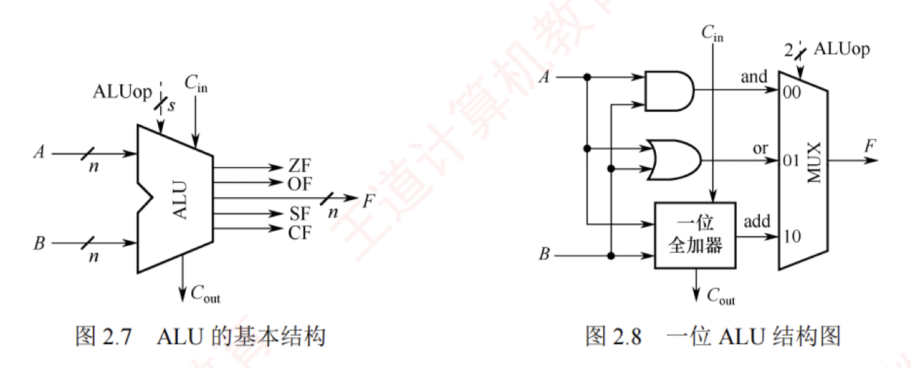

---

### 算术逻辑单元（ALU）

**ALU = Arithmetic and Logic Unit**

ALU 是一种功能较强的组合逻辑电路，能够执行多种算术与逻辑运算。 
 > ALU是运算器的核心
 
其中，加法和减法由带标志加法器直接完成；  
乘法和除法则通常通过 ALU 配合控制逻辑，以多次加减和移位的方式迭代实现。
>加法器是ALU的核心，因为加减乘除等运算都要基于加法器来实现

此外，ALU 还能执行与、或、非等基本逻辑运算。其基本结构如图 2.7 所示：$A$ 和 $B$ 为两个 $n$ 位操作数输入端，$C_{in}$ 为进位输入端，$ALUop$ 为操作控制信号，用于选择 ALU 执行的具体功能。 

例如，当 $ALUop$ 选择加法（Add）时，ALU 输出 $A + B + C_{in}$。  
$ALUop$ 的位数决定了可支持的操作种类数量。  
例如，3 位 $ALUop$ 最多可支持 8 种不同操作。

图 2.8 展示了一位 ALU 的结构，可完成“与”“或”“加法”三种操作。  
其中，加法由一个全加器实现，逻辑运算由专用门电路并行计算，最终通过多路选择器（MUX）根据 $ALUop$ 选择输出结果。  
由于有 3 种操作，$ALUop$ 至少需要 2 位。

