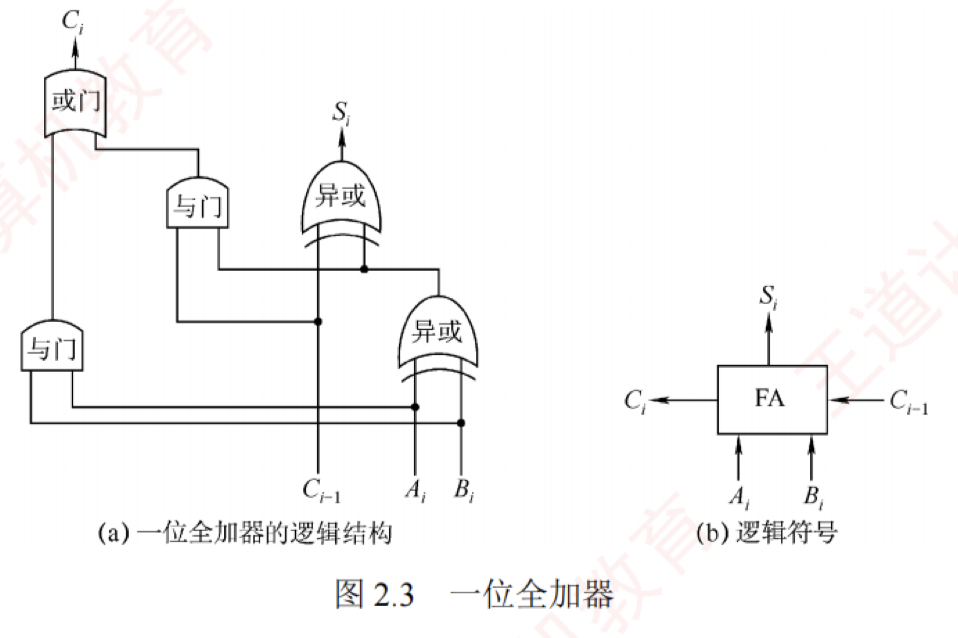
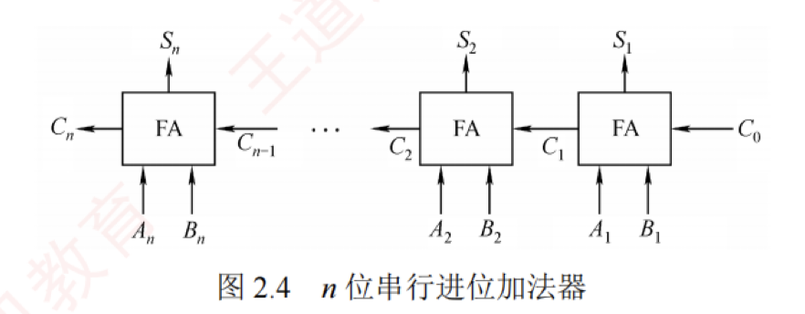
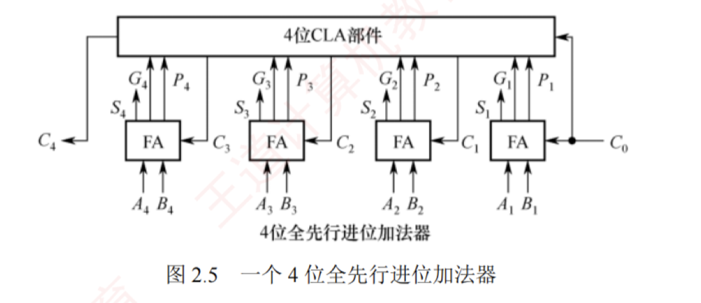
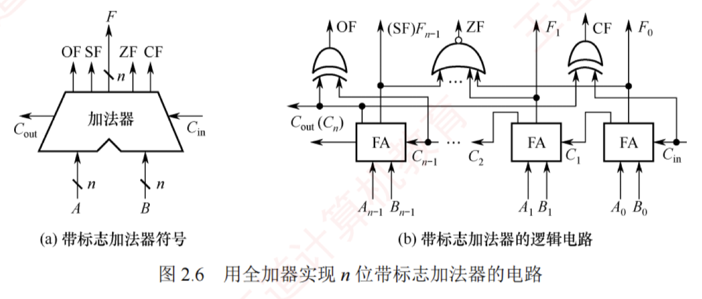

---

### 一位全加器

全加器（FA）是最基本的加法单元，有三个输入：加数 $A_i$、加数 $B_i$ 与来自低位的进位 $C_{i-1}$，两个输出：本位和 $S_i$ 及向高位的进位 $C_i$。其逻辑表达式如下。

- **和表达式**：$S_i = A_i \oplus B_i \oplus C_{i-1}$（当 $A_i$、$B_i$、$C_{i-1}$ 中有奇数个 1 时，$S_i = 1$，否则 $S_i = 0$）

- **进位表达式**：$C_i = A_i B_i + (A_i \oplus B_i)C_{i-1}$

一位全加器的逻辑结构如图 2.3(a) 所示，其逻辑符号如图 2.3(b) 所示。

### 串行进位加法器

将 $n$ 个全加器级联可构成 $n$ 位串行进位加法器（又称行波进位加法器），如图 2.4 所示。  
其特点是**进位信号逐级传递**，**每一级的进位输出直接作为下一级的进位输入**。

图 2.4 中的加法器实现两个 $n$ 位二进制数 $A = A_n A_{n-1} \dots A_1$ 和 $B = B_n B_{n-1} \dots B_1$ 逐位相加的功能，得到和 $S = S_n S_{n-1} \dots S_1$ 及最终进位 $C_n$。  
例如，当 $A = 1111$，$B = 0001$（4 位）时，输出 $S = 0000$，$C_4 = 1$。由于位数固定，结果实际为模 $2^n$ 的加法（溢出部分被丢弃）。

在串行进位加法器中，**总运算延迟主要由进位信号从最低位传播到最高位的时间决定**。位数越多，进位链越长，延迟越大。  
因此，**缩短进位传递路径**是提升加法器性能的关键。

### 并行进位加法器

并行进位（也称先行进位）加法器能够显著提升加法运算速度，因为它能以几乎同时生成所有进位信号的方式工作，而非逐级传递进位。  
为了实现这一目标，$n$ 个一位全加器被连接至一个 $n$ 位先行进位逻辑部件（CLA 部件），以便几乎同时生成所有进位信号。  
因此，并行进位加法器对于较大位数的数据处理效率要高于串行进位加法器。  
图 2.5 展示了一个 4 位全先行进位加法器的例子。  
随着加法器位数的增加，电路设计复杂度也会相应提高。

### 带标志加法器

对于 $n$ 位加法器来说，除了得到运算结果外，还要关注加法运算过程中是否发生了溢出、结果的正负性、结果是否为零等，这些信息对于程序的执行控制非常关键。  
为此，在 $n$ 位加法器的基础上增加了额外的逻辑电路，不仅支持计算和/差，还能生成以下标志位：**OF、CF、SF 和 ZF**，每个标志占 1 位。  
图 2.6 展示了用全加器实现 $n$ 位带标志加法器的电路示意图。

- $C_{in}$是进位输入信号，$C_{out}$是进位输出信号
- **溢出标志 OF** 通过检测最高有效位的进位输入 $C_{n-1}$ 与进位输出 $C_n$ 是否不同决定，即 $OF = C_n \oplus C_{n-1}$，用于**判断有符号数加法运算是否溢出**：$OF = 1$ 表示溢出，$OF = 0$ 表示未溢出。  
- **符号标志 SF** 等于结果的最高有效位，即 $SF = F_{n-1}$，用于指示**有符号数加法运算结果的正负性**：$SF = 0$ 表示结果为正，$SF = 1$ 表示结果为负。  
- **零标志 ZF** 在结果的所有位均为 0 时设置为 1，用于**指示加减运算的结果是否为零**：$ZF = 1$ 表示结果为 0，$ZF = 0$ 表示结果非零。  
- **进位/借位标志 CF** 用于判断**无符号数的加减运算是否发生溢出**：$CF = 1$ 表示溢出，$CF = 0$ 表示未溢出。
  >这些标志信息通常会被送到PSW程序状态字寄存器中(又称FR)。

