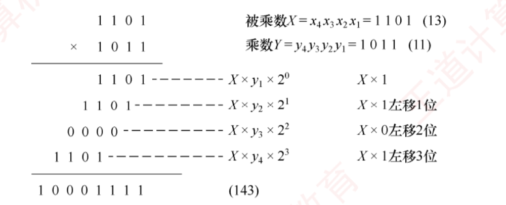
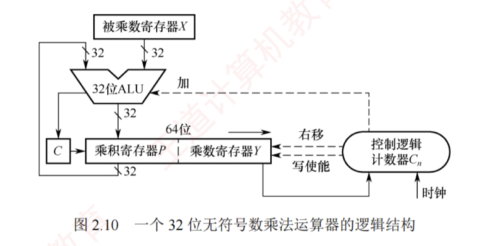
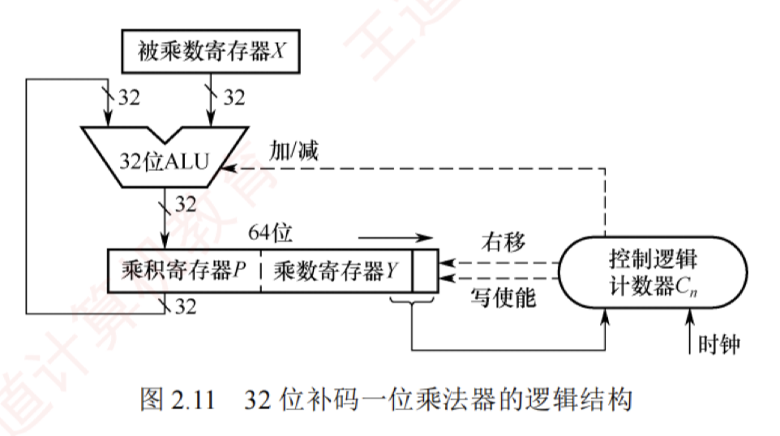
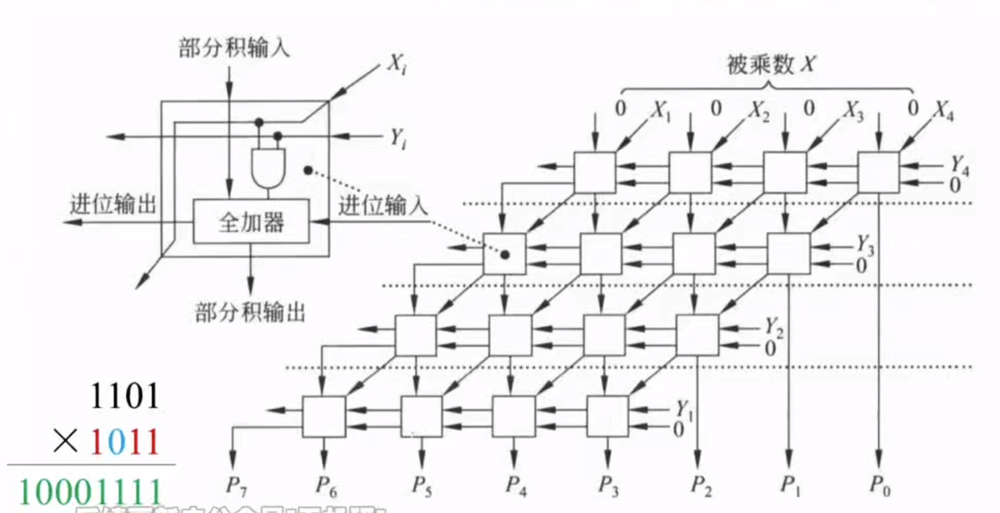
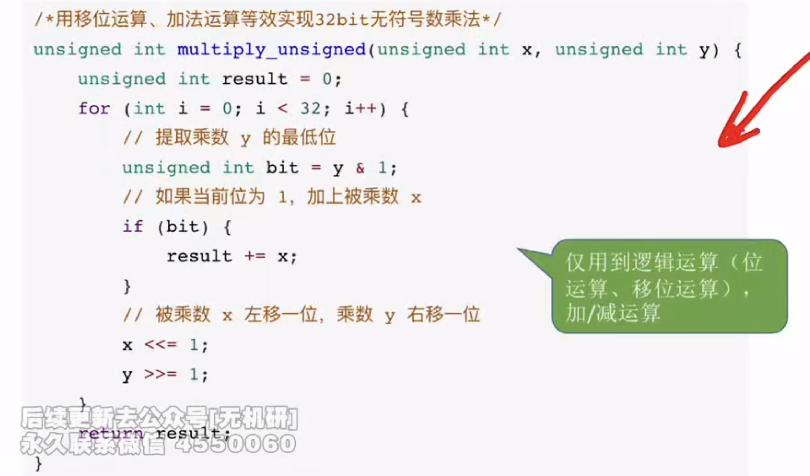
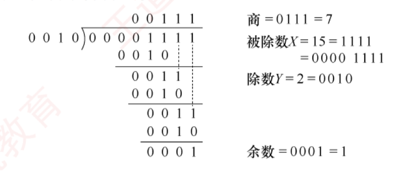
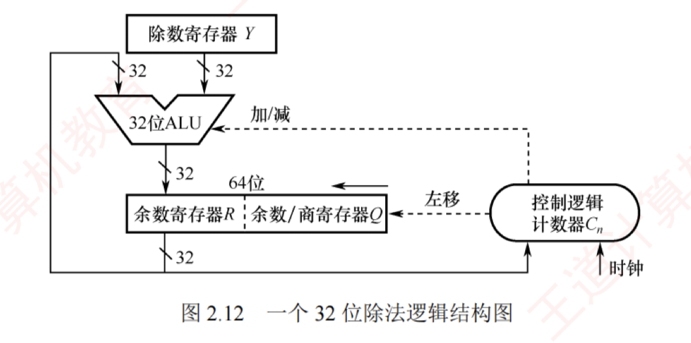

---

## 定点数的乘除运算

### 乘法运算

#### 原码乘法的运算原理

原码乘法的特点是符号位与数值位分别处理，其运算过程分为两步：  
1. 乘积的符号位由两个乘数的符号位异或得到；  
2. 乘积的数值位是两个乘数绝对值的乘积。 
   数值位的乘法可归结为两个无符号数相乘。  

##### 手算过程
以下是两个无符号数相乘的**手算过程**。

上述过程可写成数学推导形式：

$$X \times Y = X \times (y_4 \times 2^3 + y_3 \times 2^2 + y_2 \times 2^1 + y_1 \times 2^0) = \{[(X \times y_4) \times 2 + X \times y_3] \times 2 + X \times y_2\} \times 2 + X \times y_1$$

在硬件实现中，通常采用部分积右移的方式将上述求和过程转换为迭代形式。  
设乘数 $Y = y_n \dots y_2 y_1$（其中 $y_1$ 为最低位），定义部分积序列 $P_0, P_1, \dots, P_n$ 如下：

$$\begin{aligned}

P_0 &= 0 \

P_1 &= (P_0 + X \times y_1) \gg 1 \

P_2 &= (P_1 + X \times y_2) \gg 1 \

&\dots \

P_n &= (P_{n-1} + X \times y_n) \gg 1

\end{aligned}$$

其中，“$\gg 1$”表示逻辑右移一位。需要注意的是，这里的右移是位操作的一部分，而非数学上的除法；所有中间结果均在 $2n$ 位存储空间中保留完整精度。经过 $n$ 次迭代后，最终得到的 $2n$ 位部分积 $P_n$ 即为乘积 $X \times Y$ 的完整二进制表示。因此，乘法运算可通过加法和移位实现。

##### 原码乘法的过程

为了保证精度，部分积需要使用 $2n$ 位寄存器存储。原码乘法的过程可归纳如下：

1. 被乘数和乘数均取绝对值，作为无符号整数参与运算，结果的符号位为 $x_s \oplus y_s$。
    
2. 初始化部分积 $P_0 = 0$，从乘数的最低位 $y_1$ 开始，将当前部分积 $P_{i-1}$ 加上 $X \times y_i$，然后逻辑右移 1 位。重复此步骤 $n$ 次，最终所得的 $2n$ 位部分积即为数值乘积。
    

#### 无符号整数的乘法运算电路

图 2.10 展示了一个。**32 位无符号数乘法运算器**的逻辑结构。  
该电路采用**加法与移位**相结合的方法来完成乘法运算，其设计思想源自手算乘法的基本原理。

##### 主要组成部分及其工作原理

1. **初始化**
    
	- **被乘数寄存器 X**：存储 32 位被乘数 $X$，在整个乘法过程中保持不变。
	    
	- **乘数寄存器 Y**：初始时存储 32 位乘数 $Y$。
	    
	- **乘积寄存器 P**：初始化为 0，用于存放累加的部分积（高 32 位结果）。
	    
	- **计数器 $C_n$**：初始化为 $n$（本例为 32），表示需进行 $n$ 次迭代。
    

2. **执行过程（循环 $n$ 次）**
    
3. **判断**：将乘数寄存器 $Y$ 的**最低位**，送入控制逻辑。
    
4. **加法操作**：若 $Y$ 的最低位为 1，则将当前部分积 $P$ 加上被乘数 $X$，并将进位存入进位触发器 $C$；若 $Y$ 的最低位为 0，则执行**空操作**。
    
5. **移位操作**：将 $C$、$P$ 和 $Y$ 视为一个整体，执行一次**逻辑右移**。  
   具体来说，进位 $C$ 移入 $P$ 的最高位；  
   $P$ 的最低位移入 $Y$ 的最高位；  
   $Y$ 的最低位被丢弃。
    
6. **更新计数器**：计数器 $C_n$ 减 1。若 $C_n \neq 0$，则继续下一轮迭代，否则算法结束。
    

7. **结果与溢出判断**
    

	- **最终结果**：64 位乘积结果存储在寄存器对 $[P:Y]$ 中，其中 $P$ 为高 32 位，$Y$ 为低 32 位。
	    
	- **溢出判断**：若高 32 位结果 $P$ 不为零，则表明乘积超出了 32 位无符号数的表示范围，发生溢出。  
	  此时，处理器将**溢出标志 OF 与进位标志 CF** 同时置 1。
	  >无符号数一般使用溢出标志OF来记录是否发生溢出，而不使用进位标志CF。
    

8. **溢出处理**
    
    溢出处理属于软件层面的操作，通过检查 CF 或 OF 标志位即可判断是否发生溢出。  
    若检测到溢出，则可在乘法指令后插入一条**溢出自陷指令**，自动触发**异常处理程序**，以处理错误（如报告错误、转为高精度计算等）。  
    对于不要求结果精确性的应用，程序员可选择忽略溢出。
    

#### 有符号整数的乘法运算电路

**有符号整数采用补码表示，其乘法需要同时处理符号与数值**。  
A. D. Booth 提出的 Booth 算法让符号位与数值位统一参与运算，直接生成补码形式的乘积，且对正数和负数一视同仁。

图 2.11 所示为 32 位补码一位乘法器的逻辑结构，  
其整体架构与图 2.10 中的无符号乘法器非常相似，**主要区别在于控制逻辑**。  

##### 主要组成部分及其工作原理

1. **初始化**
    

	- **被乘数寄存器 X**：存储 32 位被乘数，在整个乘法过程中保持不变。
	    
	- **乘积寄存器 P**：初始化为 0，用于存放累加的部分积（高 32 位结果）。
	    
	- **乘数寄存器 Y**：初始时存储 32 位乘数；在其右侧附加一个**辅助位** $y_{-1}$，且初始化为 0。
	    
	- **计数器 $C_n$**：初始化为 $n$（本例为 32），表示需进行 $n$ 次迭代。
    

2. **执行过程（循环 $n$ 次）**
    

3. **判断**：将 $Y$ 的最低位 $y_0$ 与辅助位 $y_{-1}$ 组合形成**两位二进制码**，送入控制逻辑。
    
4. **加减法**：若组合为 10，则执行 $P = P - X$（减去被乘数）；  
   若为 01，则执行 $P = P + X$（加上被乘数）；  
   若为 00 或 11，则执行空操作（Booth 算法的原理请参见教材）。
    
5. **移位**：将 $P$、$Y$ 和辅助位 $y_{-1}$ 视为一个整体，执行一次算术右移。  
      >这里需要区别于无符号数的逻辑右移  

   具体来说，$P$ 的最低位移入 $Y$ 的最高位；  
   $Y$ 的最低位移入辅助位 $y_{-1}$；原辅助位 $y_{-1}$ 被丢弃。
    
6. **循环控制**：计数器 $C_n$ 减 1。若 $C_n \neq 0$，则继续下一轮迭代，否则算法结束。
    

7. **结果与溢出判断**
    

	- **最终结果**：64 位乘积存储在寄存器对 $[P:Y]$ 中，其中 $P$ 为高 32 位，$Y$ 为低 32 位。
	    
	- **溢出判断**：若高 32 位结果 $P$ 不是低 32 位结果 $Y$ 的**符号扩展**（$P$ 的所有位不等于 $Y$ 的符号位），则判定为溢出。  
	  此时，处理器将溢出标志 OF 与进位标志 CF 同时置 1。
    

4. **溢出处理**
    
    其溢出处理同样由软件完成。执行有符号乘法指令（如 `imul`）后，应检查 OF 标志位；  
    若发生溢出，则可通过条件跳转进入错误处理程序，或者利用溢出自陷机制由硬件自动触发异常处理程序，以确保程序的健壮性；  
    若已知操作数不会导致溢出，则也可选择忽略该标志。
    

#### 乘法运算的三种实现方式

1. **迭代式乘法器**：即前文所述的经典实现结构，由 ALU、移位器、寄存器和控制逻辑构成。  
   通过多次迭代完成乘法，每次迭代处理一位乘数，若一次 ALU 运算和一次移位各需 1 个时钟周期，则完成 $n$ 位乘法约需 $2n$ 个时钟周期。
    
2. **阵列乘法器**：一种全并行的**快速乘法器**。  
   所有部分积同时生成，并以二维阵列形式组织，再通过加法器网络逐级压缩求和，从而直接得到最终乘积。  
   由于整个数据通路为组合逻辑，在时钟周期足够长的前提下，可在单个时钟周期内完成一次乘法运算。
   
    
3. **移位-加减法**：利用移位与加法（或减法）的组合来模拟乘法运算（例如，乘以 13 可分解为 $X \ll 3 + X \ll 2 + X$）。该方法的硬件成本最低，但运算速度最慢。
   

### 除法运算

在进行定点数除法运算之前，需要先对被除数和除数的取值进行预判，以识别异常或确定结果是否为零。  

**具体规则**如下：

1. 若被除数为 0、除数不为 0，或 $|被除数| < |除数|$，则商为 0，余数等于被除数。
    
2. 若被除数不为 0、除数为 0，则发生“除数为 0”异常。
    
3. 若被除数和除数均为 0，则发生除法错误异常。
    

仅当被除数和除数均不为 0 且 $|被除数| \ge |除数|$ 时，才进入正式的除法计算过程。

#### 无符号整数的除法运算原理

##### 手算演示

无符号整数除法与乘法类似，也是一种基于移位与加减的迭代过程，但流程更为复杂。下面以两个无符号数为例，说明手算除法步骤。

在手算二进制除法中，为便于从最高位开始逐位试商，通常按固定位宽书写被除数，并在高位补 0（例如将 4 位的 1111 写成 00001111），这些前导零不改变数值大小。  
**具体步骤**：

1. 取被除数的高 $n$ 位部分（与除数同宽）作为初始部分被除数，与除数相减。若够减，则上商 1，并将差值作为中间余数；若不够减，则上商 0，中间余数即为该部分被除数。
    
2. 将被除数的下一位“带下来”，拼接 到当前余数末尾，形成新的 $n$ 位部分被除数；再与除数相减，确定下一位商。如此重复，直到所有位处理完毕。
    

手算中在被除数前补 0 主要是为了便于对齐和观察；  
硬件设计采用类似的策略，将 $n$ 位被除数高位补 0 扩展为 $2n$ 位，以支持统一的迭代过程。

#### 无符号整数的除法运算电路

图 2.12 所示为一个 32 位除法逻辑结构图。  
为了适应逐位试商的迭代过程，需要将被除数加载到一个 64 位寄存器中（高 32 位为 0，低 32 位为实际被除数）。  
一般而言，**$n$ 位无符号数除法采用一个 $2n$ 位的被除数（高位补 0）除以一个 $n$ 位的除数，产生 $n$ 位的商和 $n$ 位的余数**。

##### 主要组成部分及其工作原理

1. **初始化**
    

	- **除数寄存器 $Y$**：存储 $n$ 位除数，在整个除法过程中保持不变。
	    
	- **余数/商寄存器 $Q$**：初始时存储 $n$ 位被除数；
	  在迭代过程中逐步生成 $n$ 位商。
	    
	- **余数寄存器 $R$**：初始化为 0，用于**暂存中间余数**。
	    
	- **计数器 $C_n$**：初始化为 $n$，表示需要执行 $n$ 轮迭代。
	    
	- **异常预检**：若除数为 0，则立即触发“除零错误”异常，停止除法运算；  
	  若被除数 $<$ 除数，则商 $= 0$，余数 $=$ 被除数，无须进入执行过程。
    

2. **执行过程（循环 $n$ 次）**
    
    - **移位**：将 $R$ 与 $Q$ 视为一个整体，执行一次**逻辑左移**。  
      具体来说，$R$ 的最高位被移出（通常丢弃），$Q$ 的最高位移入 $R$ 的最低位，$Q$ 的最低位空出以接收新商位。
    
    - **试商与减法**：计算 $[R]-[Y]$；  
      若结果大于或等于 0，则当前商位为 1，并将结果（差值）写回 $R$；  
      若结果小于 0，则当前商位为 0，并执行 $[R]+[Y]$ 以恢复余数（**撤销减法**）。
    
    - **循环控制**：计数器 $C_n$ 减 1。若 $C_n \neq 0$，则继续下一轮迭代，否则算法结束。
    
3. **最终结果**
    
    最终的 $n$ 位商存储在寄存器 $Q$ 中，$n$ 位余数存储在寄存器 $R$ 中。
    
2. **异常处理**
    
    当检测到“**除数为 0**”时，除法器立即停止运算，并置位“除零”异常标志。  
    该异常通常由硬件自动捕获，并通过中断向量表跳转至预设的异常处理程序。
    

> **注意**
> 
> 两个 $n$ 位无符号数相除不会发生溢出。因为被除数最大为 $2^n - 1$，最小的非零除数为 1，此时商为最大值，即为 $2^n - 1$，恰好可用 $n$ 位无符号数表示。

#### 补码除法运算的工作原理

补码作为**有符号整数**的标准表示形式，其除法运算需要**同时处理符号与数值**。  
补码除法让符号位与数值位统一参与运算，商的符号在运算过程中自然生成。  
对于两个 $n$ 位补码数相除，**被除数需要先进行符号扩展至 $2n$ 位**；  
若被除数为 $2n$ 位，除数为 $n$ 位，则无须扩展。

由于补码除法涉及有符号数的比较、加减和移位，其试商规则要比无符号除法复杂得多。  
根据考试大纲要求，仅需掌握其基本实现，底层的原理可参见教材。  
补码除法的硬件结构与图 2.11 所示的无符号除法电路基本一致，下面结合该图说明其基本工作过程。

1. 初始化
    

	- 除数寄存器 $Y$：存储 $n$ 位除数，在整个除法过程中保持不变。
	    
	- 余数/商寄存器 $Q$：初始时存储 $n$ 位被除数；在迭代过程中逐步生成 $n$ 位商。
	    
	- 余数寄存器 $R$：所有位都初始化为被除数的符号位，即完成符号扩展。
	    
	- 计数器 $C_n$：初始化为 $n$，表示需要执行 $n$ 轮迭代。
	    
	- 异常预检：若除数为 0，则立即触发“除零错误”异常，停止除法运算；若 $|被除数| < |除数|$，则商 $= 0$，余数 $=$ 被除数，无须进入执行过程。
    

2. 执行过程（循环 $n$ 次）
    
    - **移位**：将 $R$ 与 $Q$ 视为一个整体，执行一次算术左移。
    
    - **试商与减法**：控制逻辑根据 $[R]$ 与 $[Y]$ 的关系，发出加法或减法信号以确定当前商位。由于涉及有符号数的恢复机制，具体判定规则较复杂，此处不展开。
    
    -  **循环控制**：计数器 $C_n$ 减 1。若 $C_n \neq 0$，则继续下一轮迭代，否则算法结束。
    
3. 最终结果
    
    最终的商存储在 $Q$ 中，余数（符号与被除数相同）存储在 $R$ 中。
    
4. 异常处理
    
    当检测到除数为 0 或发生商溢出时，除法器立即停止运算，并置位相应异常标志，该异常的捕获和处理方式与无符号除法类似。值得注意的是，在两个 $n$ 位补码除法中，商溢出仅有一种情形：被除数为最大负数 $-2^{n-1}$，且除数为 $-1$，此时结果 $2^{n-1}$ 无法用 $n$ 位补码表示。