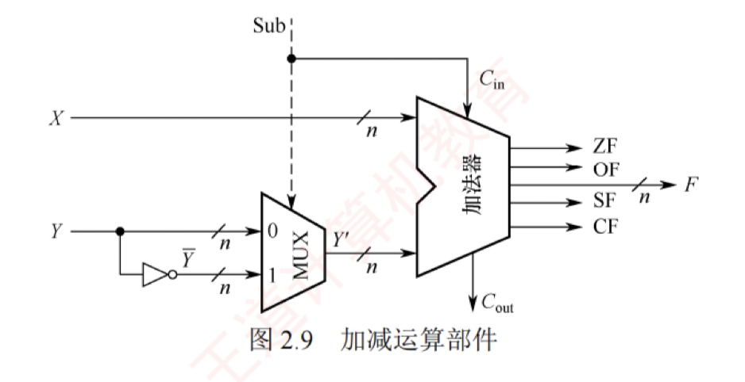

---
## 有符号数的加减运算
### 补码加减运算

补码加减运算规则简单，易于硬件实现。补码加减运算的公式如下（设字长为 $n+1$）。

$$[A+B]_补 = [A]_补 + [B]_补 \pmod{2^{n+1}}$$

$$[A-B]_补 = [A]_补 + [-B]_补 \pmod{2^{n+1}}$$

补码运算具有以下**特点**：

1. 按二进制加法规则运算，逢二进一。
    
2. 若做加法，则两个数的补码直接相加；  
   若做减法，则将被减数与减数的负数补码相加。
    
3. 符号位与数值位一同参与运算，结果的符号位由运算自然得出。
    
4. 运算结果自动截断为 $n+1$ 位（模 $2^{n+1}$），高位进位被丢弃，结果仍为补码形式。
    

**【例 2.3】** 设字长为 8 位（含 1 位符号位），$A=15$，$B=24$，求 $[A+B]_补$ 和 $[A-B]_补$

**解：**

$A=+0001111$，$B=+0011000$；求得 $[A]_补=00011111$，$[B]_补=0011000$，$[-B]_补=1101000$。则

$[A+B]_补 = [A]_补 + [B]_补 = 00001111 + 0011000 = 00100111$，符号位为 0，真值为 $+39$。

$[A-B]_补 = [A]_补 + [-B]_补 = 00001111 + 11101000 = 11110111$，符号位为 1，真值为 $-9$。

### 溢出判别方法

补码加减运算仅在**同号相加**或**异号相减**时可能发生溢出。例如，两个正数相加结果为负，或一个负数减去一个正数结果为正。  
常用的溢出判别方法有以下三种。

#### 采用一位符号位

减法运算在机器中是用加法器实现的，因此加法和减法均可统一视为两个补码数相加。溢出仅发生在参与运算的两个数符号相同，而结果符号与之不同的情况下。  
设参与运算的两个操作数的符号位分别为 $A_s$ 和 $B_s$，运算结果的符号为 $S_s$，则溢出逻辑表达式为

$$V = A_s B_s \bar{S_s} + \bar{A_s} \bar{B_s} S_s$$

#### 采用一位符号位并结合进位情况

设**符号位（最高位）产生的进位为 $C_n$，最高数值位（次高位）产生的进位为 $C_{n-1}$**。  
若 $C_n$ 与 $C_{n-1}$ 不同，则表示溢出。溢出逻辑表达式为

$$V = C_n \oplus C_{n-1}$$
> **原理推导** ：溢出只发生在“正+正”或“负+负”时，我们可以完美推导出这个公式的合理性：
> 
> - **场景 A：两个正数相加（正溢出/上溢）** 两个正数的符号位都是 `0`。`0+0` 本身绝不可能产生进位，所以必定有 $C_{n}$=0。 如果此时它们的数值部分相加太大了，导致最高数值位向符号位进了一个 `1`，即 $c_{n-1}=1$。 此时留在符号位的结果变成了 `0+0+1 = 1`（变成了负数），发生正溢出。 刚好满足：0⊕1=1→OF = 1。
> - **场景 B：两个负数相加（负溢出/下溢）** 两个负数的符号位都是 `1`。`1+1` 必定会向外产生进位，所以必定有 $C_{n}=1$。 如果此时它们的数值部分相加不够大，没能向符号位进位，即 $C_{n-1}=0$。 此时留在符号位的结果变成了 `1+1+0 = 0`（变成了正数），发生负溢出。 刚好满足：1⊕0=1→OF = 1。
> - **场景 C：一正一负相加（绝对不会溢出）** 此时要么都进位（1⊕1=0），要么都不进位（0⊕0=0），OF 恒为 0，这与“异号相加必不溢出”的数学规律完美契合！

#### 采用双符号位

使用两个符号位 $S_{s1}S_{s2}$（$S_{s1}$ 为高位符号位），若两个符号位不同，则表示溢出。  
$S_{s1}S_{s2}$ 的各种情况如下：  
① $S_{s1}S_{s2}=00$：表示结果为正数，无溢出。  
② $S_{s1}S_{s2}=01$：表示结果正溢出。  
③ $S_{s1}S_{s2}=10$：表示结果负溢出。  
④ $S_{s1}S_{s2}=11$：表示结果为负数，无溢出。溢出逻辑表达式为

$$V = S_{s1} \oplus S_{s2}$$

在上述三种方法中，若 $V=0$，则表示无溢出；若 $V=1$，则表示有溢出。
>对于双符号位来说，第一个符号位也就是最高位符号位代表的是本来应该得到的符号位，第二个符号位也就是次高位符号位代表的是实际得到的符号位。
>如果第一个符号位为0，第二个符号位为1，就说明本来应该得到的数是一个正值，但是实际上却得到了一个负值，这就说明发生了上溢。

## 无符号数的加减运算
### 无符号数的加法
无符号整数的加法：从最低位开始，按位相加，并往更高位进位

### 无符号数的减法

计算机硬件如何做无符号整数的減法：

1. 被减数不变，“减数”全部位按位取反、末位+1，**减法变加法**
   
2. 从最低位开始，按位相加，并往更高位进位

### 溢出判别方法

#### 手算判断溢出的方法

n bit 无符号整数表示范围$0$~$2^{n}-1$，超出此范围则**溢出**

#### 计算机判断溢出的方法

**无符号数加法的溢出判断**：最高位产生的进位=1时，发生溢出，否则未溢出。

**无符号数减法的溢出判断**：减法变加法，最高位产生的进位=0时，发生溢出，否则未溢出。

## 加减运算电路

在计算机中，无论是**有符号数还是无符号数的加减运算**，均采用同一套硬件电路实现，即“一套电路，两种语义”。  
图 2.9 所示为一个加减运算部件，其输入端包括两个 $n$ 位操作数 $X$ 和 $Y$，以及一个控制信号 $\text{Sub}$。  
其中，$Y$ 分成两路：一路直接接入二选一多路选择器（MUX），另一路经 $n$ 位反相器后接入同一选择器。控制信号 $\text{Sub}$ 不仅决定选择哪一路数据进入加法器，还在执行减法时作为最低位的进位输入。  
输出端包括 $n$ 位运算结果 $F$ 以及各类标志位。

#### 加法运算的工作原理

无论是有符号数还是补码表示的有符号数，其加法均通过同一加法器电路完成。  
当执行加法操作时（$\text{Sub}=0$），电路实现过程如下。

- **输入：** $X$ 直接接入加法器的一端；$Y$ 接入 MUX。
    
- **控制信号：** $\text{Sub}=0$，同时作为加法器的最低位进位输入 $C_{in}=0$。
    
- **运算：** MUX 在 $\text{Sub}=0$ 时选择 $Y$ 直接通过，加法器执行 $X + Y + C_{in}$ ($X + Y$)，输出 $n$ 位结果 $F$ 和进位输出 $C_{out}$，并生成状态标志位。
    

**语义解释：**

1. 若 $X, Y$ 被视为无符号数，则结果 $F = (X + Y) \bmod 2^n$。当 $X + Y \ge 2^n$ 时，产生进位 $C_{out} = 1$，表示发生无符号溢出；此时，标志 $\text{CF} = C_{out}$ 反映进位状态。
    
2. 若 $X, Y$ 被视为有符号数（$[X]_{\text{补}}, [Y]_{\text{补}}$），则结果 $F = [X + Y]_{\text{补}}$。此时，若两个操作数同号而结果异号（如正+正→负），则表示有符号溢出，由溢出标志 $\text{OF}$ 指示。
    
#### 减法运算的工作原理

无论是有符号数还是补码表示的有符号数，其减法也通过同一加法器电路实现。  
当执行减法操作时（$\text{Sub}=1$），电路实现过程如下：

- **输入：** $X$ 直接接入加法器的一端；$Y$ 接入 MUX。
    
- **控制信号：** $\text{Sub}=1$ ，同时作为加法器的最低位进位输入 $C_{in}=1$。
    
- **运算：** MUX 在 $\text{Sub}=1$ 时选择反相后的 $\bar{Y}$ 输出，加法器执行 $X + \bar{Y} + C_{in}$ ($X + \bar{Y} + 1$)，输出 $n$ 位结果 $F$ 和进位输出 $C_{out}$，并生成状态标志位。
    

**语义解释：**

1. 若 $X, Y$ 被视为无符号数，则该运算等价于计算 $X - Y + 2^n$ (模 $2^n$ 运算)：
    
    - $X \ge Y$ 时，$X - Y + 2^n \ge 2^n$，有进位 $C_{out}=1$，舍去高位后 $F = X - Y$，表示无借位（结果非负）。
        
    - $X < Y$ 时，$0 < X - Y + 2^n < 2^n$，无进位 $C_{out}=0$，表示有借位（结果为负，超出 $n$ 位无符号数范围），表示发生无符号溢出。此时，标志 $\text{CF} = C_{out}$ 反映借位状态。
        
2. 若 $X, Y$ 被视为有符号数（$[X]_{\text{补}}, [Y]_{\text{补}}$），则该运算等价于 $[X - Y]_{\text{补}} = [X]_{\text{补}} + [-Y]_{\text{补}}$：
    
    - 结果 $F$ 即为 $[X - Y]_{\text{补}}$。
        
    - 若运算导致结果超出 $n$ 位补码表示范围（例如，正减负得负，或负减正得正），则发生有符号溢出，由溢出标志 $\text{OF}$ 指示。
        

> **注意**
> 
> 运算器本身无法识别所处理的二进制串是有符号数还是无符号数。例如，$0 - 1 = 00...0 + 11...1 = 11...1$，若解释为有符号数，对应值为 $-1$，结果正确；若解释为无符号数，对应值为 $2^n - 1$ ($n$ 位无符号数的最大值)，与数学结果不符。此类易混点是统考极易考查的内容。

#### 各类标志位的含义

可通过状态标志位来区分有符号数与无符号数的运算结果，各类标志位的含义如下。

- **零标志 ZF：** 当结果 $F = 0$ 时，$\text{ZF} = 1$；否则 $\text{ZF} = 0$。对无符号数和有符号数均有意义。
    
- **溢出标志 OF：** 用于判断有符号数运算是否发生溢出，$\text{OF} = C_n \oplus C_{n-1}$（符号位进位与最高数值位进位的异或）。  
  对无符号数运算无意义。  
  即无法依据 $\text{OF}$ 判断无符号数运算是否溢出。  
  例如，无符号加法 $010 + 011 = 101$，虽然 $\text{OF} = 1$，但结果并未溢出。
    
- **符号标志 SF：** 等于结果 $F$ 的最高位（符号位）。仅对**有符号数**有意义。
    
- **进/借位标志 CF：** 用于表示无符号数运算中的进位/借位情况，判断是否溢出。  
  仅对无符号数有意义。  
  加法（$\text{Sub}=0$）时，$\text{CF} = 1$ 表示有进位，即发生上溢，$\text{CF} = C_{out}$。  
  减法（$\text{Sub}=1$）时，$\text{CF} = 1$ 表示有借位，即不够减，$\text{CF}$ 等于 $C_{out}$ 取反。  
  综合得 $\text{CF} = \text{Sub} \oplus C_{out}$。  
  例如，无符号数加法 $110 + 011$ 产生进位；  
  无符号数减法 $000 - 111$ 产生借位，结果均发生溢出 ($\text{CF} = 1$)。
    

#### 无符号数大小的比较

在无符号数运算中，**零标志 ZF** 和 **进/借位标志 CF** 是判断大小关系的关键。设 $A$ 和 $B$ 为两个无符号数，执行运算 $A - B$ 后，根据 $\text{ZF}$ 和 $\text{CF}$ 的值可判断 $A$ 和 $B$ 的大小。

- **若 $A = B$。** 如 $A - B = 011 - 011 = 000$，结果为零 $\text{ZF} = 1$，无借位 $\text{CF} = 0$。
    
- **若 $A > B$。** 如 $A - B = 010 - 001 = 001$，结果非零 $\text{ZF} = 0$，无借位 $\text{CF} = 0$。
    
- **若 $A < B$。** 如 $A - B = 000 - 001 = (1)000 - 001 = 111$，结果非零 $\text{ZF} = 0$，有借位 $\text{CF} = 1$。
    

综上，判断规则如下：当 $\text{ZF} = 1$ 时（无须检查 $\text{CF}$），说明 $A = B$；当 $\text{ZF} = 0$ 且 $\text{CF} = 0$ 时，说明 $A > B$；当 $\text{CF} = 1$ 时（此时 $\text{ZF}$ 必为 0，无须额外检查），说明 $A < B$。

#### 有符号数大小的比较

在有符号数运算中，**零标志 ZF**、**溢出标志 OF** 和 **符号标志 SF** 共同用于判断大小关系。设 $A$ 和 $B$ 为两个有符号数，执行运算 $[A]_{\text{补}} - [B]_{\text{补}}$ 后，根据 $\text{ZF}$、$\text{OF}$、$\text{SF}$ 的值判断 $A$ 和 $B$ 的大小。

- **若 $A = B$。** 如 $[A]_{\text{补}} - [B]_{\text{补}} = 011 - 011 = 011 + 101 = (1)000$，得 $\text{ZF} = 1, \text{OF} = C_3 \oplus C_2 = 0, \text{SF} = 0$。
    
- **若 $A > B$。**
    
    - 无溢出示例：如 $[A]_{\text{补}} - [B]_{\text{补}} = 010 - 001 = 010 + 111 = (1)001$，得 $\text{ZF} = 0, \text{OF} = 0, \text{SF} = 0$；
        
    - 有溢出示例：$[A]_{\text{补}} - [B]_{\text{补}} = 011 - 101 = 011 + 011 = 110$，得 $\text{ZF} = 0, \text{OF} = 1, \text{SF} = 1$。
        
- **若 $A < B$。**
    
    - 无溢出示例：如 $[A]_{\text{补}} - [B]_{\text{补}} = 000 - 001 = 000 + 111 = 111$，得 $\text{ZF} = 0, \text{OF} = 0, \text{SF} = 1$。
        
    - 有溢出示例：$[A]_{\text{补}} - [B]_{\text{补}} = 101 - 011 = 101 + 101 = (1)010$，得 $\text{ZF} = 0, \text{OF} = 1, \text{SF} = 0$。
        

综上，判断规则如下：当 $\text{ZF} = 1$ 时，说明 $A = B$；当 $\text{ZF} = 0$ 且 $\text{OF} = \text{SF}$（或 $\text{OF} \oplus \text{SF} = 0$）时，说明 $A > B$；当 $\text{ZF} = 0$ 且 $\text{OF} \neq \text{SF}$（或 $\text{OF} \oplus \text{SF} = 1$）时，说明 $A < B$。

> **注意**
> 
> 当 $\text{ZF} = 0$ 且未发生溢出时，即 $\text{OF} = 0$ 时，若 $\text{SF} = 0$，则表示结果非负，说明 $A > B$；当发生溢出时，即 $\text{OF} = 1$ 时，若 $\text{SF} = 1$，则必然是正数减去负数发生溢出导致结果为负，说明 $A > B$。
> 
> 当 $\text{ZF} = 0$ 且未发生溢出时，即 $\text{OF} = 0$ 时，若 $\text{SF} = 1$，则表示结果为负，说明 $A < B$；当发生溢出时，即 $\text{OF} = 1$ 时，若 $\text{SF} = 0$，则必然是负数减去正数发生溢出导致结果为正，说明 $A < B$。
