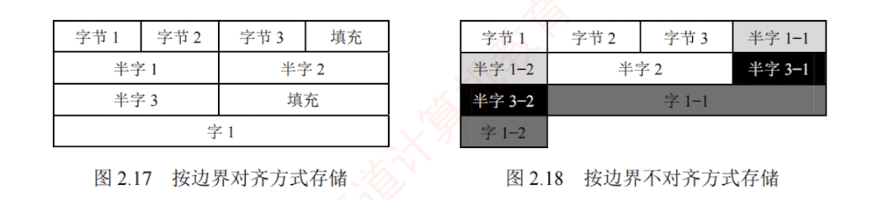

---

### C 语言中的浮点数类型


C 语言中的 `float` 型和 `double` 型分别对应 IEEE 754 单精度和双精度浮点数。`long double` 型通常对应扩展双精度格式，其长度和格式依赖于编译器与目标平台。在 C 语言中，表达式中的赋值、运算或比较操作会触发自动类型转换，常见的转换序列为 `char` $\to$ `int` $\to$ `long` $\to$ `double` 和 `float` $\to$ `double`，这些转换通常由范围和精度较低的类型向更高者进行，一般不会丢失信息。

当不同类型的数据混合运算时，遵循类型提升原则：较低类型自动转换为较高类型。例如，$long$ 与 $int$ 运算时，先将 $int$ 转换为 $long$，然后进行运算，结果为 $long$；$float$ 与 $double$ 运算时，先将 $float$ 转换为 $double$，结果为 $double$。这类由编译器自动完成的转换称为隐式类型转换。


1. **int 转 float 时**，虽然不会发生溢出，但由于 `float` 尾数（含隐藏位）仅 24 位有效，而 `int` 为 32 位，当整数值的二进制有效位超过 24 位时，需做舍入处理，导致精度损失。
    
2. **int 或 float 转 double 时**，因 `double` 的有效位更多，通常能精确表示原值。
    
3. **double 转 float 时**，一方面 `float` 的表示范围较小，大数值转换时可能发生溢出；另一方面 `float` 的尾数有效位变少，高精度数转换时会发生舍入误差。
    
4. **float 或 double 转 int 时**，由于 `int` 没有小数部分，小数部分被直接丢弃（向零截断）；同时若浮点数值超出 `int` 的表示范围，则会发生整数溢出。
    

不同数据类型之间的转换常隐藏不易察觉的精度损失或溢出风险，编程时需格外谨慎。


### 数据的宽度和存储

#### 数据的宽度和单位

##### 比特

**比特**（bit，也称位，符号为 b）是最小的信息单位，表示一个二进制位（0 或 1）； 

##### 字节

**字节**（byte，符号为 B）是基本的存储和寻址单位，1 字节 = 8 比特。  
随着信息规模增大，常在 B（字节）或 b（位）前添加前缀以表示更大的容量，如 KB、MB、GB 等。在传统计算机系统中，这些前缀通常按 2 的幂定义，如 $1\text{KB} = 2^{10}\text{B} = 1024\text{B}$。

##### 字

**字**（word）也是常用的数据组织单位。它是由体系结构定义的逻辑单位，通常用于表示整数、地址等基本数据类型的宽度，其长度因架构而异，常见的有 2、4 或 8 字节。

##### 字长

与字不同，**字长**（也称机器字长）指 CPU 内部整数运算的**数据通路**的宽度，**通常等于通用寄存器的宽度**。  
字长反映计算机一次能处理的整数数据的位数，是衡量机器性能的重要指标。  
日常所说的“32 位机”或“64 位机”，其中的 32 或 64 即指字长。  
例如，在 Intel x86 架构中，自 80386 起字长为 32 位（32 位机），但其体系结构仍将 16 位定义为一个字，32 位称为双字。  
这表明：**字是架构层面的约定，而字长体现的是硬件的实际处理能力**。

#### 数据的“大端方式”和“小端方式”存储

在存储数据时，数据从低位到高位可以按从左到右排列，也可以按从右到左排列。  
因此，不宜用最左或最右来表征数据的最高位或最低位，通常使用**最低有效字节**（LSB）和**最高有效字节**（MSB）来分别表示数据的最低位和最高位。  

例如，在 32 位计算机中，一个 `int` 型变量 `i` 的机器数为 $01\ 23\ 45\ 67\text{H}$，其最高有效字节 $\text{MSB} = 01\text{H}$，最低有效字节 $\text{LSB} = 67\text{H}$。


现代计算机普遍采用字节编址，即**每个地址对应 1 字节**。  
不同类型的数据占用不同字节数（如 `int` 和 `float` 占 4 字节，`double` 占 8 字节），而程序中每个变量仅分配一个起始地址。  
假设变量 `i` 的地址为 $0800\text{H}$，那么其 4 个字节 $01\text{H}, 23\text{H}, 45\text{H}, 67\text{H}$ 将占据连续的 4 个内存单元。  
这些字节在内存中的排列方式分为两种：

|**存储方式**|**0800H**|**0801H**|**0802H**|**0803H**|**...**|
|---|---|---|---|---|---|
|大端方式|$01\text{H}$|$23\text{H}$|$45\text{H}$|$67\text{H}$|...|
|小端方式|$67\text{H}$|$45\text{H}$|$23\text{H}$|$01\text{H}$|...|


1. **大端方式（big endian）：** MSB 存储在低地址，LSB 存储在高地址，字节顺序与标准十六进制书写顺序一致。
	>更便于人类阅读


2. **小端方式（little endian）：** LSB 存储在低地址，MSB 存储在高地址，字节顺序与标准书写顺序相反。
    >更易于机器处理


在分析机器代码时，需特别注意字节顺序。例如，以下是由反汇编器生成的一行代码：


```Plaintext
4004d3:  01 05 64 94 04 08        add  eax, 0x08049464
```

其中，`4004d3` 是指令地址，`01 05 64 94 04 08` 是指令的机器码，`add eax, 0x08049464` 是其汇编形式。指令的第二个操作数是立即数 `0x08049464`，其在内存中按地址递增顺序存储为：`64H`、`94H`、`04H`、`08H`。由于低地址存放的是 LSB（`64H`），高地址存放的是 MSB（`08H`），符合小端方式的特征。将这 4 个字节按小端规则重组，即可得到正确的立即数 `0x08049464`。  
因此，在阅读小端机器代码时，需要将连续字节按**逆序**组合才能还原其逻辑数值。

##### 理解
- 对于大端序：低位存储在高地址，高位存储在低地址
- 对于小端序：低位存储在低地址，高位存储在高地址
- 机器从低地址到高地址依次扫描获取每个字节的值。
#### 数据按“边界对齐”方式存储

在字长为 32 位的系统中，边界对齐要求数据的存储地址是其对齐值（通常等于该类型大小，单位：字节）的整数倍：字节可位于任意地址，半字地址须为 2 的倍数，字地址须为 4 的倍数。满足此条件时，CPU 可通过一次访存读取完整数据；否则，若数据跨越两个存储单元，则需两次访存并拼接字节，显著降低效率。为满足对齐要求，编译器会在必要时填充空白字节。这种“以空间换时间”的策略虽略微增加内存占用，但能大幅提升访问速度。

例如，数据序列“字节 1、字节 2、字节 3、半字 1、半字 2、半字 3、字 1”按边界对齐与非对齐方式存储的格式分别如图 2.17 和图 2.18 所示。


C 语言中，`struct` 型的内存布局遵循以下对齐规则：① 每个成员的起始地址必须是其对齐值的整数倍（例如：`char` 为 1，`short` 为 2，`int` 为 4）；② 整个结构体的大小必须是其最大成员对齐值的整数倍（不足则在尾部填充）。这确保了每个结构体成员的起始地址均满足对齐要求。

先看两个例子（基于 32 位 x86 环境，GCC 编译器）：


```c
struct A {
    int a;
    char b;
    short c;
}

struct B {
    char b;
    int a;
    short c;
}
```

结果却是：`sizeof(A) = 8`, `sizeof(B) = 12`。

设 B 从地址 `0x0000` 开始，成员 b 的对齐值是 1，其存放地址符合 `0x0000 % 1 = 0`；成员 a 的对齐值是 4，需对齐到 4 字节边界，故起始于 `0x0004`，占据 `0x0004 ~ 0x0007`；成员 c 的对齐值是 2，起始于 `0x0008`，占据 `0x0008 ~ 0x0009`。此外，结构体长度必须是最大对齐值（4）的整数倍，当前大小 10 字节，需填充至 12 字节（`0x000A ~ 0x000B`）。

设 A 也从地址 `0x0000` 开始，成员 a 的对齐值是 4，存放在 `0x0000 ~ 0x0003`；成员 b 的对齐值是 1，存放在 `0x0004`；成员 c 的对齐值是 2，为满足“起始地址 % 对齐值 = 0”的条件，只能存放在 `0x0006 ~ 0x0007`，总大小为 8 字节，无须尾部填充。

精简指令集计算机（RISC）普遍采用边界对齐，以支持高效的指令流水线。