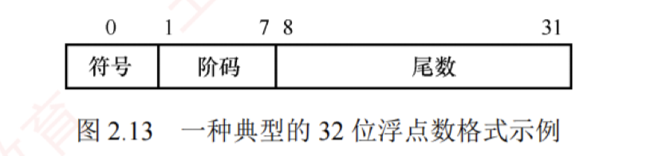

---

### 浮点数的表示与运算

浮点数表示法通过将比例因子嵌入数据中，使小数点位置可根据需要浮动。  
这样，在有限位数下，既能扩大数值的表示范围，又能保持较高的有效精度。  
例如，用定点数表示电子质量 ($9 \times 10^{-28}\text{g}$) 或太阳质量 ($2 \times 10^{33}\text{g}$) 极为不便，而浮点数则能高效处理此类极大或极小的数值。

通常，浮点数表示为
$$N = (-1)^S \times M \times R^E$$

$S$（取值 0 或 1）决定**浮点数的符号**；  
$M$ 是一个非负的**定点小数**，称为**尾数**，通常用**原码**表示；  
$E$ 是一个**定点整数**，称为阶码（或指数），通常采用**偏置**表示（一种**移码**形式）。  
$R$ 是**基数**（通常隐含约定为 2、4 或 16）。  
可见，**浮点数由符号、尾数和阶码三部分组成**。

#### 浮点数举例
在 IEEE 754 浮点数标准广泛使用之前，不同计算机所用的浮点数表示格式各不相同。图 2.13 展示了一种典型的 32 位短浮点数格式示例。

其中，第 0 位为符号 $S$；  
第 1~7 位为阶码 $E$，采用偏置值为 64 的移码表示；  
第 8~31 位为 24 位尾数 $M$，以二进制原码小数表示；  
基数 $R$ 为 2。  
在该格式中，阶码的值决定了小数点实际位置；  
阶码的位数决定了浮点数的表示范围；  
尾数的位数则决定了数值的精度。