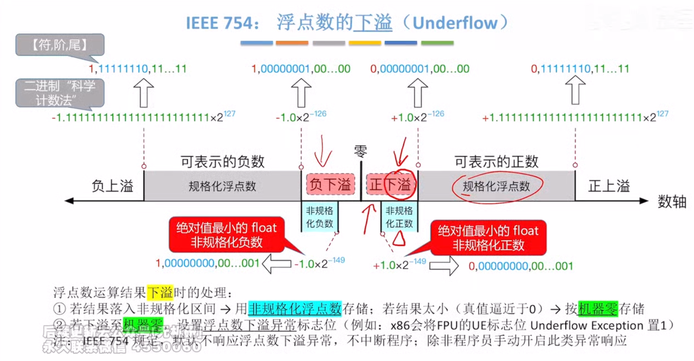

---

### 2.3.2 浮点数的加减运算

浮点数运算的特点是阶码与尾数分开处理，浮点数加减运算分为以下几个步骤。

#### 对阶

对阶的目的是使两个操作数的小数点位置对齐，即令它们的阶码相等，以便尾数可以直接相加减。 

对阶的原则是：**小阶向大阶看齐**，即将阶码较小的数的尾数右移，右移位数等于两阶码差的绝对值。
>更有可能得到规格化的尾数，若采用大阶向小阶看齐，则需将尾数左移，导致最高有效位被移出，造成不可逆的精度错误。

对于 IEEE 754 标准的浮点数，对阶时需要进行移码减法运算，以求得阶码差。  
尾数右移时，仅移动数值位，符号位不参与移位；对于规格化数，隐藏位 1 会随尾数右移而进入小数部分，空出的高位补 0。  

**为保证运算精度，移出的低位不应丢弃，而应保留并参与后续尾数运算。**

#### 2. 尾数加减

由于 IEEE 754 标准采用定点原码小数表示尾数，因此**尾数加减运算实质上是定点原码小数的加减运算**，应根据相应的规则执行。  
对于规格化数，在运算前还需要将**隐藏位还原到尾数部分**，形成完整的 **$1.f$ 形式**。  
此外，对阶过程中为保持精度而保留的**附加位也要参与尾数加减运算**。

#### 3. 尾数规格化

为在浮点运算中最大限度保留有效数字，需要对运算结果进行规格化处理。  
所谓**规格化**，是指通过调整尾数与阶码，使**浮点数的尾数满足最高有效位为 1 的形式**。

IEEE 754 规格化尾数的形式为 $1.x \dots x$。尾数相加减后可能出现两类非规格化结果：

$$1.x \dots x + 1.x \dots x = 1x.x \dots x$$

$$1.x \dots x - 1.x \dots x = 0.0 \dots 01x \dots x$$

1. **右规**：当结果为 $1x.x \dots x$ 时，需要进行右规。尾数每右移一位，阶码加 1。尾数右移时，最高位 1 被移到小数点前一位作为隐藏位，最后一位移出时，要考虑舍入。
    
2. **左规**：当结果为 $0.0 \dots 01x \dots x$ 时，需要进行左规。尾数每左移一位，阶码减 1。可能需要左规多次，直到将第一位 1 移至小数点左边。

	>这里的左规和右规可以理解成，小数点固定不变，尾数向左或向右移动。

**注意**

1. 左规一次相当于乘以 2，右规一次相当于除以 2；  
2. 需要右规时，只需进行一次。

#### 舍入

在对阶和右规过程中，尾数右移可能导致低位丢失。为保证精度，移出的低位通常被保留用于中间计算。最终结果需通过舍入处理，还原为标准的 IEEE 754 格式。

为此，IEEE 754 引入**三个辅助位**以指导精确舍入。

1. **保护位**：紧邻尾数最低有效位之后的第一位，用于初步判断舍入方向。
    
2. **舍入位**：位于保护位之后，与保护位和粘滞位共同构成完整的舍入信息。
    
3. **粘滞位**：只要舍入位之后被移出的位中存在至少一个 1，粘滞位就置为 1，否则为 0。
    

IEEE 754 定义了四种可选的舍入模式。

1. **就近舍入（默认方式）**：选择最接近真实值的可表示数。若真实值恰好位于两个可表示数的正中间，则选择尾数最低有效位为 0 的那个（偶数）。  
   **具体规则**：  
	- ① 若保护位 = 0，直接舍去；
	- ② 若保护位 = 1 且（舍入位 = 1 或粘滞位 = 1），则尾数加 1；
	- ③ 若保护位 = 1、舍入位 = 0、粘滞位 = 0，则在尾数末位为奇数时向其加 1，以符合向偶数舍入的要求。
    

例如，运算后得到浮点数的临时尾数 $M_1$，舍入过程如下：$M_1$

$$M_1 = 1.1011\ 0011\ 1100\ 1100\ 1101\ 010\ \underline{1\ 0\ 1}$$

注意，下划线部分为保留的 23 位尾数，其后依次为保护位、舍入位、粘滞位。
由于保护位 = 1、舍入位 = 0、粘滞位 = 1，结果属于非中间值，需要向尾数加 1。加 1 后的 23 位尾数为 $1011\ 0011\ 1100\ 1100\ 1101\ 011$。

若运算后得到临时尾数 $M_2$，则舍入过程如下：

$$M_2 = 1.1011\ 0011\ 1100\ 1100\ 1101\ 010\ \underline{1\ 0\ 0}$$

由于保护位 = 1、舍入位 = 0、粘滞位 = 0，结果恰好位于两个可表示数的正中间。此时尾数最低有效位为偶数，无须加 1。最终的 23 位尾数保持为 $1011\ 0011\ 1100\ 1100\ 1101\ 010$。

2. **正向舍入**：朝数轴 $+\infty$ 方向舍入，即选择数值更大的可表示数。
    
3. **负向舍入**：朝数轴 $-\infty$ 方向舍入，即选择数值更小的可表示数。
    
4. **截断法**：直接截取所需位数，丢弃后面的所有位，实现最为简单。对正数或负数来说，都是选择更接近原点的那个可表示数，也称为朝原点舍入。
    

#### 溢出判断

在尾数规格化或舍入过程中，可能对阶码进行加减操作，因此需要判断指数是否溢出。在 IEEE 754 中，浮点数的溢出由阶码是否超出可表示范围决定；  
尾数溢出可通过右规修正，而真正的溢出仅发生在阶码上溢或下溢时。

1. **上溢判断**：尾数相加后结果 $\ge 2$，或舍入时尾数末位加 1 引发进位（如 $1.111\dots+1 = 10.000\dots$），则均需右规：尾数右移一位，阶码加 1。若原阶码已为最大正规格化值（单精度阶码字段为 $11111110$，对应真值 $+127$），加 1 后变为 $11111111$（该编码保留用于表示无穷大或 NaN），则视为指数上溢，通常会引发异常。
    
2. **下溢判断**：左规时尾数左移，阶码减 1。若阶码真值减至低于最小正规格化值（单精度 $-126$，双精度 $-1022$），则进入非规格化数范围（阶码字段为 0）。若结果进一步小于最小可表示非规格化数（如 $2^{-149}$ 或 $2^{-1074}$），则视为指数下溢，通常将结果置为机器零。

 

#### 举例

**【例 2.7】** 设 $x$ 和 $y$ 为 float 型变量，$x=10.5$，$y=-120.625$，请给出 $x+y$ 的计算过程。

**解**：

$x=10.5=(1010.1)_2=(1.0101)_2 \times 2^3$。其 IEEE 754 单精度：符号位为 0；阶码为 $3 + 127 = 130$，即 $1000\ 0010$；机器数（注意隐含尾数最高位）为 `0;1000 0010;010 1000 0000 0000 0000 0000`。

$y=-120.625=-(1111000.101)_2=-(1.111000101)_2 \times 2^6$。其 IEEE 754 单精度：符号位为 1；阶码为 $6 + 127 = 133$，即 $1000\ 0101$；机器数为 `1;1000 0101;111 0001 010 0000 0000 0000`。

1. **对阶**。求阶差 $E_x - E_y = -3$。故将 $x$ 的尾数右移 3 位，阶码调整为 $E_y = 133$。对阶后，$x$ 的尾数变为 $0.0010\ 1010\ 0000\ 0000\ 0000\ 000\ 000$（含保留的附加位），此时无隐藏位。
    
2. **尾数相加**。$0.0010\ 1010\ 0000\ 0000\ 0000\ 000\ 000 + (-1.1110\ 0010\ 1000\ 0000\ 0000\ 000) = -1.1011\ 1000\ 1000\ 0000\ 0000\ 000\ 000$（注意，附加位参与运算，但不会存储）。
    
3. **规格化**。尾数相加结果 $-1.1011100010 \dots \times 2^6$，已是规格化形式。
     
4. **舍入**。单精度尾数保留 23 位，附加位全为 0，按就近舍入规则，直接截断。
    

因此，$x+y$ 的机器数为 `1;1000 0101;1011 1000 1000 0000 0000 000`。

其真值为 $-(1.101110001)_2 \times 2^6 = -(1101110.001)_2 = -110.125$。