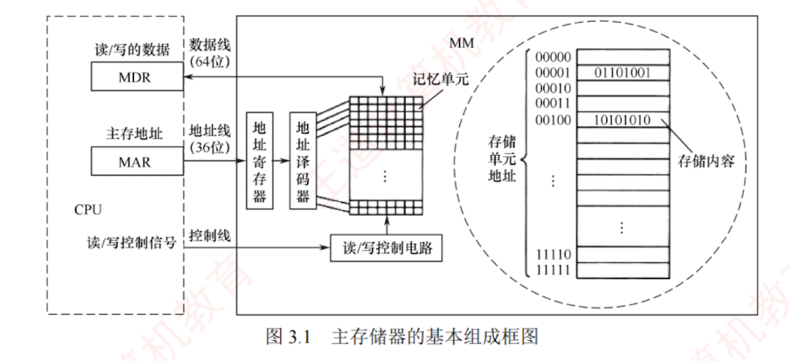

---

##  主存储器的组成和基本操作

### 组成

图 3.1 是主存储器 (Main Memory, MM) 的基本组成框图。  
其中，由大量用于存储二进制数 0 或 1 的**记忆单元**（也称**存储元**）构成的**存储矩阵**（也称**存储体**、**存储阵列**）是存储器的核心部件。  
每个记忆单元是一种具有两种稳定物理状态、能够表示 0 和 1 的器件。  
为访问存储体中的信息，必须对存储单元编号（**地址**）。  
**编址单位**是指具有相同地址的一组记忆单元，称为一个**存储单元**。  
现代计算机普遍采用**字节编址方式**，即每个地址对应 1 字节（8 位）数据。

### 基本操作

当 CPU 执行指令需访问主存时，首先将目标地址送入**存储器地址寄存器 (MAR)**，并通过地址线传至主存的地址寄存器；地址译码器据此选中对应的存储单元。  
同时，CPU 通过控制线向主存发送读/写控制信号。  
若为写操作，CPU 将待写入的数据送入**存储器数据寄存器 (MDR)**，在控制电路作用下，经数据线写入选中单元；  
若为读操作，主存将选中单元的内容经数据线送至 MDR。  
**MDR 的位数等于数据线宽度，MAR 的位数等于地址线位数**。  
图中数据线为 64 位，因此在字节编址下，每次可并行存取 8 个字节 ($64 \text{ 位} \div 8 \text{ 位/字节} = 8 \text{ 字节}$)。  
地址线的位数决定了主存的最大可寻址范围。  
例如，36 位地址的寻址范围为 $0 \sim 2^{36}-1$，共 $2^{36}$ 个字节 (64GB)。

