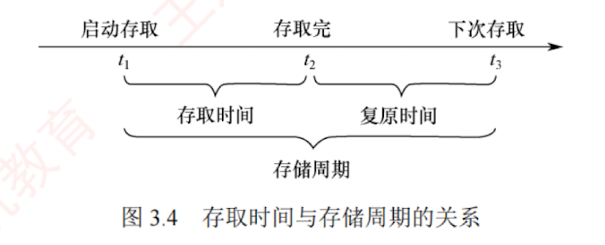

---

## 存储器的主要性能指标

**存取时间**：完成一次读/写操作所需的时间，其中**读出时间**是指从主存接收到有效地址到数据有效输出的时间，**写入时间**是指从主存接收到有效地址到数据成功写入指定单元的时间。

**存储周期**：存储器进行连续两次独立的读/写操作所需的**最小时间间隔**。

存取时间不等于存储周期。通常，**存储周期大于存取时间**，因为每次读/写操作后，存储器需要一定时间恢复内部状态。  
对于**破坏性读出**的存储器（如 **DRAM**），读出后必须立即再生数据，因此其存储周期往往显著大于存取时间，甚至可达 $T_m = 2T_a$（其中 $T_m$ 为**存储周期**，$T_a$ 为**存取时间**）。

存取时间与存储周期的关系如图 3.4 所示。

**存储器带宽**：存储器每秒能够传输的最大数据量。例如，若存储周期为 50ns，每个周期可传输 64 位数据，则理论带宽为 $64\text{b} / 50\text{ns} = 1.28\text{Gb/s}$。在实际系统中，存储器常被组织为多模块结构，许多个模块并行工作，从而将总带宽提升至单模块带宽的若干倍。