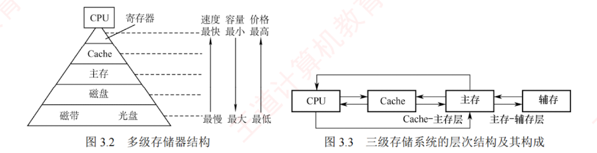

---

## 存储器的层次化结构

为缓解存储系统在**容量**、**速度**与**成本**之间的矛盾，现代计算机普遍采用**多级存储器结构**（见图 3.2）。  
从上至下，各层存储器的单位价格逐渐降低，存取速度变慢，容量增大，CPU 访问频率也相应降低。  
该层次结构主要体现为两个关键层级：**Cache-主存层**和**主存-辅存层**。  
其中，Cache 和主存可直接与 CPU 交换信息；  
>硬件自动完成

辅存则需通过主存间接与 CPU 通信；    
>辅存中的数据需要调入主存后才能被CPU访问
>数据交换是在硬件和操作系统层面进行
>利用了页面置换算法

主存作为枢纽，能与 CPU、Cache 及辅存**双向交换数据**（见图 3.3）。

存储层次的**核心思想**如下：上一层存储器作为下一层的高速缓存。  
当 CPU 访问数据时，按 **Cache $\to$ 主存 $\to$ 辅存**的顺序逐级查找；  
若所需数据不在上层，则从下层逐级调入：先从磁盘读入主存，再从主存加载到 Cache。  
从 CPU 视角看：Cache-主存层的速度接近 Cache，而容量和单位成本接近主存；主存-辅存层的速度接近主存，而容量和单位成本接近辅存。

两层机制的主要目标和实现方式不同：  

- **Cache-主存层**用于缓解 **CPU 与主存速度不匹配问题**，数据调度由**硬件自动完成**，对所有程序员**透明**。  
- **主存-辅存层**则用于解决**存储容量不足问题**，数据调度由硬件与操作系统协同完成，对**应用程序员透明**。

随着主存-辅存层的不断发展，逐渐形成了**虚拟存储系统**。  
在该系统中，程序员使用的地址空间（虚拟地址空间）远大于实际主存容量，程序可按更大的逻辑地址空间进行编写。

> **注意**
> 
> 在 Cache-主存层和主存-辅存层中，上一层的内容始终是下一层内容的子集副本，即 Cache 中的数据来自主存，主存中的数据来自辅存。
 
