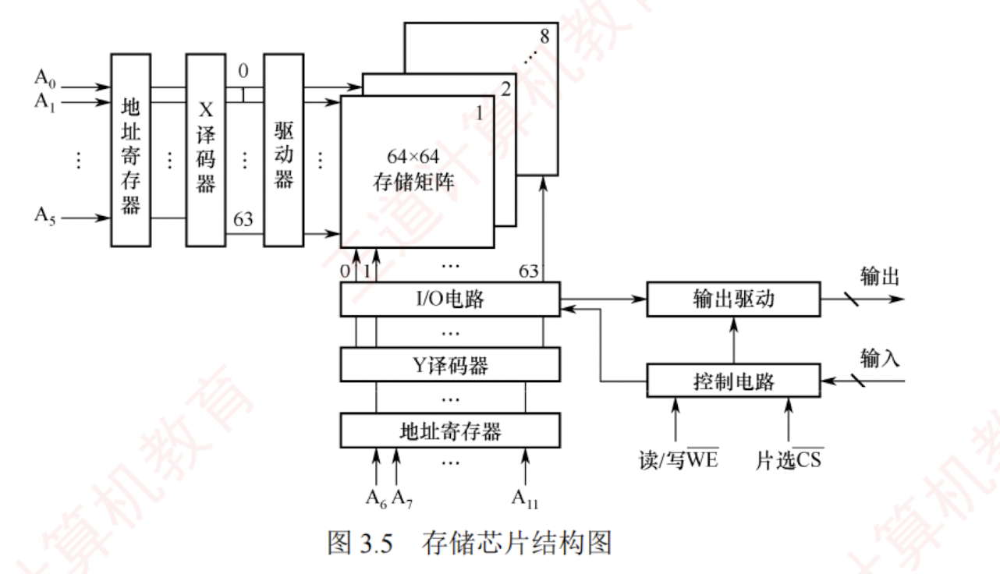
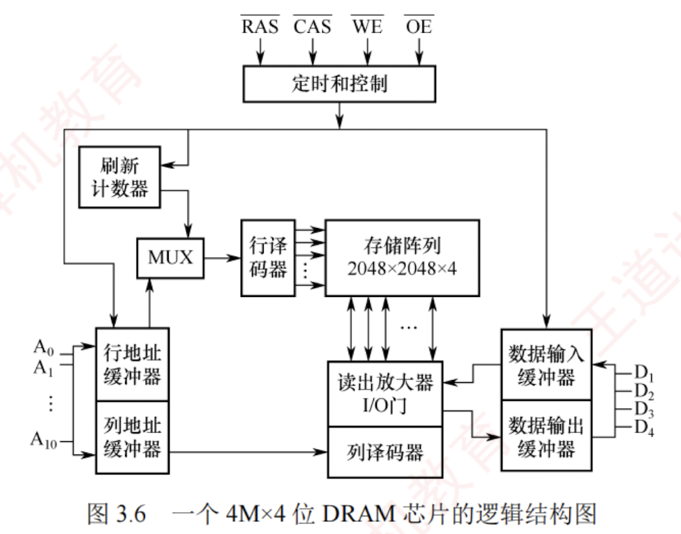
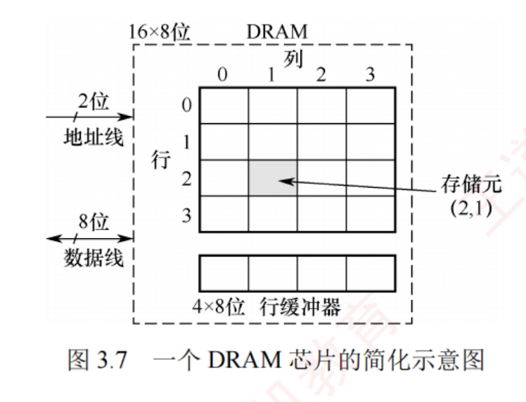

---
### 半导体随机存取存储器

随机存取存储器（RAM）分为**静态 RAM（SRAM）和**动态 RAM（DRAM）**，二者均为易失性存储器。  

现代计算机中，**主存**主要采用 **DRAM**，而 **Cache** 使用 **SRAM**。

#### SRAM 的工作原理

地址相同的多个存储单元构成一个存储单元。  
若干存储单元的集合构成**存储体**。

SRAM 的存储单元基于**双稳态触发器**（六晶体管 MOS）利用电路的两个稳定状态分别表示二进制 0 和 1。  
其静态特性体现在：**读操作为非破坏性读出**，因此无须再生。

SRAM 的存取速度快，但集成度低，功耗较大，成本高，通常用于**高速缓冲存储器**。

#### DRAM 的工作原理

与 SRAM 不同，DRAM 利用**栅极电容上的电荷**来存储信息：有电荷表示 1，无电荷表示 0。  
其基本存储单元仅由一个晶体管和一个电容构成，结构简单，因而**集成度远高于 SRAM**。

DRAM 具有位价低、功耗小、容量大等优势。  
但同时也存在**明显局限**：  
存取速度较慢；  
电荷会因漏电而逐渐丢失，必须**定时刷新**以维持数据；  
且读出过程为破坏性读出，需在读取后立即再生。  
因此，DRAM 被广泛用于大容量**主存**系统，在成本、容量与性能之间取得良好平衡。

#### 存储芯片的组成

如图 3.5 所示，存储芯片由**存储体**、**I/O 读/写电路**、**地址译码器**和**控制电路**等部分组成。  
前文介绍的 DRAM 芯片的存储阵列结构，正是此图中存储矩阵的核心构成部分。

1. **存储体（存储矩阵）**。是存储单元的集合，通过**行选择线**（X）和**列选择线**（Y）共同选项目标单元。位于**相同行列交叉点**上的多个位（**位平面数**）被同时读/写。
    
2. **地址译码器**。用来将输入地址转换为译码输出线上的高电平信号，以驱动相应的读/写电路。  
   地址译码方式有**单译码法**（一维译码）和**双译码法**（二维译码）两种。
    
    - **单译码法**。仅使用一个行译码器，同一行中所有存储单元的字线相连，构成一个字可被同时读/写。其缺点是译码器输出线数量过多。
        
    - **双译码法**。如图 3.5 所示，地址译码器分为 X（行）和 Y（列）两个部分，通过行与列的交叉点唯一确定一个存储单元。  
      这是**当前 DRAM 芯片普遍采用的译码结构**。
        
3. **I/O 电路**。用于控制被选中存储单元的读/写，具有**放大信号**的作用。
    

4. **片选控制线**。单个存储芯片容量有限，通常无法满足计算机对主存容量的需求，因此需将多个芯片组合扩展。在访问某个存储字时，必须“选中”该存储字所在的芯片，而其他芯片不被“选中”，因此需要有片选控制信号（经片选控制线传输）。
    
5. **读/写控制线**。根据 CPU 发出的读/写命令，通过读/写控制线选中单元执行相应操作。
    
[[对存储芯片结构图的理解]]

#### DRAM 芯片的关键技术

##### 地址引脚复用技术

图 3.6 给出了一个 $4M \times 4$ 位 DRAM 芯片的逻辑结构图。  
该芯片共有 11 个地址引脚 ($A_0 \sim A_{10}$)，在**行选通信号** $\overline{RAS}$ 和**列选通信号** $\overline{CAS}$ 的控制下，**分时复用**传送行地址和列地址。  
数据端口有 4 个引脚 ($D_1 \sim D_4$)，因此每个芯片可同时读/写 4 位数据。  
$\overline{WE}$ 为读/写控制信号，低电平表示写操作；  
$\overline{OE}$ 为输出使能信号，低电平有效，高电平时断开输出驱动。  
芯片内部存储阵列采用三维结构，总容量为 $2048 \times 2048 \times 4$ 位，即 $4M \times 4$ 位。  
因此，行地址和列地址各需 11 位，共 4 个位平面；  
在任意行与列的交叉点上，4 个位平面上的数据被同时读/写。

DRAM 芯片容量较大，所需地址位数较多。  
为减少芯片地址引脚数量，通常采用**地址引脚复用技术**：行地址和列地址通过相同的引脚分两次先后输入，从而使地址引脚数量减少一半。

[[对DRAM芯片结构图的理解]]

[[地址引脚复用技术中的片选信号起什么作用]]

##### 刷新机制与阵列设计优化

DRAM 芯片需要定期刷新以维持所存信息。  
刷新时，**仅向芯片提供行地址和 $\overline{RAS}$ 信号**，即可选中某一行的所有存储单元并执行读操作。  
由于 DRAM 采用破坏性读出，每次读取后必须立即再生：若读出为 0，则将电容充分放电；若读出为 1，则重新充电。  
对于图中所示的 $2048 \times 2048 \times 4$ 存储阵列，只需进行 2048 次刷新操作即可完成全芯片刷新（因**刷新按整行进行**，无须列地址）。  
芯片内部集成一个**刷新计数器**，可自动产生刷新所需的行地址，其位数与行地址位数相同。  
行地址缓冲器与刷新计数器通过一个**多路选择器**（MUX）共享通往行译码器的地址通路。  

**刷新周期定义为对某一特定行完成一次刷新后，到下一次对该行再次刷新的时间间隔。**

假定一个 DRAM 芯片的存储容量为 $2^n \times b$ 位，其存储阵列的行数为 $r$，列数为 $c$，则满足 $2^n = r \times c$。  
整个阵列的地址位数为 $n$，其中行地址占 $\log_2 r$ 位，列地址占 $\log_2 c$ 位，因此有 $n = \log_2 r + \log_2 c$。  
由于 DRAM 采用地址引脚复用技术，引脚数量由行、列地址位数中的**较大者**决定，为最小化地址引脚数，应使 $r$ 与 $c$ 尽可能接近。  
此外，DRAM 按行刷新，行数越少，刷新开销越低，故还需满足 $r \leq c$。  
综合考虑，通常将阵列设计为**行数略小于或等于列数的近似正方形结构**。

##### 缓存机制与突发传输

图 3.7 展示了一个 DRAM 芯片的简化示意图，其容量为 $16 \times 8$ 位，存储阵列为 4 行 $\times$ 4 列。

由于采用地址引脚复用技术，仅需 2 根地址线，分时传送 2 位行地址和 2 位列地址。  
每个存储单元包含 8 位数据，因此需要 8 根数据线。  
芯片内部设有一个**行缓冲器**（通常由 **SRAM** 实现），用于缓存被选中行中所有列的数据。  
其**容量等于一行中所有存储单元的数据总量**，即列数 $\times$ 每个存储单元的位数（如 4 列 $\times$ 8 位 $= 32$ 位）。  
当某一行被选中后，该行全部数据被一次性加载到行缓冲器中，后续可在每个时钟周期连续输出一个存储单元的数据（8 位），从而支持**突发传输**，即在寻址阶段提供**首地址**，随后连续读取多个**相邻存储单元**的数据，显著提升有效带宽。

[[行缓冲器有什么作用]]

#### 同步 DRAM

目前更广泛使用的是。**SDRAM**（**同步 DRAM**）。  
与传统的**异步 DRAM** 不同，SDRAM 的数据读/写操作**与系统时钟同步**，能够以 CPU-主存总线的较高速率运行。  
在连续访问同一行（页）内的数据时，可实现突发传输，显著减少甚至避免插入等待状态。  
在异步 DRAM 中，CPU 发出地址和控制信号后，必须等待一段不确定的延迟时间才能获得数据或完成写入；  
在此期间，CPU 不断轮询存储器的状态信号，无法执行其他任务，从而降低整体执行效率。  
而 SDRAM 在系统时钟驱动下工作，它将 CPU 发出的地址和控制信号锁存，并在预设的若干时钟周期后返回数据或完成写入，使得 CPU 无须等待，可在延迟期间执行其他指令，显著提升系统性能。

[[同步DRAM和异步DRAM的对比]]

#### SRAM 和 DRAM 的比较

| **特点** | **SRAM** | **DRAM** |
| ------ | -------- | -------- |
| 存储信息   | 触发器      | 电容       |
| 破坏性读出  | 非        | 是        |
| 需要刷新   | 不需要      | 需要       |
| 送行列地址  | 同时送      | 分两次送（复用） |
| 运行速度   | 快        | 慢        |
| 集成度    | 低        | 高        |
| 存储成本   | 高        | 低        |
| 主要用途   | 高速缓存     | 主机内存     |
