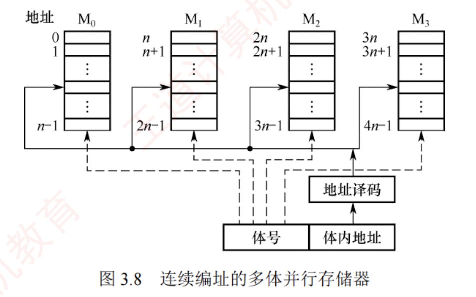
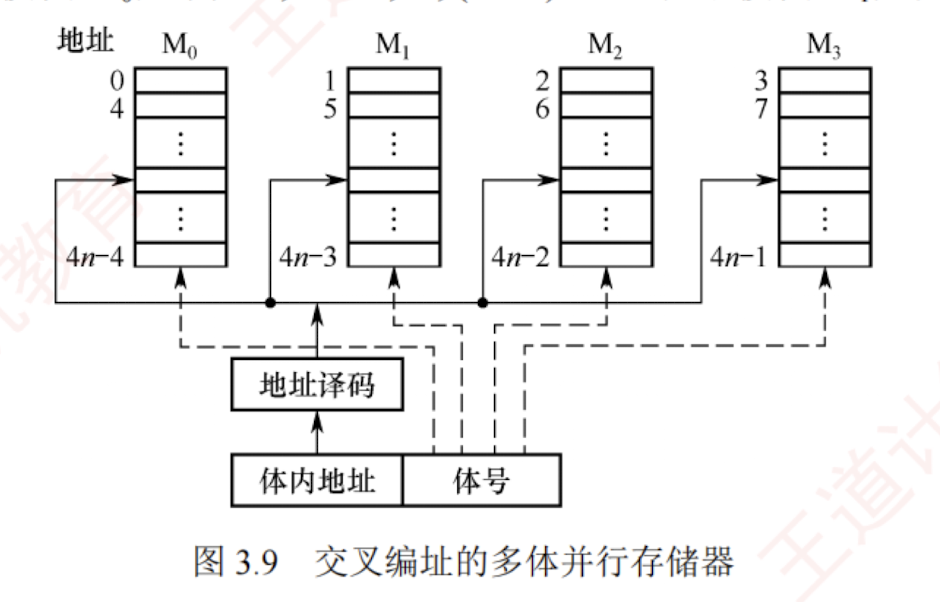

---

### 多模块存储器

多模块存储器是一种空间并行技术，通过多个结构完全相同的存储模块并行工作来提高存储器的吞吐率。  
由于 CPU 的速度远高于存储器，若能在一个存取周期内连续获取多条指令或多个数据字，便可更充分利用 CPU 资源，提升系统性能。  
**多体交叉存储器**正是基于这一思想设计的。

根据模块间地址分配方式的不同，多模块存储器可分为**连续编址**和**交叉编址**两种结构。

#### 连续编址方式

高位地址为模块号（或体号），低位地址为模块内地址（或体内地址）。如图 3.8 所示，存储器共有 4 个模块 $M_0 \sim M_3$，每个模块有 $n$ 个单元，各模块的地址范围如图所示。

在连续编址方式下，低位的体内地址总是被送到由高位体号确定的模块内进行译码。访问一个连续主存块时，总是先在一个模块内访问，直到该模块访问完后才转到下一个模块访问。由于 CPU 按顺序访问存储模块，各模块不能并行访问，因此无法提高存储器的吞吐率。

> **注意**
> 
> 模块内的地址是连续的，存取方式仍是串行存取，因此这种存储器本质上仍属于顺序存储器。

#### 交叉编址（低位交叉）方式

低位地址用作模块号（体号），高位地址作为模块内地址。假设有 $m$ 个模块，每个模块含 $k$ 个存储单元，则模块编号由地址对 $m$ 取模决定，即模块号 = 单元地址 $\% m$。如图 3.9 所示，单元 $0, m, \cdots, (k-1)m$ 位于模块 $M_0$；单元 $1, m+1, \cdots, (k-1)m+1$ 位于模块 $M_1$；以此类推。

【图 3.9 交叉编址的多体并行存储器：展示了地址译码器连接体内地址和体号，体号指向 $M_0, M_1, M_2, M_3$ 模块，地址分布为 $M_0(0, 4, \dots, 4n-4)$, $M_1(1, 5, \dots, 4n-3)$, $M_2(2, 6, \dots, 4n-2)$, $M_3(3, 7, \dots, 4n-1)$】

在交叉编址方式下，由于连续地址的数据被依次分布到不同模块中，程序或数据块在物理上是“交叉存放”的，采用此方式的多模块存储器被称为交叉存储器。通过多个结构完全相同的存储模块并行工作，这种设计能够在访问连续地址时显著提高存储器的吞吐率。

交叉存储器可以采用**轮流启动**或**同时启动**两种方式。

**(1) 轮流启动方式**

若每个模块一次读/写的位数正好等于数据总线位数，模块的存取周期为 $T$，总线周期为 $r$，则为实现轮流启动方式，存储器交叉模块数应满足：

$$m = T/r$$

按每隔 $1/m$ 个存取周期轮流启动各模块，则每隔 $1/m$ 个存取周期就可读/写一个数据，存取速度提高 $m$ 倍。图 3.10 展示了 4 体低位交叉轮流启动的存取时间示意图。交叉存储器要求其模块数大于或等于 $m$，以保证启动某模块后经过 $mr$ 的时间后再次启动该模块时，其上次的存取操作已经完成（以保证流水线不间断）。这样，连续存取 $m$ 个字所需的时间为

$$t_1 = T + (m - 1)r$$

而顺序方式连续读取 $m$ 个字所需的时间为 $t_2 = mT$。可见交叉存储器的带宽大大提高。

【图 3.10 低位交叉轮流启动的存取时间示意图：纵轴为字 $W_0, W_1, W_2, W_3, W_4$，横轴为时间，显示了 $T$ 和 $r$ 的流水关系】

在理想情况下，$m$ 体交叉存储器每隔 $1/m$ 存取周期可读/写一个数据。若相邻的 $m$ 次访问的访存地址出现在同一个模块内，则会发生访存冲突，此时需延迟发生冲突的访问请求。

**(2) 同时启动方式**

当所有存储模块一次并行读/写的总位数恰好等于存储器数据总线宽度时，可采用同时启动方式。例如，使用 8 个 $16M \times 8$ 位的 DRAM 芯片构成一个 128MB 内存条；每个 DRAM 芯片内部为 $4096 \times 4096 \times 8$ 位的存储阵列（行地址与列地址各 12 位），含 8 个平面。

CPU 发出的主存地址被拆分为行地址和列地址，通过分时复用方式先后送入 DRAM 芯片的行、列地址译码器，选中行列交叉处的 8 位单元进行读/写操作。因此，单个芯片每次传输 8 位，8 个芯片同步工作，可一次性提供 64 位数据，匹配 64 位总线宽度。

需要注意的是，并行访问以连续 8 字节为单位进行，即每次读取的数据只能来自地址对齐的块（如第 $0 \sim 7, 8 \sim 15, \cdots, 8k \sim 8k+7$ 单元）。若访问一个 int 型（4 字节）数据时起始地址未对齐（如地址 6，占用第 $6 \sim 9$ 单元，横跨两个访问块），则需两次访问；若地址按 4 字节对齐（4 的倍数），则一次即可完成。这正是内存访问要求数据对齐的根本原因。