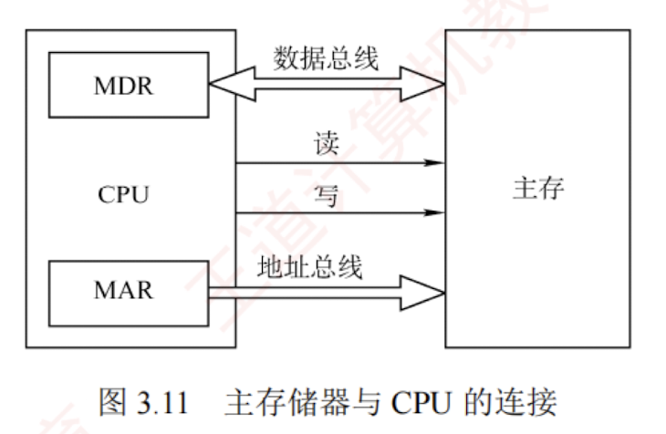

---
## 连接原理

主存储器通过**数据总线**、**地址总线**和**控制总线**与 CPU 相连，三者协同完成数据传输、地址定位与操作控制。  
数据总线的**位数**与其**工作频率**共同决定数据传输速率，其乘积正比于**理论带宽**；  
**地址总线**的位数决定了 CPU 可寻址的**最大内存空间**。  

控制线因存储器类型而异：  
SRAM 芯片通常包含**片选**和**读/写控制信号线**；  
ROM 芯片仅需**片选线**；  
DRAM 芯片一般**不设独立片选线**，其芯片选择可通过行/列地址选通或外部译码逻辑实现。  

主存储器与 CPU 的连接如图 3.11 所示。

由于单个存储芯片的容量有限，实际系统中需通过**存储器扩展**技术将多个芯片集成在内存条上，并结合主板上的 ROM，共同构成计算机所需的主存空间，再经由系统总线与 CPU 连接。

作为你的 **“408 计算机组成原理复习助手”**，我为你梳理了主存与 CPU 连接的底层物理机制。

在 408 考纲中，这部分知识很少单独出概念题，但它是第三章综合大题中**“主存容量扩展（字扩展、位扩展）”**和**“画出 CPU 与存储芯片连接图”**的绝对基础。

## 主存与CPU的连接如何实现
### 结论

主存与 CPU 之间是通过**系统总线（System Bus）**进行物理连接的。为了实现精准的数据存取，系统总线被严格划分为三组不同功能的并行总线：**地址总线、数据总线和控制总线**。

---

### 关键点：三大总线的物理分工

请务必掌握这三组总线分别连接了 CPU 和主存的什么部件，这是画连接图的核心依据：

**1. 地址总线（Address Bus, AB）—— 负责“指路”**

- **连接方式**：CPU 内的 **MAR（存储器地址寄存器）** 通过地址总线与存储芯片的地址引脚相连。
- **性能影响**：地址总线的宽度（根数）直接决定了 CPU 可寻址的主存最大逻辑空间大小。
- **大题用法**：在主存扩展大题中，CPU 发出的地址线必须被劈成两半用：
    - **低位地址线**：直接连入所有存储芯片的地址引脚，用于**“片内寻址”**。
    - **高位地址线**：接入译码器（如 3:8 译码器），用于生成片选信号，也就是**“片外寻址”**。

**2. 数据总线（Data Bus, DB）—— 负责“运货”**

- **连接方式**：CPU 内的 **MDR（存储器数据寄存器）** 通过数据总线与存储芯片的数据引脚相连。
- **性能影响**：数据总线的宽度决定了 CPU 单次访存能够传输的最大数据位数（通常等于机器字长或存储字长）。当单个存储芯片的位宽不够时，必须采用“位扩展”将多个芯片的数据引脚分别连到数据总线的不同位上。

**3. 控制总线（Control Bus, CB）—— 负责“下指令”** CPU 通过控制总线向主存发送各种操作命令。大题中必须画出的核心控制线有两类：

- **读/写控制线**：指示当前访存是读还是写。通常 CPU 会发出 $\overline{WE}$（写使能）或 $\overline{OE}$（读使能），直接连到所有存储芯片对应的读/写引脚上。
- **片选线（$\overline{CS}$ 或 $\overline{CE}$）**：**最关键的使能开关！** 只有当片选信号为有效电平（通常为低电平）时，该存储芯片才会工作。这个信号通常由 CPU 的高位地址线配合读写信号，经过译码电路逻辑后生成。

---

### ⚠️ 易错点 / 易混点

在 408 的“主存扩展”综合大题或选择题中，最容易在连线细节上掉入以下陷阱：

**1. 陷阱：片选信号的来源**

- **易错做法**：很多同学在画字扩展连接图时，直接把 CPU 的地址线连到了芯片的片选端。
- **正确机制**：CPU 的高位地址线通常需要**经过一个地址译码器（如 74LS138）**，将其转化为独立的多个片选信号（如 $Y_0, Y_1...$），再分别连到不同芯片组的 $\overline{CS}$ 端。只有这样才能保证在任意一个合法地址下，总有且只有一组芯片被激活。

**2. 易混点：ROM 与 RAM 控制线的区别**

- 在与 CPU 连接时，由于 ROM（只读存储器）在正常工作时是不可写的，因此它的控制线**只连片选线和读控制线**，不需要连写控制线。而 RAM（如 SRAM）必须同时连接读/写控制线。

**3. 陷阱：DRAM 的特殊连接要求**

- 如果考题明确说明使用的是 **DRAM 芯片**，由于其“地址引脚复用”的特性，它的连接要比 SRAM 复杂得多。CPU 不能直接把完整地址一次性送给它，必须通过多路选择器分两次传送，并且 CPU 的控制线还需要提供专门的 **$\overline{RAS}$（行选通）** 和 **$\overline{CAS}$（列选通）** 信号。

---

### 💡 记忆提示

你可以用**“外卖站调派系统”**来完美对应这三组连线机制：

- **地址总线** = **配送地址单**。低位地址是“门牌号”（连所有芯片），高位地址是“所在小区”（进译码器产生片选）。
- **数据总线** = **配送车队**。数据总线有多宽，一次就能运多少包裹。
- **控制总线** = **调度命令**。其中“读/写信号”告诉你今天是去取件还是送件；“片选信号”则是该小区的**大门门禁开关**，门禁不开，车队到了也进不去（芯片不工作）。