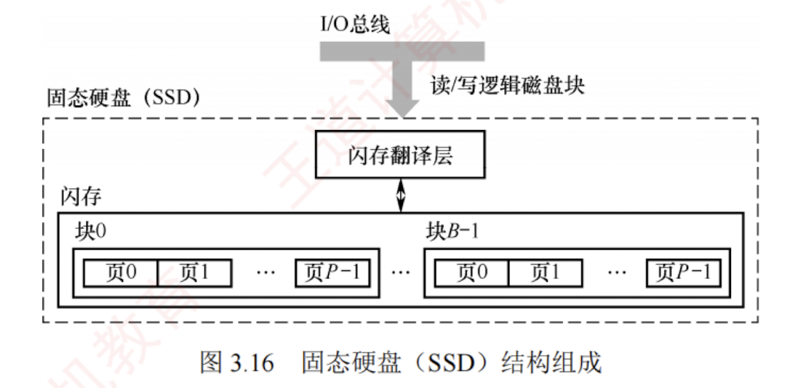

---

### 固态硬盘

#### 固态硬盘的特性

固态硬盘（SSD）是一种基于闪存技术的存储设备。  
其存储介质与 U 盘类似，但容量更大、存取性能更优。一个 SSD 由一个或多个闪存芯片以及闪存翻译层组成，如图 3.16 所示。其中，闪存芯片替代了传统磁盘中的机械驱动器；而闪存翻译层负责将 CPU 发出的逻辑块读/写请求转换为底层物理闪存的读/写控制信号，因此，闪存翻译层相当于代替了磁盘控制器的角色。

一个闪存芯片由 $B$ 个块组成，每个块包含 $P$ 页。通常，页的大小为 512B～4KB，每块包含 32～128 页，块的大小为 16KB～512KB。**读/写操作以页为单位进行**；**擦除操作以块为单位进行**，只有在整块被擦除后，才能向其中的页写入新数据。一旦某块被擦除，其所有页均可重新写入一次。每个块的擦写次数有限，经过若干重复写入后，该块会因磨损而失效。

**随机写入速度较慢**，主要有两个原因：  
1. 擦除操作耗时较长，通常比页访问慢一个数量级。  
2. 若需修改一个已包含有效数据的页 $P_i$，必须先将该块中所有有效页复制到一个新的（已擦除的）块中，再执行对 $P_i$ 的写入。

相比传统机械磁盘，SSD 具有显著优势：由半导体器件构成，无机械运动部件，因此随机访问延迟极低，且**无噪声、无振动、功耗更低、抗震性强、安全性更高**。

#### 磨损均衡（Wear Leveling）

SSD 的主要缺点在于闪存的**擦写寿命有限**，通常仅为几百至几千次。若直接用普通闪存构建 SSD 而不加管理，则实际的寿命表现可能令人失望——因为读/写操作往往会集中在少数物理块上，导致这些区域迅速磨损。一旦这部分闪存损坏，整块 SSD 即告失效。这种磨损不均衡的情况可能导致一块 256GB 的 SSD，仅因几兆字节的闪存损坏而报废。

为解决这一问题，SSD 引入了磨损均衡技术，主要分为两类：

1. **动态磨损均衡**。在写入数据时，优先选择擦写次数较少的空闲块，避免反复写入同一区域，从而将写入负载分散到更多物理块上。
    
2. **静态磨损均衡**。这是一种更高级的策略。即使没有新数据写入，控制器也会定期扫描并自动进行数据迁移，将高磨损块中的有效数据迁移到低磨损块中。使高磨损块转为以读为主，低磨损块承担更多写入任务，进一步均衡整体寿命。
    

得益于磨损均衡算法，SSD 的实际使用寿命显著提升。例如，一块 256GB 的 SSD，若其闪存的擦写寿命为 500 次，则理论总写入量可达 125TB。即使每天持续写入 10GB 数据，也需要三十多年才会达到寿命极限。而日常使用中，普通用户的日均写入量通常远低于此值。

作为你的 **“408 计算机组成原理复习助手”**，我为你提炼了外存储器中极其重要的新兴考点——**固态硬盘（SSD）**。

在近年的 408 统考中，随着技术发展，SSD 的底层读写机制和磨损均衡策略已经成为选择题和综合大题（尤其是文件系统/I/O结合）的高频命题区。

### 结论

**固态硬盘（SSD）**是一种基于闪存（Flash Memory）技术的高速外部存储器。 它彻底抛弃了传统磁盘的机械传动部件，核心由**闪存翻译层（FTL）**和**闪存芯片**组成。虽然其拥有极高的随机读写速度和抗震性，但受限于闪存的物理特性，它面临着**“必须先擦除后写入”**以及**“擦除寿命有限”**两大核心硬件瓶颈。

---

### 关键点

结合 408 考纲，你必须掌握 SSD 的以下核心机制：

**1. 核心架构与地址映射**

- **机制**：CPU 依然像访问传统磁盘一样发送逻辑块号（LBA）给 SSD，而 SSD 内部的**闪存翻译层（FTL）**负责将这个逻辑块号翻译成底层的物理闪存地址。

**2. 读写机制（绝对重点！）**

- **层级结构**：闪存芯片内部被划分为多个**块（Block）**，每个块又包含多个**页（Page）**。
- **读写单位**：数据的**读和写**是以**页（Page）**为单位进行的。
- **擦除单位**：数据的**擦除**是以**块（Block）**为单位进行的。
- **写入前提条件**：闪存的物理特性决定了**只能向“空闲页”直接写入数据**。如果某页已经有数据，必须将整个块擦除后才能重新写入。这就是 SSD 随机写入速度慢的根本原因（因为可能引发庞大的数据搬迁和块擦除操作）。

**3. 磨损均衡机制（Wear Leveling）**

- **必要性**：闪存的每个“块”都有固定的擦写寿命（通常几千到十万次），一旦超过就会损坏。FTL 必须引入磨损均衡算法，让所有块的擦写次数尽可能平均。
- **动态磨损均衡**：当需要写入新数据时，FTL 优先挑选**擦除次数最少**的空闲块来写。
- **静态磨损均衡（更优秀）**：不仅在写新数据时挑好块，还会在后台**主动把那些“冷数据”（如长期不修改的操作系统文件）搬迁到老化（擦写次数多）的块中**，从而把健康的块腾出来给频繁读写的“热数据”使用。

---

### ⚠️ 易错点 / 易混点

在 408 试卷中，命题人最喜欢利用 SSD 的不对称特性挖坑：

**1. 致命陷阱：擦除与读写的单位混淆**

- **错觉**：认为 SSD 的读、写、擦除都是以块为单位的。
- **辨析**：请牢记口诀：**“按页读写，按块擦除”**。选择题经常在这里张冠李戴。

**2. 易混点：SSD 的读写速度是对称的吗？**

- **错觉**：SSD 速度极快，所以读和写一样快。
- **真相**：**SSD 的随机写速度远慢于随机读速度**。因为写操作极易触发底层的“读出旧页 $\rightarrow$ 修改 $\rightarrow$ 擦除旧块 $\rightarrow$ 写入新块”的庞大开销（这种现象在业界被称为写放大）。

**3. 易错点：静态磨损均衡的直觉误区**

- **误区**：认为静态磨损均衡是把频繁写的数据放到好块里，所以不需要搬迁老数据。
- **纠正**：静态磨损均衡的核心精髓恰恰在于**“主动搬迁冷数据”**。如果不搬走，那些存放冷数据的好块就永远得不到使用，导致剩下的块被迅速写坏。

---

### ✅ 复习检查清单

你可以用以下判断题自测： □ 判断：固态硬盘（SSD）在覆盖原有数据时，可以直接在原物理位置（页）上直接修改。 _（**错误**。闪存的特性决定了必须先擦除整个“块”，才能对“页”进行重新写入，通常的做法是写到新的空闲页，并更改 FTL 映射表）_