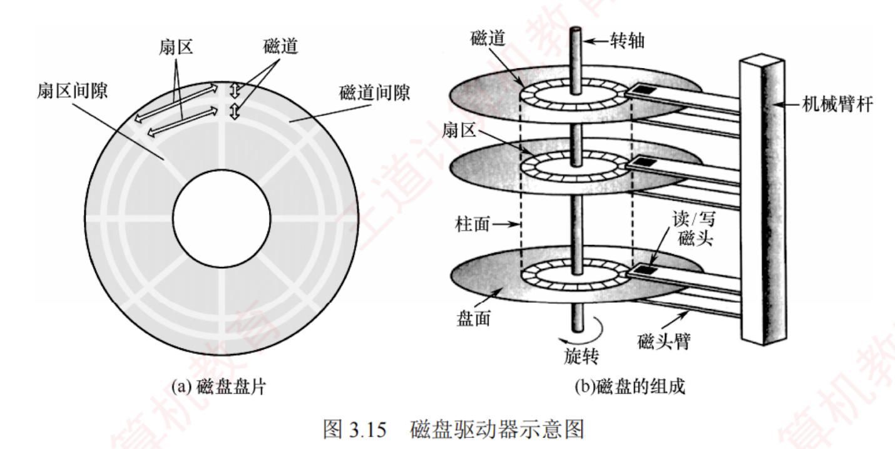

---

## 磁盘存储器

磁盘存储器采用磁盘作为存储介质，具有以下优点：① 存储容量大，成本低；② 支持数据的重复写入和删除；③ 能长期保存信息，即使脱机也能存档；④ 读取操作是非破坏性的，无须再生数据。然而，其缺点包括存取速度较慢、机械结构复杂以及对工作环境要求较高。

### 磁盘存储器

#### 磁盘设备的组成

1. **磁盘存储器的组成**。磁盘存储器由**磁盘驱动器**、**磁盘控制器**和**盘片**组成。

	- **磁盘驱动器**。驱动磁盘旋转并通过磁头在盘面上执行读/写操作，如图 3.15 所示。
	    
	- **磁盘控制器**。磁盘驱动器与主机之间的接口，负责接收并解析来自 CPU 的命令，向磁盘驱动器发送控制信号，同时监控其运行状态。
	

2. **存储区域**。磁盘由多个记录面组成，每面含若干同心磁道，每条磁道划分为若干扇区。

	- **记录面数**：表示磁头数量，每个磁头负责一个记录面的数据读/写。
	    
	- **柱面数**：表示单个记录面上的磁道数量。所有记录面上相同编号的磁道构成一个柱面。
	    
	- **扇区数**：表示每条磁道所包含的扇区数量。扇区是磁盘读/写的最小单位。
	    
	    相邻的磁道和扇区之间通过间隔隔开，以防止读/写错误。扇区按固定圆心角度划分，导致从外到内的位密度逐渐增加，磁盘的存储能力受限于最内圈的最大记录密度。
    

3. **磁盘高速缓存（Disk Cache）**。在内存中开辟一部分空间，用于暂存待写入磁盘的数据。

	**优点**：磁盘以“簇”（由若干连续扇区组成）为单位进行写操作，缓存可减少频繁的小块写入；同时，中间结果若在写回前被再次使用，可直接从缓存读取，提升效率。

#### 磁盘记录原理

**原理**：当磁头和磁性记录介质发生相对运动时，通过电磁转换实现数据的读/写操作。

**编码方法**：按照特定规则，将二进制数据序列转换为磁层中对应的磁化翻转状态序列，以便读/写控制电路能够高效、可靠地完成信号转换。

#### 磁盘的性能指标

1. **记录密度**。指单位面积上可存储的二进制数据量，通常以道密度、位密度和面密度表示。

	**道密度**是沿磁盘半径方向单位长度上的磁道数；**位密度**是单条磁道单位长度上可记录的二进制位数；**面密度**是位密度与道密度的乘积，反映单位面积的存储能力。

 2. **磁盘的容量**。分为非格式化容量和格式化容量。非格式化容量是指磁记录表面可利用的磁化单元总数，非格式化容量 = 记录面数 $\times$ 柱面数 $\times$ 每磁道磁化单元数。格式化容量是指按特定格式组织后实际可用的存储容量，格式化容量 = 记录面数 $\times$ 柱面数 $\times$ 每道扇区数 $\times$ 每扇区字节数。**非格式化容量 > 格式化容量**，因需预留扇区间隔、同步字段等格式开销。

3. **响应时间与存取时间**。磁盘处理一次读/写请求的完整过程包括请求排队、控制器解析以及三个关键物理操作：寻道、旋转等待和数据传输。因此，总响应时间为

	$$\text{响应时间} = \text{排队延迟} + \text{控制器时间} + \text{寻道时间} + \text{旋转等待时间} + \text{数据传输时间}$$

	其中，“寻道时间 + 旋转等待时间 + 数据传输时间”也称**存取时间**，特指从磁头定位开始到数据传输完成所需的时间，是衡量磁盘性能的核心指标。
	
	- **寻道时间**：磁头移动到目标磁道所需时间。平均寻道时间通常取最大寻道时间的一半（从最外道到最内道时间的 1/2）。
	    
	
	- **旋转等待时间**：目标扇区旋转至磁头下方所需时间。平均旋转等待时间等于磁盘旋转半周的时间。
	    
	- **数据传输时间**：读取或写入一个扇区所需时间，取决于磁盘转速和数据密度。
	    

4. **数据传输速率**。指磁盘在单位时间内向主机传送的数据量（单位为 B/s）。若磁盘转速为 $r$ 转/秒，单磁道容量为 $N$ 字节，则最大数据传输速率为

	$$D_r = rN$$

#### 磁盘地址

主机向磁盘控制器发送寻址信息，磁盘地址通常由三部分组成，如下图所示。

|**柱面（磁道）号**|**盘面（磁头）号**|**扇区号**|
|---|---|---|

例如，磁盘有 16 个盘面，每个盘面有 256 个磁道，每个磁道划分为 16 个扇区，则每个扇区的地址可用 16 位二进制代码表示：其中柱面号占 8 位，盘面号占 4 位，扇区号占 4 位。

#### 磁盘的工作过程

磁盘的主要操作包括寻址、读盘和写盘。每种操作对应一个控制字。磁盘工作时，首先读取控制字，然后执行该控制字。由于磁盘是机械式部件，因此其读/写操作为串行执行。

### 磁盘阵列

RAID（独立冗余磁盘阵列）是指将多个独立的物理磁盘组合成一个逻辑磁盘，数据在多个物理盘上交叉分割存储并并行访问，从而获得更高的存储性能、可靠性与安全性。

RAID 的分级如下所示。在 RAID1～RAID5 等方案中，当任意磁盘发生故障时，可随时拔出损坏磁盘并插入新盘，系统仍能恢复或维持数据完整性，显著提升了可靠性。

- RAID0：无冗余、无校验的磁盘阵列。
    
- RAID1：镜像磁盘阵列。
    
- RAID2：采用海明码进行纠错的磁盘阵列。
    
- RAID3：位交叉奇偶校验的磁盘阵列。
    
- RAID4：块交叉奇偶校验的磁盘阵列。
    
- RAID5：无独立校验盘的分布式奇偶校验磁盘阵列。
    

RAID0 将连续的多个数据块交替存放在不同物理磁盘的扇区中，利用多个磁盘交叉并并行读/写，即条带化技术，不仅扩展了存储容量，还显著提高了存取速度，但不具备容错能力。

为提高可靠性，RAID1 通过两个磁盘同步进行读/写操作，互为镜像备份。当一个磁盘故障时，可从另一磁盘完整读取数据。其代价是有效容量减半（两盘仅当一盘使用）。

总之，RAID 通过多磁盘并行工作提升数据传输速率；通过并行存取大幅提高存储系统的吞吐量；通过镜像实现高可用性；通过校验机制提高容错能力。

