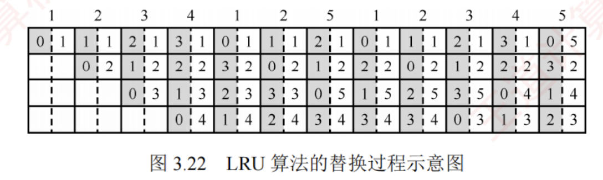

---

### Cache 中主存块的替换算法 $^①$

在采用**全相联映射**或**组相联映射**方式时，当向 Cache 传送一个新主存块而 Cache（或 Cache 组）已满，就需要使用替换算法选择被替换的 Cache 行。  

而在**直接映射**中，每个主存块只能映射到唯一的 Cache 行，因此当该行已被占用时，新块直接覆盖旧块，无须替换算法。

常用的替换算法包括**随机、先进先出、最近最少使用和最不经常使用**算法。

1. **随机（RAND）算法**：随机选择一个 Cache 行进行替换。实现简单，但未利用程序访问的局部性原理，命中率通常较低。
    
2. **先进先出（FIFO）算法**：替换最早装入的 Cache 行。实现较容易，但未考虑局部性原理，最早进入的块可能仍是当前热点数据，因此命中率不高。
    

3. **最近最少使用（LRU）算法**：基于程序访问的局部性原理，优先替换最近最久未被访问的 Cache 行。其平均命中率通常高于 FIFO。LRU 算法是考查重点。
    

	在硬件实现中，LRU 算法为每组 Cache 维护一组计数器（常称 LRU 替换位），用来记录各 Cache 行的相对访问顺序。  
	
	LRU 位的位数取决于组的路数：2 路组相联需 1 位 LRU 位，4 路组相联需 2 位 LRU 位。假定采用 4 路组相联，5 个主存块 $\{1, 2, 3, 4, 5\}$ 映射到同一 Cache 组，访问序列为 $\{1, 2, 3, 4, 1, 2, 5, 1, 2, 3, 4, 5\}$，LRU 替换过程如图 3.22 所示。 
	 
	图中左边阴影部分的数字表示对应 Cache 行的 LRU 计数值（反映最近访问顺序），右侧数字为主存块号。
	
	
	
	计数器的**更新规则**：  
	① 命中时，所命中行的计数器清零，比其低的计数器加 1，其余不变；
	② 未命中且有空闲行时，新装入的行的计数器置 0，其他非空闲行全加 1；
	③ 未命中且无空闲行时，替换计数值最大（本例中为 3）的行，新装入的行的计数器置 0，其余全加 1。
	
	**当被频繁访问的主存块数量超过 Cache 每组的行数时，可能导致持续缺失**。例如，若访问序列变为 $1, 2, 3, 4, 5, 1, 2, 3, 4, 5, \dots$，而 Cache 每组仅有 4 行，则每次访问第 5 个块都会驱逐下一个将被访问的块，导致命中率为 0，这种现象称为**抖动**。

4. **最不经常使用（LFU）算法**：替换一段时间内累计访问次数最少的 Cache 行。每行设置一个计数器，新行装入时计数器初始化为 0，每次访问该行则计数器加 1；替换时选择计数值最小的行。LFU 与 LRU 的思想不同：LRU 关注最近是否用过，LFU 关注总共用了多少次。
    

