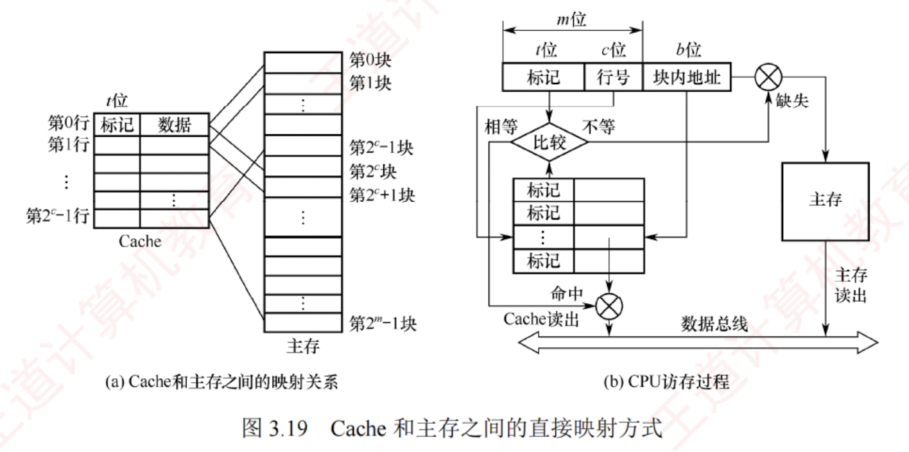
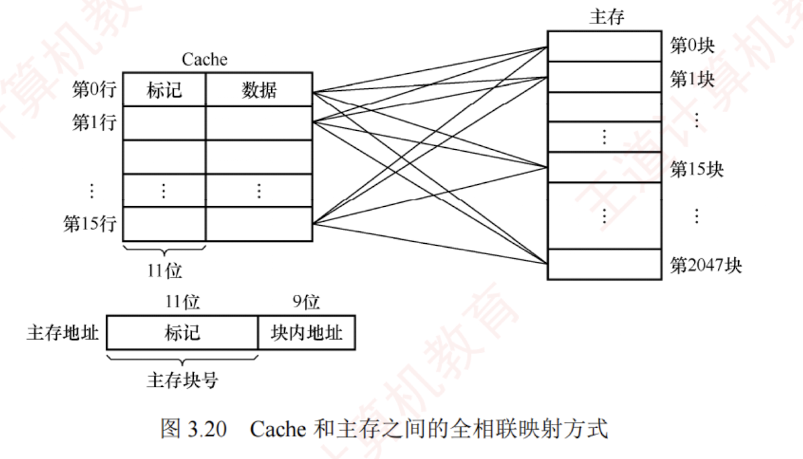
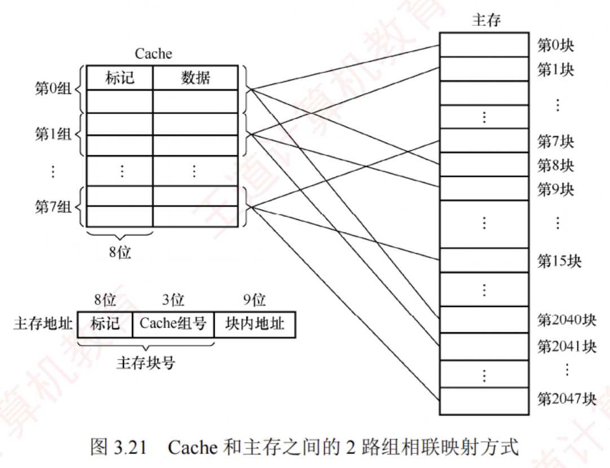

---

### Cache 和主存的映射方式

由于 **Cache 行数远少于主存块数**，Cache 只能存放主存中部分块的副本。  
为识别每个 Cache 行对应哪个主存块，需要为每行设置一个**标记**，记录其主存块编号。  
同时设置一位**有效位**，用于指示该行数据是否有效。  
系统启动或复位时，所有 Cache 行均无效；  
仅当主存块被装入某 Cache 行后，其有效位才置为 1。

**地址映射**是指将主存地址空间按一定规则映射到 Cache 地址空间，即决定主存块如何装入 Cache。  

常见的映射方式有三种，包括**直接映射、组相联映射和全相联映射**。

#### 直接映射

主存中的每一块只能装入 Cache 中的唯一指定位置。  

若该位置已有内容，则发生块冲突，原块将被无条件替换（**无须替换算法**）。  

直接映射实现简单，但灵活性差，即使 Cache 中其他行空闲，也不能用于存放该主存块，因此块冲突概率最高，空间利用率最低。

**直接映射关系**可表示为

$$\text{Cache 行号} = \text{主存块号} \mod \text{Cache 总行数}$$

设 Cache 共有 $2^c$ 行，主存共有 $2^m$ 块。则主存的第 0 块、第 $2^c$ 块、第 $2^{c+1}$ 块 $\dots$ 均映射到 Cache 的第 0 行；主存的第 1 块、第 $2^c+1$ 块、第 $2^{c+1}+1$ 块 $\dots$ 均映射到 Cache 的第 1 行，以此类推。

由此可见，主存块号的**低 $c$ 位**即为其对应的 **Cache 行号**。

为标识来源，每个 Cache 行设置一个长度为 $t=m-c$ 的标记。  
当某主存块调入 Cache 后，将其块号的高 $t$ 位存入对应 Cache 行的标记字段中，如图 3.19(a)所示。

**直接映射**的地址结构如下

|**标记**|**Cache 行号**|**块内地址**|
|---|---|---|

**CPU 访存过程**：  

根据访存地址中间的 $c$ 位确定 Cache 行，将该 Cache 行中的标记与主存地址的高 $t$ 位进行比较，若标记相等且有效位为 1，则 Cache 命中，根据地址低位的块内地址从该 Cache 行中读取数据；

若标记不等或有效位为 0，则 Cache 未命中，CPU 需从主存读取该地址所在块，将其装入对应 Cache 行，置有效位为 1，更新标记为地址高 $t$ 位，并将所需数据送至 CPU。

#### 全相联映射

主存中的每一块可以装入 Cache 中的任何位置，如图 3.20 所示。  
每行的标记用于指出该行来自主存的哪一块，因此 CPU 访存时需要与所有 Cache 行的标记进行比较。  

**优点**：  
1. Cache 块的冲突概率低，只要有空闲 Cache 行，就不会发生冲突；
2. 空间利用率高；
3. 命中率高。  

**缺点**：
1. 标记的比较速度较慢；
2. 实现成本较高，通常需采用按内容寻址的相联存储器。

全相联映射的地址结构如下

|**标记**|**块内地址**|
|---|---|

**CPU 访存过程**：  
首先将主存地址的高位标记（位数 $= \log_2 \text{主存块数}$）与 Cache 各行的标记进行比较。  
若有一个相等且对应有效位为 1，则 Cache 命中，此时根据块内地址从该 Cache 行中取出信息；  
若都不相等或有效位为 0，则 Cache 未命中，此时 CPU 从主存中读出该地址所在的一块信息装入 Cache 的任意一个空闲行，置有效位为 1，并设置标记，同时将所需数据送至 CPU。

通常为**每个 Cache 行都设置一个比较器**，比较器的位数等于标记字段长度。  
访存时根据标记字段的内容访问 Cache 中的主存块，因此其查找过程是一种按内容访问的存取方式，属于**相联存储器**。  

这种方式的时间开销和硬件开销都较大，不适合大容量 Cache。

#### 组相联映射

将 Cache 划分为 $Q$ 个大小相等的组，每个主存块只能映射到固定组中的任意一行，即**组间采用直接映射**，**组内采用全相联映射**，如图 3.21 所示。  
它是直接映射与全相联映射的一种折中方案：当 $Q=1$（整个 Cache 为一个组）时，退化为全相联映射；当 $Q=\text{Cache 总行数}$（每组仅 1 行）时，退化为直接映射。设每组包含 $r$ 个 Cache 行，则称为 $r$ 路组相联映射。

路数 $r$ 越大，组内可选位置越多，块冲突概率越低，但所需的比较器数量和控制逻辑也越复杂。合理选择 $r$，可在硬件成本接近直接映射的同时，获得接近全相联映射的性能。

组相联映射关系可表示为

$$\text{Cache 组号} = \text{主存块号} \pmod{\text{Cache 组数 } (Q)}$$

组相联映射的地址结构如下

|**标记**|**组号**|**块内地址**|
|---|---|---|

**CPU 访存过程**：首先根据**访存地址**中的**组号字段**确定目标 Cache 组；  
将该组内所有 Cache 行的标记与主存地址的高位标记**并行比较**；  
若某行标记匹配且其有效位为 1，则 Cache 命中，根据块内地址从该行读取数据；  
若所有行均不匹配或匹配行的有效位为 0，则 Cache 未命中，CPU从主存读取该地址所在块，将其装入该组中任意一个空闲行（若无空闲行，则按替换算法选择一行），置有效位为 1，写入标记，并将所需数据送至 CPU。

直接映射中每块仅对应一个唯一的 Cache 行，因此只需设置 1 个比较器。  
而 $r$ 路组相联映射需在同一组的 $r$ 个 Cache 行中并行比较，因此需设置 **$r$ 个比较器**。

#### 三种映射方式的对比

在 Cache 容量和主存块大小固定的条件下，三种映射方式的特性对比如下：

1. **命中率**：直接映射最低，全相联映射最高。
    
2. **判断开销与所需时间**：直接映射最小、更快，全相联映射最大、最慢。
    
3. **标记存储开销**：直接映射最少，全相联映射最多。