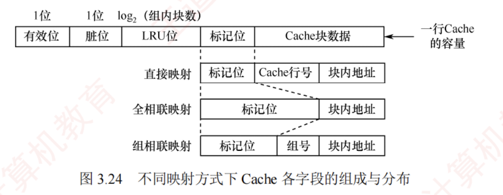

---

### Cache 容量的计算举例

在计算 Cache 总容量时，需考虑 Cache 行的数据部分和每行的标记信息，即

$$\text{Cache 总容量} = (\text{每行标记位数} + \text{每行数据位数}) \times \text{Cache 总行数}$$

每行的**标记信息**通常包括：**有效位**、**标记位**、**脏位**和 **LRU 替换位**。  
其中，**有效位和标记位**是所有 Cache **必须包含**的；  
**脏位**仅在采用**回写**策略时存在；  
**LRU 替换位**仅在使用 **LRU 算法**时存在，其位数取决于**组内行数**。

图 3.24 展示了不同映射方式下 Cache 各字段的组成与分布。

>这张图有一定的误导性
>第一行是cache的组成，包含四个特殊位以及Cache数据内容，共同构成了一行Cache容量
>后面三行代表分别使用不同映射方式时，访存地址的各字段的组成。

**【例 3.3】** 假设某主存地址空间大小为 256MB，按字节编址，其数据 Cache 有 8 个 Cache 行，行长为 64B。请回答：

1. 若不考虑脏位和替换算法控制位，并采用直接映射方式，求该数据 Cache 的总容量？
    
2. 若采用直接映射方式，主存地址为 3200（十进制）的主存块对应的 Cache 行号是多少？若采用 2 路组相联映射，对应的 Cache 组号及可能的行号是多少？
    
3. 以直接映射方式为例，简述访存过程（设访存地址为 0123456H）。
    

**解：**

1. $\text{Cache 总容量} = \text{数据信息容量} + \text{标记信息容量}$（包括有效位和标记位）。本题不考虑脏位和替换算法控制位。主存地址位数为 28 位（主存地址空间为 $256\text{MB} = 2^{28}\text{B}$）；块内地址位数为 6 位（行长 $64\text{B} = 2^6\text{B}$）；Cache 行号为 3 位（Cache 行数 $8 = 2^3$）。标记信息位数 $= 28 - 6 - 3 = 19$ 位。每行含 1 位有效位 $+ 19$ 位标记位 $= 20$ 位标记信息。每行数据部分为 $64\text{B} = 512$ 位。因此，$\text{Cache 总容量} = 8 \times (512 + 1 + 19) = 4256$ 位。
    
2. 主存地址 3200 对应的块号为 $3200\text{B} / 64\text{B} = 50$。在直接映射方式中，$\text{Cache 行号} = 50 \bmod 8 = 2$，故对应的 Cache 行号为 2。
    
    在组相联映射方式中，组内采用全相联映射，组外采用直接映射，$\text{组号} = 50 \bmod 4 = 2$，即该块可映射到第 2 组中的任意一行，对应的 Cache 行号为 4 或 5。
    
3. 在直接映射方式中，28 位主存地址可分为 19 位的标记位，3 位的块号，6 位的块内地址，即 `0000 0001 0010 0011 010` 为标记位，`001` 为块号，`010110` 为块内地址。
    
    访存过程：根据行号 `010` 访问 Cache 第 2 行，比较其标记与地址高 19 位，并检查有效位；若匹配且有效位为 1，则命中，按块内地址 `010110` 读取数据并送至 CPU；否则未命中，从主存读取该块，写入 Cache 第 2 行，更新标记为地址高 19 位，并置有效位为 1。
    

**思考：** 若 1) 问中采用 2 路组相联映射方式，则 Cache 总容量是多少？结合主存与 Cache 的划分关系，推导 2 路组相联映射下的主存地址结构，并简述其访存过程。

[[行号和组号是隐含的]]
