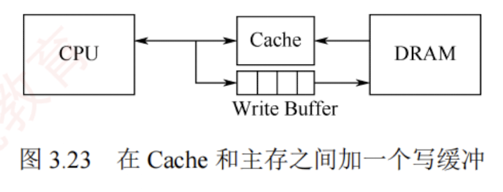

---

### Cache 的一致性问题

由于 Cache 中的内容是主存块的副本，当对 Cache 进行写操作时，必须采用适当的写策略以维持 Cache 与主存数据的一致性。根据写操作是否命中 Cache，可分为两类情况。所谓写命中是指 CPU 要写入的主存地址所在的块当前已在 Cache 中；反之则为写不命中。

#### Cache 写命中时的处理方法

##### **全写法（直写法，Write Through）**

当 CPU 对 Cache 写命中时，数据同时写入 Cache 和主存。  
由于主存始终与 Cache 保持同步，因此在替换 Cache 块时，可直接覆盖，无须写回。

该方法实现简单，能**保证主存数据的实时正确性**，  
但缺点是**每次写操作都需访问主存**，降低了系统性能。

为缓解直写法的性能开销，可在 Cache 与主存之间增设**写缓冲**（Write Buffer），如图 3.23 所示。  

CPU 将数据同时写入 Cache 和写缓冲，由写缓冲异步地将数据写入主存。  

写缓冲可缓解 CPU 与主存之间的速度差异。      
[[为什么写缓冲可缓解 CPU 与主存之间的速度差异。]]  

但在高频率写操作下，写缓冲**可能饱和甚至溢出**。

##### **回写法（Write Back）** 

当 CPU 对 Cache 写命中时，仅将数据写入 Cache，不立即写入主存，仅在该块被替换出 Cache 时才写回主存。  
这种方法减少了主存访问次数，提高了 Cache 效率，但存在**数据不一致**的风险。  

为避免不必要的写回操作，每个 Cache 行设置一个修改位（又称**脏位**）：  
若修改位为 1，表示该行数据已被修改，替换时必须写回主存；  
若修改位为 0，表示该行数据与主存一致，替换时可直接覆盖。  
需要注意的是，直写法无须脏位，因为主存始终同步；  
回写法则必须设置脏位。

#### Cache 写不命中时的处理方法

#### **写分配法（Write Allocate）** 

当发生写不命中时，先将数据写入主存的对应单元，然后将该主存块调入 Cache 的一个空闲行中。该方法利用了程序的空间局部性，但每次写不命中都要将主存块加载到 Cache 中。

#### **非写分配法（Not-Write-Allocate）**

当发生写不命中时，直接将数据写入主存，不将主存块调入 Cache。
